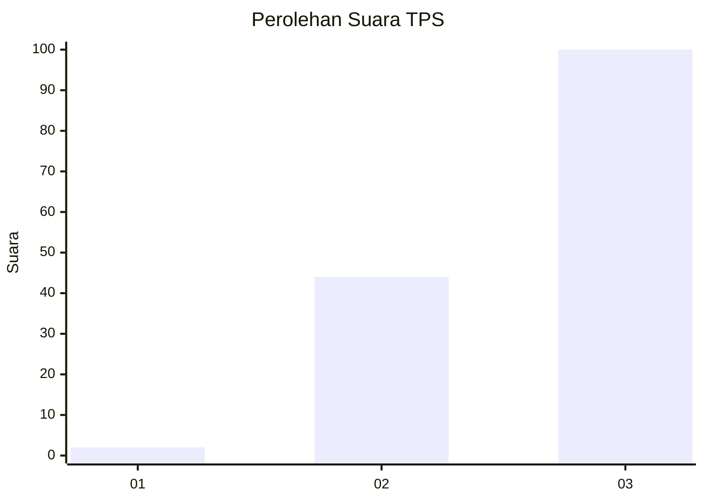
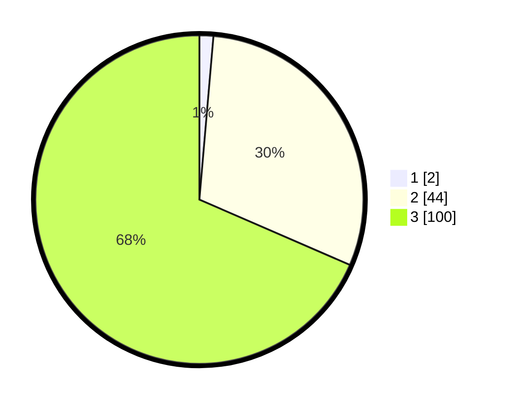

# Hasil

## Grafik

## Tabel

| No. | Nama Paslon    | Suara | Suara (raw) | Persentase |
|:--- |:-------------- | -----:| -----------:| ----------:|
| 1   | ANIES MUHAIMIN | 2     | [2][p-1]    | 1,37       |
| 2   | PRABOWO GIBRAN | 44    | [44][p-2]   | 30,14      |
| 3   | GANJAR MAHFUD  | 100   | [100][p-3]  | 68,49      |

[p-1]: https://github.com/gigit-pemilu/pemilu-2024-53-nusa-tenggara-timur/blob/main/pilpres/hitung-suara/sub/53-nusa-tenggara-timur/sub/15-manggarai-barat/sub/08-ndoso/sub/2001-golo-poleng/sub/002-tps/sub/paslon-1.txt
[p-2]: https://github.com/gigit-pemilu/pemilu-2024-53-nusa-tenggara-timur/blob/main/pilpres/hitung-suara/sub/53-nusa-tenggara-timur/sub/15-manggarai-barat/sub/08-ndoso/sub/2001-golo-poleng/sub/002-tps/sub/paslon-2.txt
[p-3]: https://github.com/gigit-pemilu/pemilu-2024-53-nusa-tenggara-timur/blob/main/pilpres/hitung-suara/sub/53-nusa-tenggara-timur/sub/15-manggarai-barat/sub/08-ndoso/sub/2001-golo-poleng/sub/002-tps/sub/paslon-3.txt

## Foto C Plano

https://sirekap-obj-formc.kpu.go.id/0d77/pemilu/ppwp/53/15/08/20/01/5315082001002-20240217-181951--bd389ffd-48d8-44f6-9966-c606122be8e2.jpg

https://sirekap-obj-formc.kpu.go.id/0d77/pemilu/ppwp/53/15/08/20/01/5315082001002-20240217-182025--b5ac0595-e801-4139-88fa-eaec0b9abcc4.jpg

https://sirekap-obj-formc.kpu.go.id/0d77/pemilu/ppwp/53/15/08/20/01/5315082001002-20240217-182108--05f1df59-d625-401c-8b95-6251e6dfd0e7.jpg

## Metadata

| Key        | Value               |
| ---------- | ------------------- |
| Time Stamp | 2024-02-19 06:16:00 |

