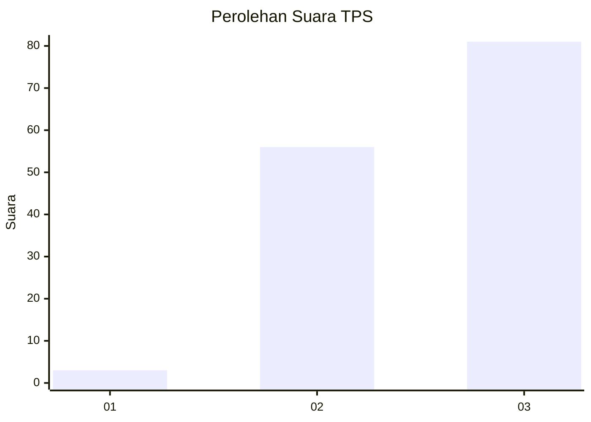
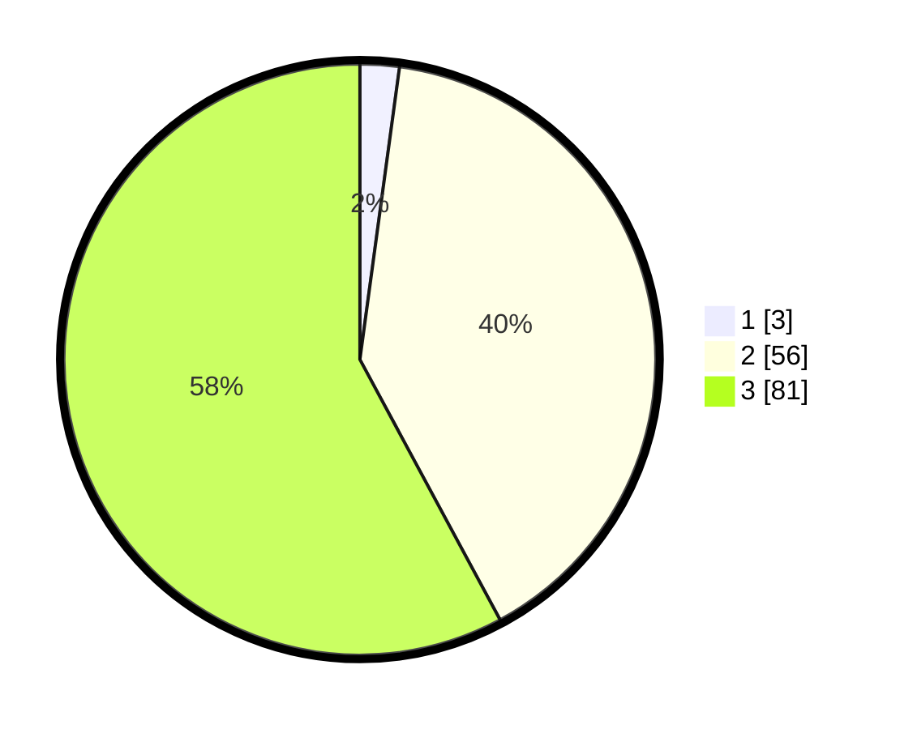

# Hasil

## Grafik

## Tabel

| No. | Nama Paslon    | Suara | Suara (raw) | Persentase |
|:--- |:-------------- | -----:| -----------:| ----------:|
| 1   | ANIES MUHAIMIN | 3     | [3][p-1]    | 2,14       |
| 2   | PRABOWO GIBRAN | 56    | [56][p-2]   | 40,00      |
| 3   | GANJAR MAHFUD  | 81    | [81][p-3]   | 57,86      |

[p-1]: https://github.com/gigit-pemilu/pemilu-2024-53-nusa-tenggara-timur/blob/main/pilpres/hitung-suara/sub/53-nusa-tenggara-timur/sub/15-manggarai-barat/sub/08-ndoso/sub/2001-golo-poleng/sub/003-tps/sub/paslon-1.txt
[p-2]: https://github.com/gigit-pemilu/pemilu-2024-53-nusa-tenggara-timur/blob/main/pilpres/hitung-suara/sub/53-nusa-tenggara-timur/sub/15-manggarai-barat/sub/08-ndoso/sub/2001-golo-poleng/sub/003-tps/sub/paslon-2.txt
[p-3]: https://github.com/gigit-pemilu/pemilu-2024-53-nusa-tenggara-timur/blob/main/pilpres/hitung-suara/sub/53-nusa-tenggara-timur/sub/15-manggarai-barat/sub/08-ndoso/sub/2001-golo-poleng/sub/003-tps/sub/paslon-3.txt

## Foto C Plano

https://sirekap-obj-formc.kpu.go.id/f9c4/pemilu/ppwp/53/15/08/20/01/5315082001003-20240217-184728--a59ef2e8-8037-4a96-84a5-a5bb6d61ffd6.jpg

https://sirekap-obj-formc.kpu.go.id/f9c4/pemilu/ppwp/53/15/08/20/01/5315082001003-20240217-184802--9260b7eb-14f2-4c16-8a76-bf8db75c5558.jpg

https://sirekap-obj-formc.kpu.go.id/f9c4/pemilu/ppwp/53/15/08/20/01/5315082001003-20240217-184835--4892f7a7-01f6-4127-b2e9-effef59fafc1.jpg

## Metadata

| Key        | Value               |
| ---------- | ------------------- |
| Time Stamp | 2024-02-19 06:16:00 |

