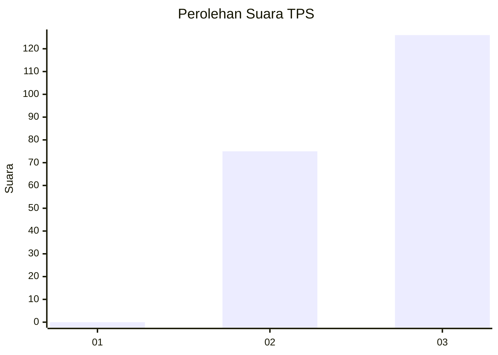
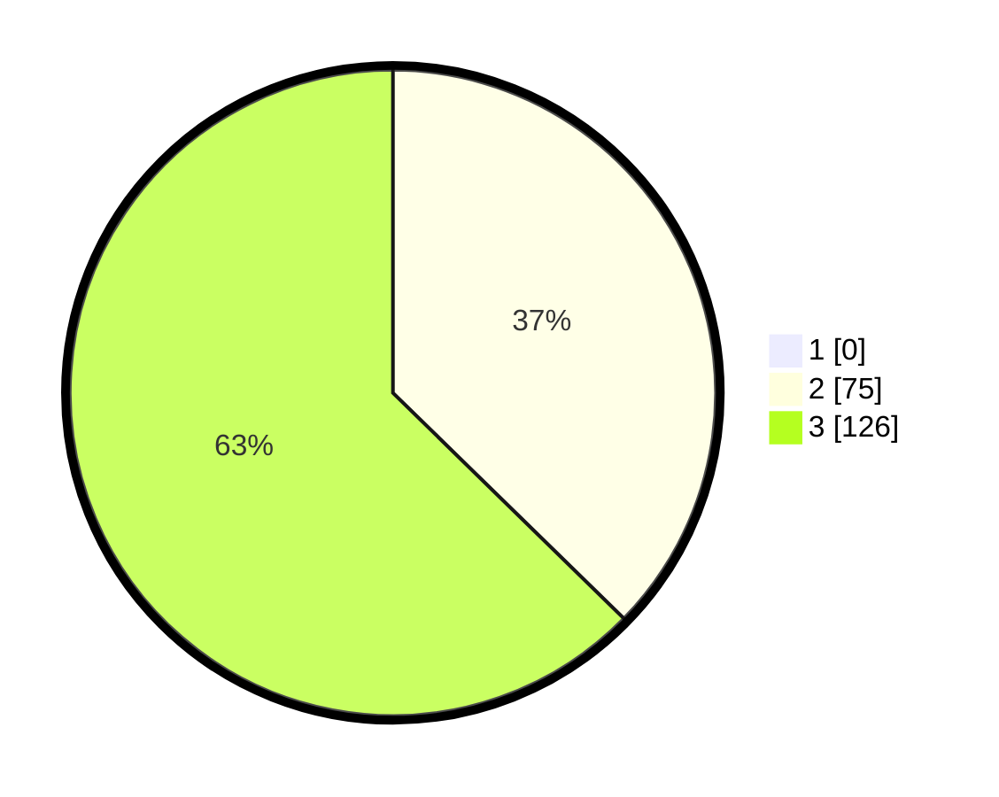

# Hasil

## Grafik

## Tabel

| No. | Nama Paslon    | Suara | Suara (raw) | Persentase |
|:--- |:-------------- | -----:| -----------:| ----------:|
| 1   | ANIES MUHAIMIN | 0     | [0][p-1]    | 0,00       |
| 2   | PRABOWO GIBRAN | 75    | [75][p-2]   | 37,31      |
| 3   | GANJAR MAHFUD  | 126   | [126][p-3]  | 62,69      |

[p-1]: https://github.com/gigit-pemilu/pemilu-2024-53-nusa-tenggara-timur/blob/main/pilpres/hitung-suara/sub/53-nusa-tenggara-timur/sub/15-manggarai-barat/sub/08-ndoso/sub/2002-tentang/sub/001-tps/sub/paslon-1.txt
[p-2]: https://github.com/gigit-pemilu/pemilu-2024-53-nusa-tenggara-timur/blob/main/pilpres/hitung-suara/sub/53-nusa-tenggara-timur/sub/15-manggarai-barat/sub/08-ndoso/sub/2002-tentang/sub/001-tps/sub/paslon-2.txt
[p-3]: https://github.com/gigit-pemilu/pemilu-2024-53-nusa-tenggara-timur/blob/main/pilpres/hitung-suara/sub/53-nusa-tenggara-timur/sub/15-manggarai-barat/sub/08-ndoso/sub/2002-tentang/sub/001-tps/sub/paslon-3.txt

## Foto C Plano

https://sirekap-obj-formc.kpu.go.id/b9b5/pemilu/ppwp/53/15/08/20/02/5315082002001-20240219-213937--17b0223b-a409-482e-bfeb-80650f62a1b0.jpg

https://sirekap-obj-formc.kpu.go.id/b9b5/pemilu/ppwp/53/15/08/20/02/5315082002001-20240219-214106--b6dd5f6b-027c-45d8-9271-0544ec415332.jpg

https://sirekap-obj-formc.kpu.go.id/b9b5/pemilu/ppwp/53/15/08/20/02/5315082002001-20240219-214205--da9f42f2-6725-44f7-90d3-ec90a42d496a.jpg

## Metadata

| Key        | Value               |
| ---------- | ------------------- |
| Time Stamp | 2024-02-25 20:00:00 |

