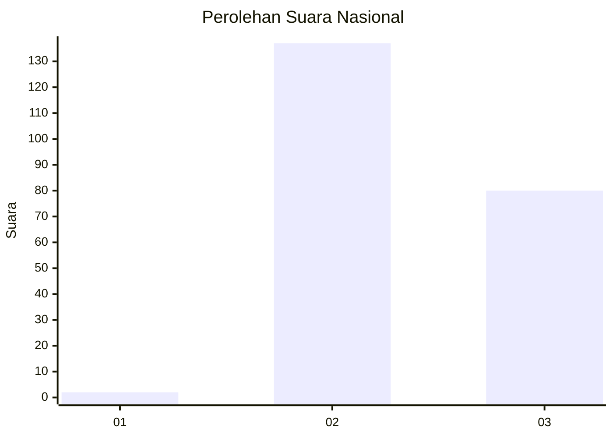
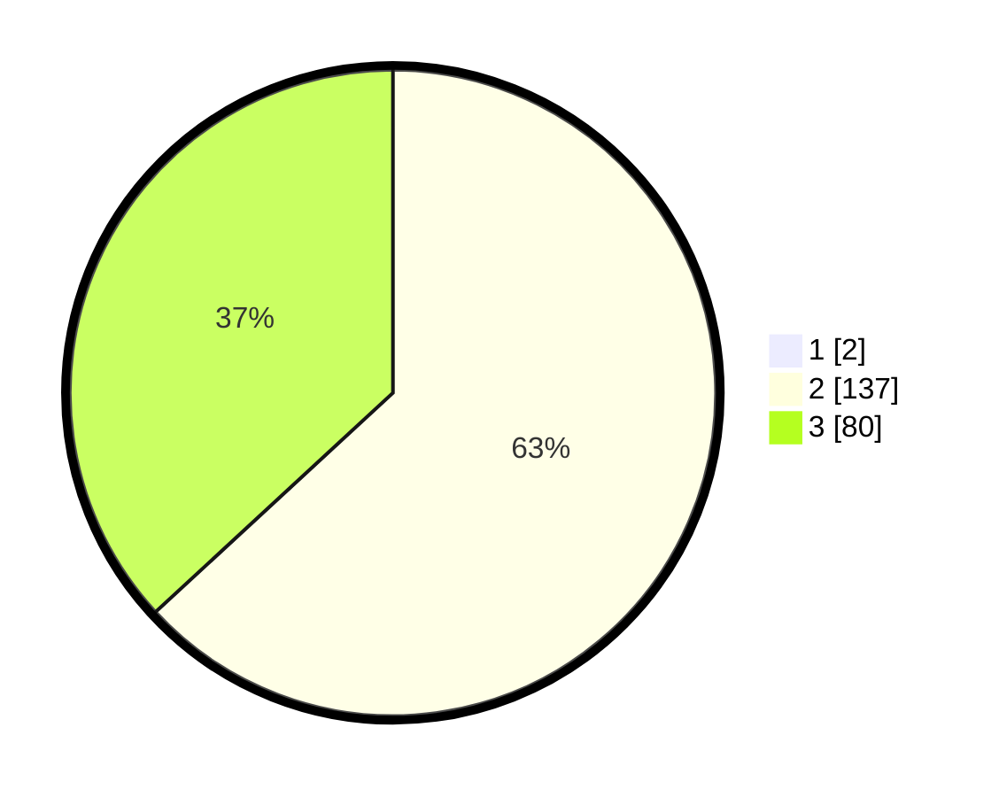

# Hasil

## Grafik

## Tabel

| No. | Nama Paslon    | Suara | Suara (raw) | Persentase |
|:--- |:-------------- | -----:| -----------:| ----------:|
| 1   | ANIES MUHAIMIN | 2     | [2][p-1]    | 0,91       |
| 2   | PRABOWO GIBRAN | 137   | [137][p-2]  | 62,56      |
| 3   | GANJAR MAHFUD  | 80    | [80][p-3]   | 36,53      |

[p-1]: https://github.com/gigit-pemilu/pemilu-2024/blob/main/pilpres/hitung-suara/sub/53-nusa-tenggara-timur/sub/15-manggarai-barat/sub/08-ndoso/sub/2002-tentang/sub/002-tps/sub/paslon-1.txt
[p-2]: https://github.com/gigit-pemilu/pemilu-2024/blob/main/pilpres/hitung-suara/sub/53-nusa-tenggara-timur/sub/15-manggarai-barat/sub/08-ndoso/sub/2002-tentang/sub/002-tps/sub/paslon-2.txt
[p-3]: https://github.com/gigit-pemilu/pemilu-2024/blob/main/pilpres/hitung-suara/sub/53-nusa-tenggara-timur/sub/15-manggarai-barat/sub/08-ndoso/sub/2002-tentang/sub/002-tps/sub/paslon-3.txt

## Foto C Plano

https://sirekap-obj-formc.kpu.go.id/9f04/pemilu/ppwp/53/15/08/20/02/5315082002002-20240219-225639--bb65e13a-9fcd-4a22-a03e-6dfdaeb92ec8.jpg

https://sirekap-obj-formc.kpu.go.id/9f04/pemilu/ppwp/53/15/08/20/02/5315082002002-20240219-225709--372d2e0f-8cfc-41cb-aab8-83c9b91a247e.jpg

https://sirekap-obj-formc.kpu.go.id/9f04/pemilu/ppwp/53/15/08/20/02/5315082002002-20240219-225741--a50606c5-0b5e-4d30-aff9-211772a080f7.jpg

## Metadata

| Key        | Value               |
| ---------- | ------------------- |
| Time Stamp | 2024-02-25 00:00:00 |

