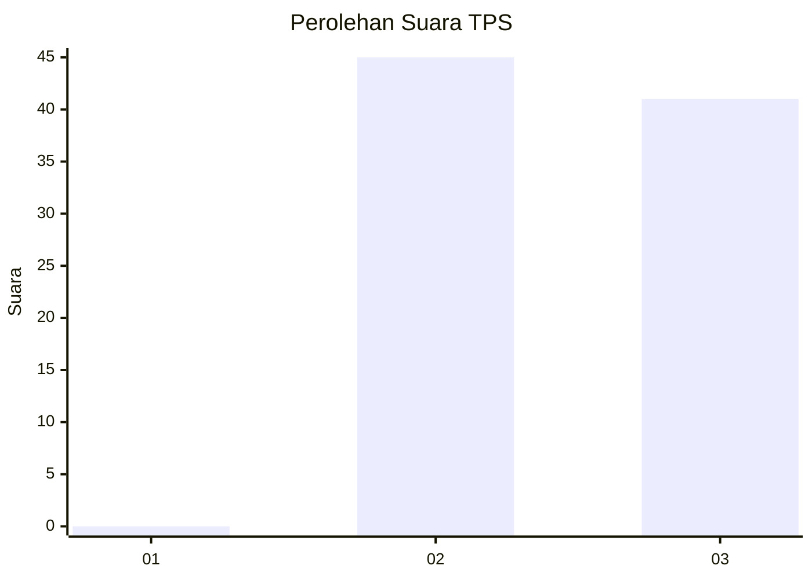
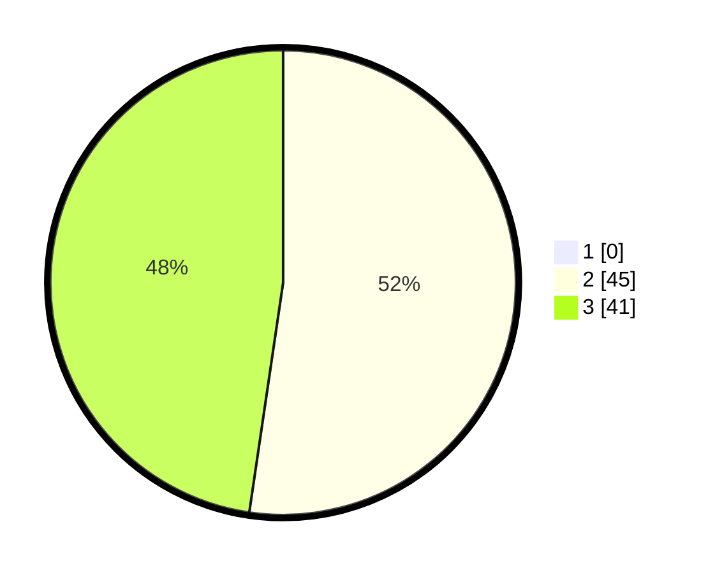

# Hasil

## Grafik

## Tabel

| No. | Nama Paslon    | Suara | Suara (raw) | Persentase |
|:--- |:-------------- | -----:| -----------:| ----------:|
| 1   | ANIES MUHAIMIN | 0     | [0][p-1]    | 0,00       |
| 2   | PRABOWO GIBRAN | 45    | [45][p-2]   | 52,33      |
| 3   | GANJAR MAHFUD  | 41    | [41][p-3]   | 47,67      |

[p-1]: https://github.com/gigit-pemilu/pemilu-2024-53-nusa-tenggara-timur/blob/main/pilpres/hitung-suara/sub/53-nusa-tenggara-timur/sub/15-manggarai-barat/sub/08-ndoso/sub/2005-ndoso/sub/001-tps/sub/paslon-1.txt
[p-2]: https://github.com/gigit-pemilu/pemilu-2024-53-nusa-tenggara-timur/blob/main/pilpres/hitung-suara/sub/53-nusa-tenggara-timur/sub/15-manggarai-barat/sub/08-ndoso/sub/2005-ndoso/sub/001-tps/sub/paslon-2.txt
[p-3]: https://github.com/gigit-pemilu/pemilu-2024-53-nusa-tenggara-timur/blob/main/pilpres/hitung-suara/sub/53-nusa-tenggara-timur/sub/15-manggarai-barat/sub/08-ndoso/sub/2005-ndoso/sub/001-tps/sub/paslon-3.txt

## Foto C Plano

https://sirekap-obj-formc.kpu.go.id/f4b1/pemilu/ppwp/53/15/08/20/05/5315082005001-20240217-194244--45c85d16-7b8e-437e-84ca-20d03b749e8f.jpg

https://sirekap-obj-formc.kpu.go.id/f4b1/pemilu/ppwp/53/15/08/20/05/5315082005001-20240217-194314--5d7d1056-a261-4d62-8716-ee71e9027d19.jpg

https://sirekap-obj-formc.kpu.go.id/f4b1/pemilu/ppwp/53/15/08/20/05/5315082005001-20240217-194356--a1319198-9a57-4977-b64a-746f7a624974.jpg

## Metadata

| Key        | Value               |
| ---------- | ------------------- |
| Time Stamp | 2024-02-19 06:16:00 |

