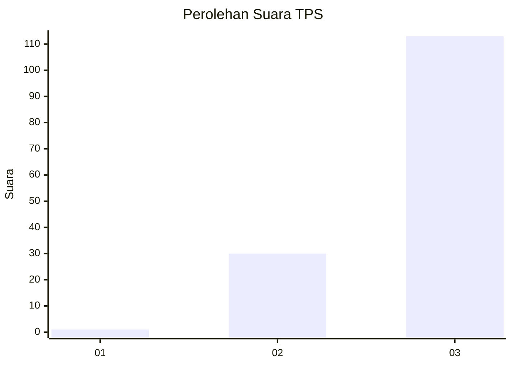
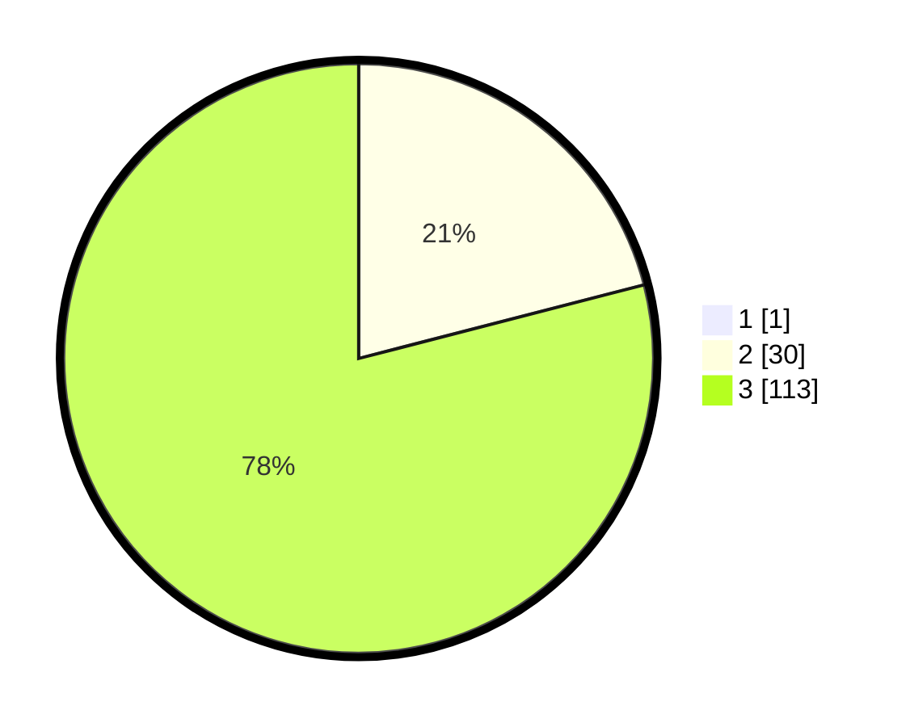

# Hasil

## Grafik

## Tabel

| No. | Nama Paslon    | Suara | Suara (raw) | Persentase |
|:--- |:-------------- | -----:| -----------:| ----------:|
| 1   | ANIES MUHAIMIN | 1     | [1][p-1]    | 0,69       |
| 2   | PRABOWO GIBRAN | 30    | [30][p-2]   | 20,83      |
| 3   | GANJAR MAHFUD  | 113   | [113][p-3]  | 78,47      |

[p-1]: https://github.com/gigit-pemilu/pemilu-2024-53-nusa-tenggara-timur/blob/main/pilpres/hitung-suara/sub/53-nusa-tenggara-timur/sub/15-manggarai-barat/sub/08-ndoso/sub/2005-ndoso/sub/003-tps/sub/paslon-1.txt
[p-2]: https://github.com/gigit-pemilu/pemilu-2024-53-nusa-tenggara-timur/blob/main/pilpres/hitung-suara/sub/53-nusa-tenggara-timur/sub/15-manggarai-barat/sub/08-ndoso/sub/2005-ndoso/sub/003-tps/sub/paslon-2.txt
[p-3]: https://github.com/gigit-pemilu/pemilu-2024-53-nusa-tenggara-timur/blob/main/pilpres/hitung-suara/sub/53-nusa-tenggara-timur/sub/15-manggarai-barat/sub/08-ndoso/sub/2005-ndoso/sub/003-tps/sub/paslon-3.txt

## Foto C Plano

https://sirekap-obj-formc.kpu.go.id/b8e1/pemilu/ppwp/53/15/08/20/05/5315082005003-20240218-122407--802cad64-d539-4e3e-ab16-6001cc6df126.jpg

https://sirekap-obj-formc.kpu.go.id/b8e1/pemilu/ppwp/53/15/08/20/05/5315082005003-20240218-122433--690b4414-c4eb-46b0-98a9-0068c93160ab.jpg

https://sirekap-obj-formc.kpu.go.id/b8e1/pemilu/ppwp/53/15/08/20/05/5315082005003-20240218-122458--e8e6f4c5-4040-4340-91bd-2b55d9f9c319.jpg

## Metadata

| Key        | Value               |
| ---------- | ------------------- |
| Time Stamp | 2024-02-19 06:16:00 |

