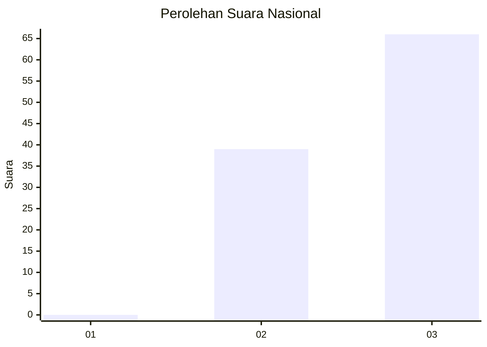
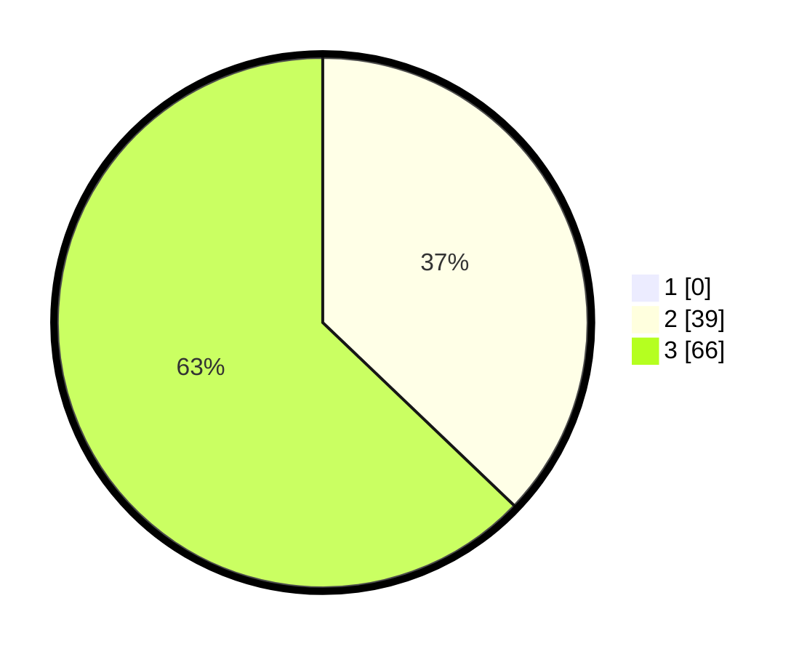

# Hasil

## Grafik

## Tabel

| No. | Nama Paslon    | Suara | Suara (raw) | Persentase |
|:--- |:-------------- | -----:| -----------:| ----------:|
| 1   | ANIES MUHAIMIN | 0     | [0][p-1]    | 0,00       |
| 2   | PRABOWO GIBRAN | 39    | [39][p-2]   | 37,14      |
| 3   | GANJAR MAHFUD  | 66    | [66][p-3]   | 62,86      |

[p-1]: https://github.com/gigit-pemilu/pemilu-2024/blob/main/pilpres/hitung-suara/sub/53-nusa-tenggara-timur/sub/15-manggarai-barat/sub/08-ndoso/sub/2007-wae-buka/sub/003-tps/sub/paslon-1.txt
[p-2]: https://github.com/gigit-pemilu/pemilu-2024/blob/main/pilpres/hitung-suara/sub/53-nusa-tenggara-timur/sub/15-manggarai-barat/sub/08-ndoso/sub/2007-wae-buka/sub/003-tps/sub/paslon-2.txt
[p-3]: https://github.com/gigit-pemilu/pemilu-2024/blob/main/pilpres/hitung-suara/sub/53-nusa-tenggara-timur/sub/15-manggarai-barat/sub/08-ndoso/sub/2007-wae-buka/sub/003-tps/sub/paslon-3.txt

## Foto C Plano

https://sirekap-obj-formc.kpu.go.id/feca/pemilu/ppwp/53/15/08/20/07/5315082007003-20240218-153326--3386efab-8627-4f9e-91ff-d10104ef47df.jpg

https://sirekap-obj-formc.kpu.go.id/feca/pemilu/ppwp/53/15/08/20/07/5315082007003-20240218-153414--b17b44b6-febd-4869-a382-9de2b2f996e9.jpg

https://sirekap-obj-formc.kpu.go.id/feca/pemilu/ppwp/53/15/08/20/07/5315082007003-20240218-153447--896b2ac2-3796-4696-9b1a-be0f287f0bd5.jpg

## Metadata

| Key        | Value               |
| ---------- | ------------------- |
| Time Stamp | 2024-02-25 21:00:00 |

