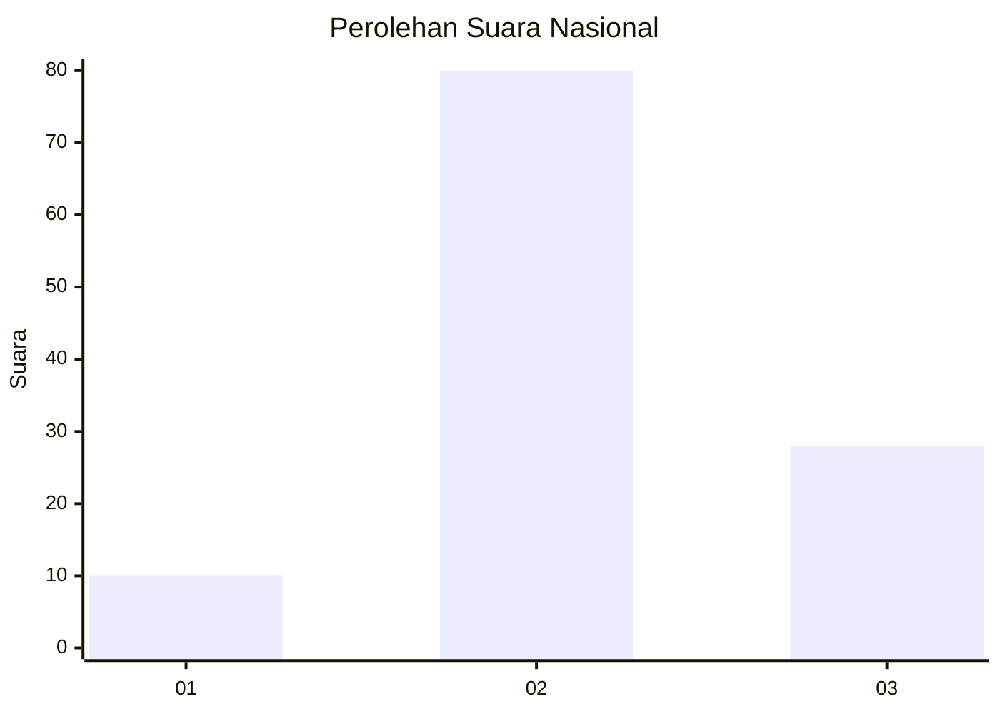
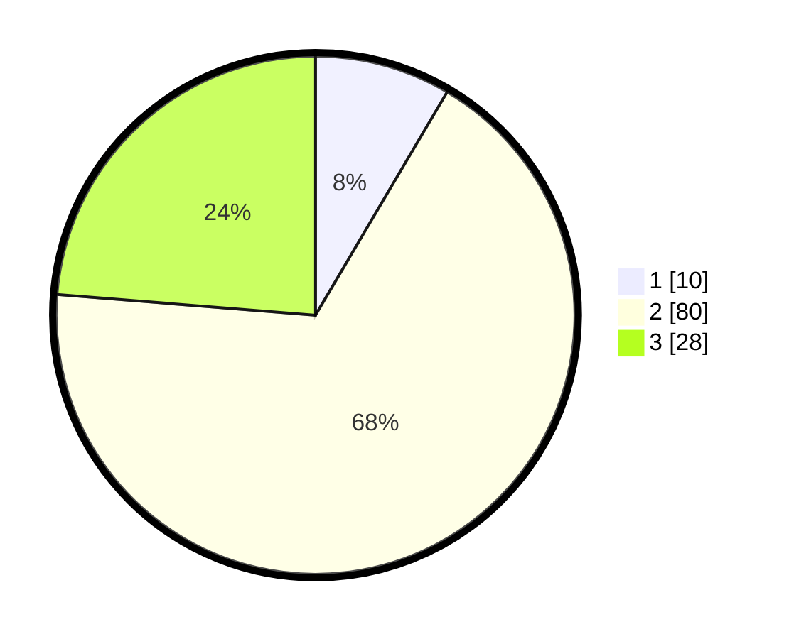

# Hasil

## Grafik

## Tabel

| No. | Nama Paslon    | Suara | Suara (raw) | Persentase |
|:--- |:-------------- | -----:| -----------:| ----------:|
| 1   | ANIES MUHAIMIN | 10    | [10][p-1]   | 8,47       |
| 2   | PRABOWO GIBRAN | 80    | [80][p-2]   | 67,80      |
| 3   | GANJAR MAHFUD  | 28    | [28][p-3]   | 23,73      |

[p-1]: https://github.com/gigit-pemilu/pemilu-2024/blob/main/pilpres/hitung-suara/sub/53-nusa-tenggara-timur/sub/15-manggarai-barat/sub/09-lembor-selatan/sub/2001-repi/sub/001-tps/sub/paslon-1.txt
[p-2]: https://github.com/gigit-pemilu/pemilu-2024/blob/main/pilpres/hitung-suara/sub/53-nusa-tenggara-timur/sub/15-manggarai-barat/sub/09-lembor-selatan/sub/2001-repi/sub/001-tps/sub/paslon-2.txt
[p-3]: https://github.com/gigit-pemilu/pemilu-2024/blob/main/pilpres/hitung-suara/sub/53-nusa-tenggara-timur/sub/15-manggarai-barat/sub/09-lembor-selatan/sub/2001-repi/sub/001-tps/sub/paslon-3.txt

## Foto C Plano

https://sirekap-obj-formc.kpu.go.id/61b7/pemilu/ppwp/53/15/09/20/01/5315092001001-20240220-081018--04f62a11-556f-40ad-bc3e-f40354884199.jpg

https://sirekap-obj-formc.kpu.go.id/61b7/pemilu/ppwp/53/15/09/20/01/5315092001001-20240220-081137--7472c4e3-dc53-4ecf-8972-1cd2521c3312.jpg

https://sirekap-obj-formc.kpu.go.id/61b7/pemilu/ppwp/53/15/09/20/01/5315092001001-20240220-081238--d87c5799-9e6c-48b6-89f6-d75f6b235577.jpg

## Metadata

| Key        | Value               |
| ---------- | ------------------- |
| Time Stamp | 2024-02-24 22:31:28 |

