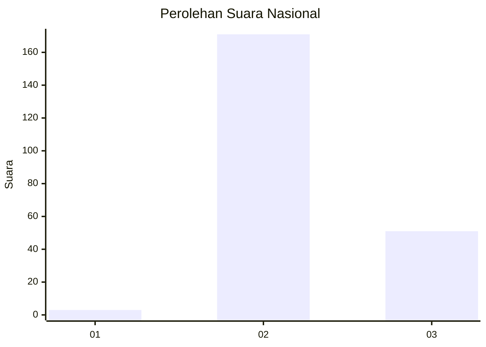
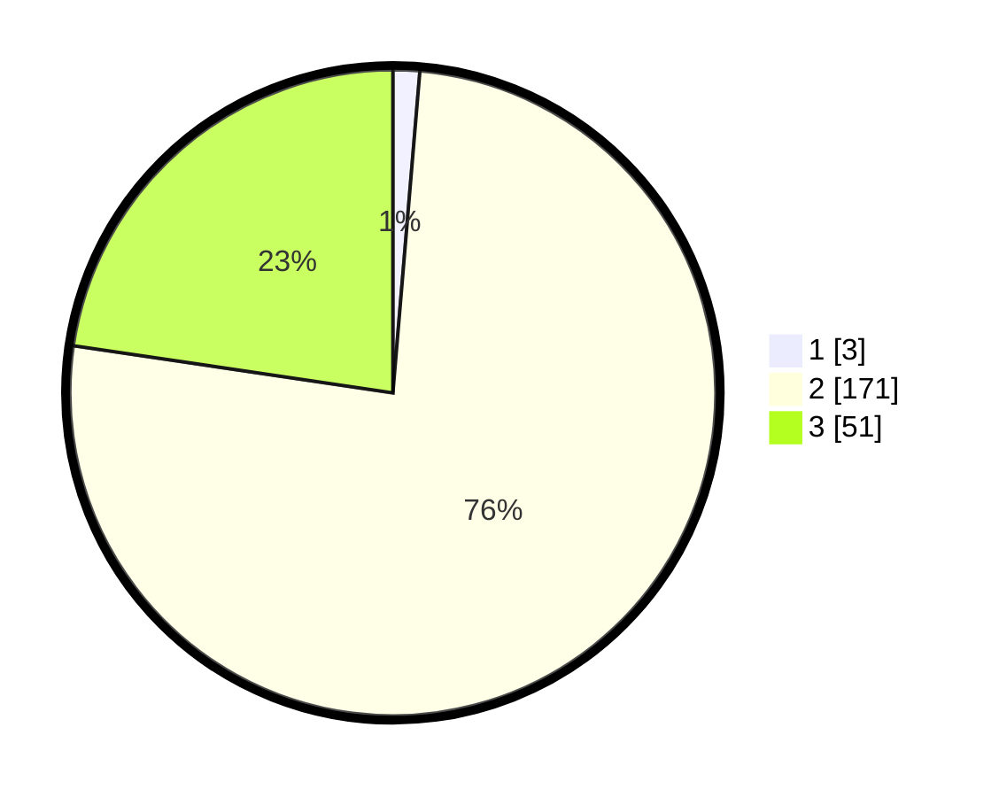

# Hasil

## Grafik

## Tabel

| No. | Nama Paslon    | Suara | Suara (raw) | Persentase |
|:--- |:-------------- | -----:| -----------:| ----------:|
| 1   | ANIES MUHAIMIN | 3     | [3][p-1]    | 1,33       |
| 2   | PRABOWO GIBRAN | 171   | [171][p-2]  | 76,00      |
| 3   | GANJAR MAHFUD  | 51    | [51][p-3]   | 22,67      |

[p-1]: https://github.com/gigit-pemilu/pemilu-2024/blob/main/pilpres/hitung-suara/sub/53-nusa-tenggara-timur/sub/15-manggarai-barat/sub/09-lembor-selatan/sub/2001-repi/sub/002-tps/sub/paslon-1.txt
[p-2]: https://github.com/gigit-pemilu/pemilu-2024/blob/main/pilpres/hitung-suara/sub/53-nusa-tenggara-timur/sub/15-manggarai-barat/sub/09-lembor-selatan/sub/2001-repi/sub/002-tps/sub/paslon-2.txt
[p-3]: https://github.com/gigit-pemilu/pemilu-2024/blob/main/pilpres/hitung-suara/sub/53-nusa-tenggara-timur/sub/15-manggarai-barat/sub/09-lembor-selatan/sub/2001-repi/sub/002-tps/sub/paslon-3.txt

## Foto C Plano

https://sirekap-obj-formc.kpu.go.id/1a15/pemilu/ppwp/53/15/09/20/01/5315092001002-20240220-090319--b46ab8a2-f715-4454-9470-bfe5fe1acb2b.jpg

https://sirekap-obj-formc.kpu.go.id/1a15/pemilu/ppwp/53/15/09/20/01/5315092001002-20240220-090403--a7ade8eb-11a9-41e6-9233-c6980ddbb5cd.jpg

https://sirekap-obj-formc.kpu.go.id/1a15/pemilu/ppwp/53/15/09/20/01/5315092001002-20240220-090448--f2be1d51-9107-4e84-8162-f75518b7fd75.jpg

## Metadata

| Key        | Value               |
| ---------- | ------------------- |
| Time Stamp | 2024-02-25 21:00:00 |

