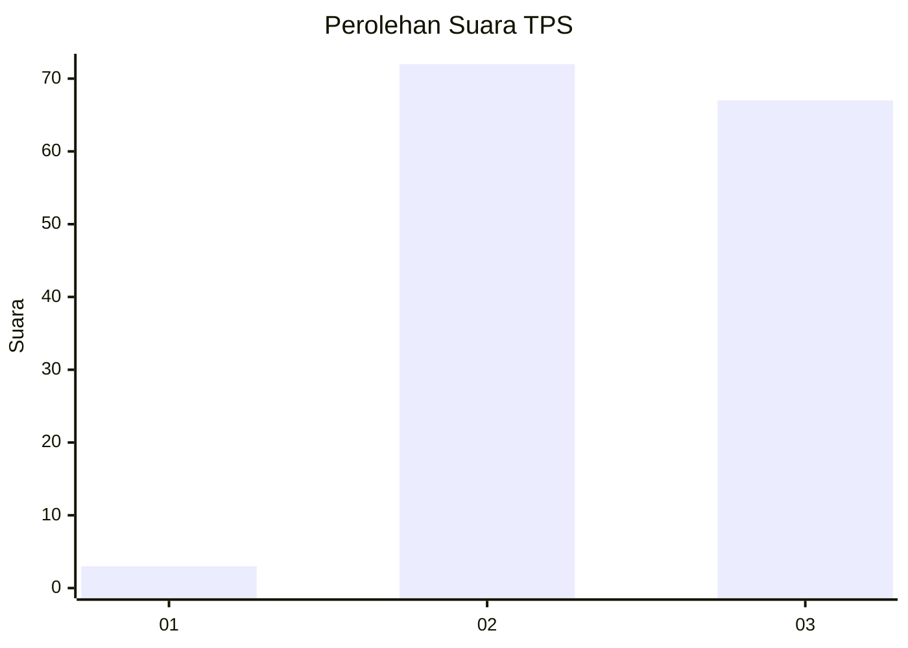
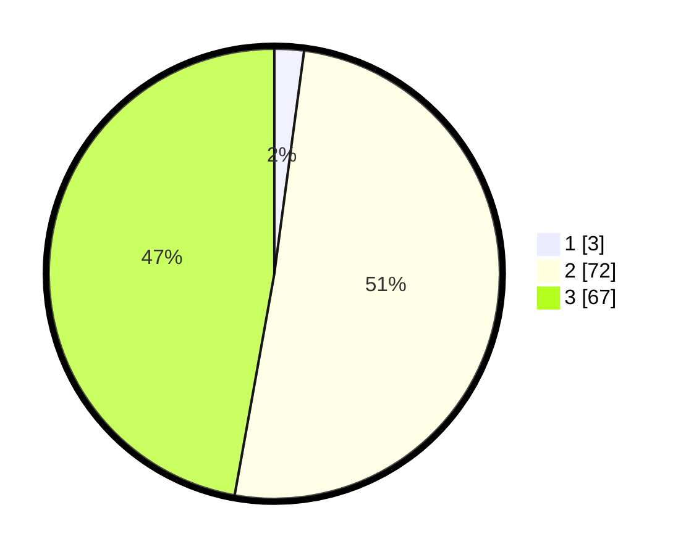

# Hasil

## Grafik

## Tabel

| No. | Nama Paslon    | Suara | Suara (raw) | Persentase |
|:--- |:-------------- | -----:| -----------:| ----------:|
| 1   | ANIES MUHAIMIN | 3     | [3][p-1]    | 2,11       |
| 2   | PRABOWO GIBRAN | 72    | [72][p-2]   | 50,70      |
| 3   | GANJAR MAHFUD  | 67    | [67][p-3]   | 47,18      |

[p-1]: https://github.com/gigit-pemilu/pemilu-2024-53-nusa-tenggara-timur/blob/main/pilpres/hitung-suara/sub/53-nusa-tenggara-timur/sub/15-manggarai-barat/sub/09-lembor-selatan/sub/2001-repi/sub/003-tps/sub/paslon-1.txt
[p-2]: https://github.com/gigit-pemilu/pemilu-2024-53-nusa-tenggara-timur/blob/main/pilpres/hitung-suara/sub/53-nusa-tenggara-timur/sub/15-manggarai-barat/sub/09-lembor-selatan/sub/2001-repi/sub/003-tps/sub/paslon-2.txt
[p-3]: https://github.com/gigit-pemilu/pemilu-2024-53-nusa-tenggara-timur/blob/main/pilpres/hitung-suara/sub/53-nusa-tenggara-timur/sub/15-manggarai-barat/sub/09-lembor-selatan/sub/2001-repi/sub/003-tps/sub/paslon-3.txt

## Foto C Plano

https://sirekap-obj-formc.kpu.go.id/28a4/pemilu/ppwp/53/15/09/20/01/5315092001003-20240220-091801--e07da964-d97e-4a59-96a6-d5d4790c891a.jpg

https://sirekap-obj-formc.kpu.go.id/28a4/pemilu/ppwp/53/15/09/20/01/5315092001003-20240220-091902--a0b26403-cfd4-4bc1-b8e1-d606f75d9099.jpg

https://sirekap-obj-formc.kpu.go.id/28a4/pemilu/ppwp/53/15/09/20/01/5315092001003-20240220-091942--97009e8c-eabf-47a8-833b-432c0a65501e.jpg

## Metadata

| Key        | Value               |
| ---------- | ------------------- |
| Time Stamp | 2024-02-25 12:00:00 |

