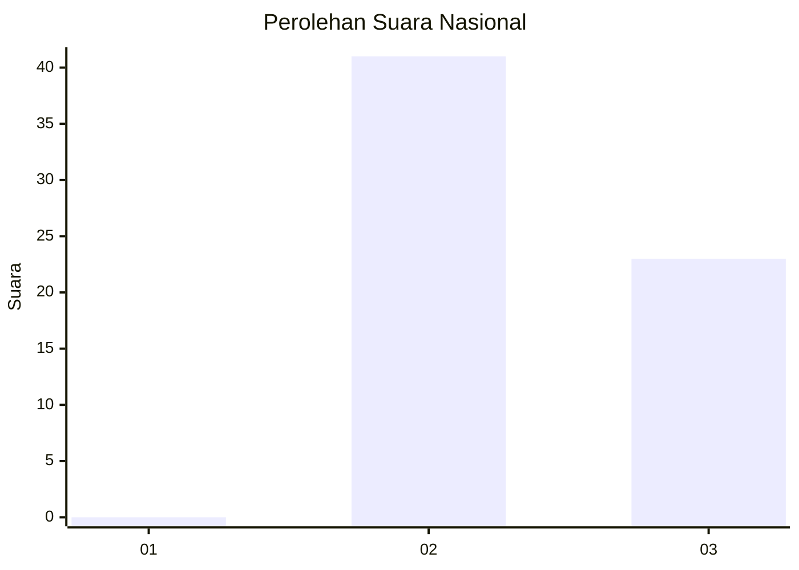
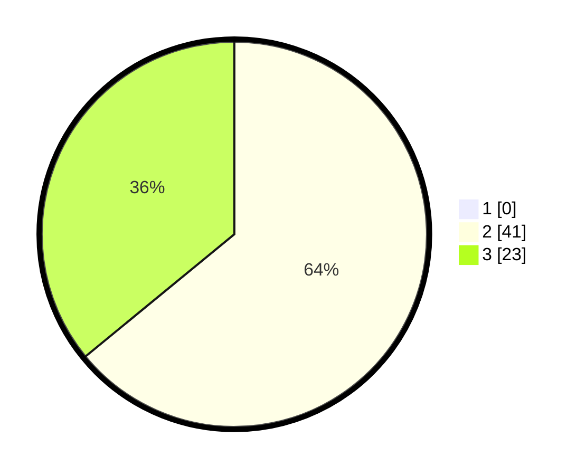

# Hasil

## Grafik

## Tabel

| No. | Nama Paslon    | Suara | Suara (raw) | Persentase |
|:--- |:-------------- | -----:| -----------:| ----------:|
| 1   | ANIES MUHAIMIN | 0     | [0][p-1]    | 0,00       |
| 2   | PRABOWO GIBRAN | 41    | [41][p-2]   | 64,06      |
| 3   | GANJAR MAHFUD  | 23    | [23][p-3]   | 35,94      |

[p-1]: https://github.com/gigit-pemilu/pemilu-2024/blob/main/pilpres/hitung-suara/sub/53-nusa-tenggara-timur/sub/15-manggarai-barat/sub/09-lembor-selatan/sub/2001-repi/sub/006-tps/sub/paslon-1.txt
[p-2]: https://github.com/gigit-pemilu/pemilu-2024/blob/main/pilpres/hitung-suara/sub/53-nusa-tenggara-timur/sub/15-manggarai-barat/sub/09-lembor-selatan/sub/2001-repi/sub/006-tps/sub/paslon-2.txt
[p-3]: https://github.com/gigit-pemilu/pemilu-2024/blob/main/pilpres/hitung-suara/sub/53-nusa-tenggara-timur/sub/15-manggarai-barat/sub/09-lembor-selatan/sub/2001-repi/sub/006-tps/sub/paslon-3.txt

## Foto C Plano

https://sirekap-obj-formc.kpu.go.id/15ad/pemilu/ppwp/53/15/09/20/01/5315092001006-20240220-102021--f11343dc-f301-45b3-906b-c2463594fa0c.jpg

https://sirekap-obj-formc.kpu.go.id/15ad/pemilu/ppwp/53/15/09/20/01/5315092001006-20240220-102050--187a79c4-9e09-4e91-9521-cbffcc9d5cf3.jpg

https://sirekap-obj-formc.kpu.go.id/15ad/pemilu/ppwp/53/15/09/20/01/5315092001006-20240220-102437--4caef809-ad7e-43ff-ab81-292c706a8bec.jpg

## Metadata

| Key        | Value               |
| ---------- | ------------------- |
| Time Stamp | 2024-02-25 15:00:00 |

