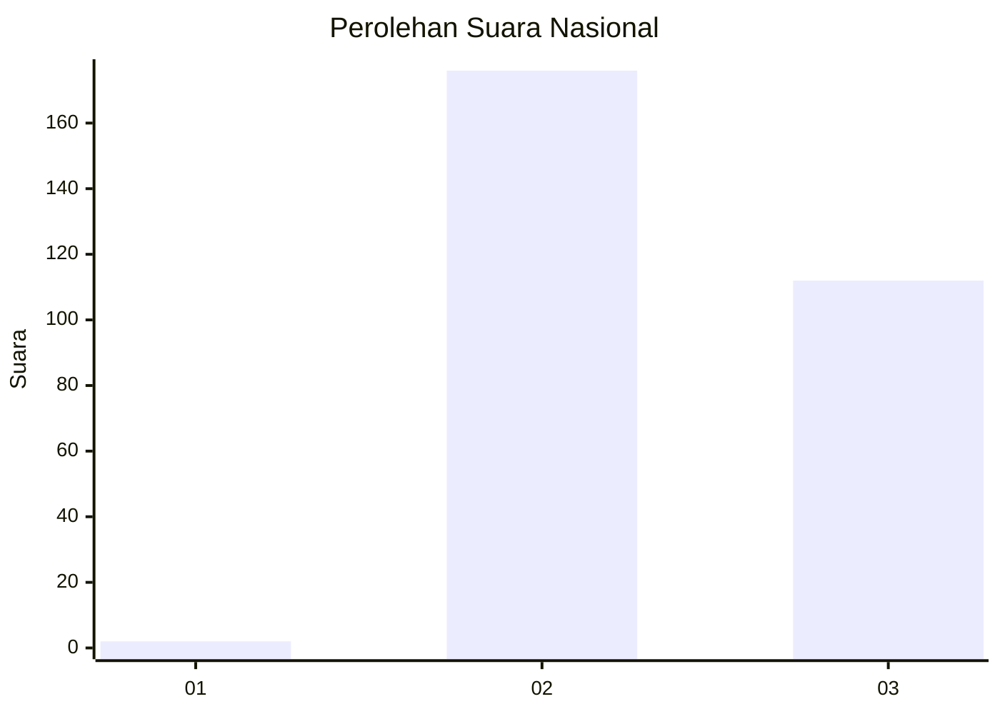
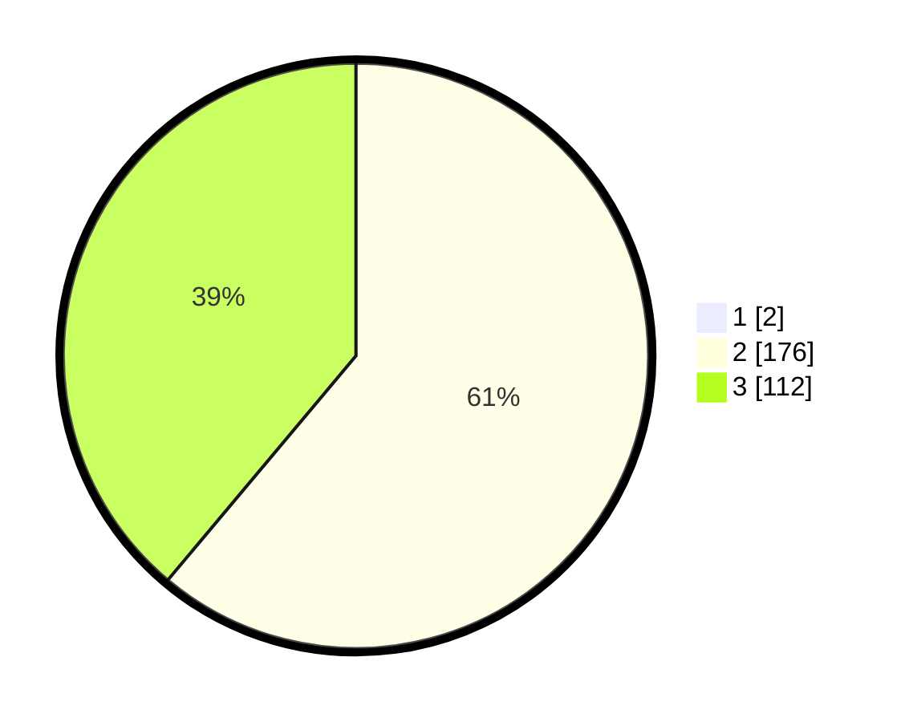

# Hasil

## Grafik

## Tabel

| No. | Nama Paslon    | Suara | Suara (raw) | Persentase |
|:--- |:-------------- | -----:| -----------:| ----------:|
| 1   | ANIES MUHAIMIN | 2     | [2][p-1]    | 0,69       |
| 2   | PRABOWO GIBRAN | 176   | [176][p-2]  | 60,69      |
| 3   | GANJAR MAHFUD  | 112   | [112][p-3]  | 38,62      |

[p-1]: https://github.com/gigit-pemilu/pemilu-2024/blob/main/pilpres/hitung-suara/sub/53-nusa-tenggara-timur/sub/15-manggarai-barat/sub/09-lembor-selatan/sub/2007-wae-mose/sub/001-tps/sub/paslon-1.txt
[p-2]: https://github.com/gigit-pemilu/pemilu-2024/blob/main/pilpres/hitung-suara/sub/53-nusa-tenggara-timur/sub/15-manggarai-barat/sub/09-lembor-selatan/sub/2007-wae-mose/sub/001-tps/sub/paslon-2.txt
[p-3]: https://github.com/gigit-pemilu/pemilu-2024/blob/main/pilpres/hitung-suara/sub/53-nusa-tenggara-timur/sub/15-manggarai-barat/sub/09-lembor-selatan/sub/2007-wae-mose/sub/001-tps/sub/paslon-3.txt

## Foto C Plano

https://sirekap-obj-formc.kpu.go.id/92e9/pemilu/ppwp/53/15/09/20/07/5315092007001-20240215-115307--1df5be7f-7f47-4b50-b182-a41e6a726726.jpg

https://sirekap-obj-formc.kpu.go.id/92e9/pemilu/ppwp/53/15/09/20/07/5315092007001-20240214-141936--2992bb9b-84aa-471f-9074-b49a2368f364.jpg

https://sirekap-obj-formc.kpu.go.id/92e9/pemilu/ppwp/53/15/09/20/07/5315092007001-20240214-185509--b7334061-d57f-4a72-9c5f-7e5d6f4c99cb.jpg

## Metadata

| Key        | Value               |
| ---------- | ------------------- |
| Time Stamp | 2024-02-15 12:00:28 |

