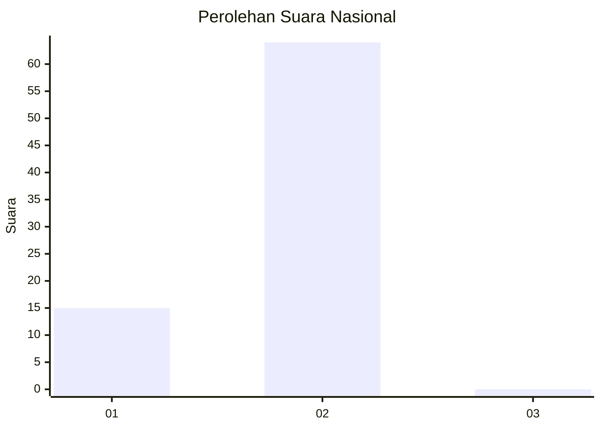
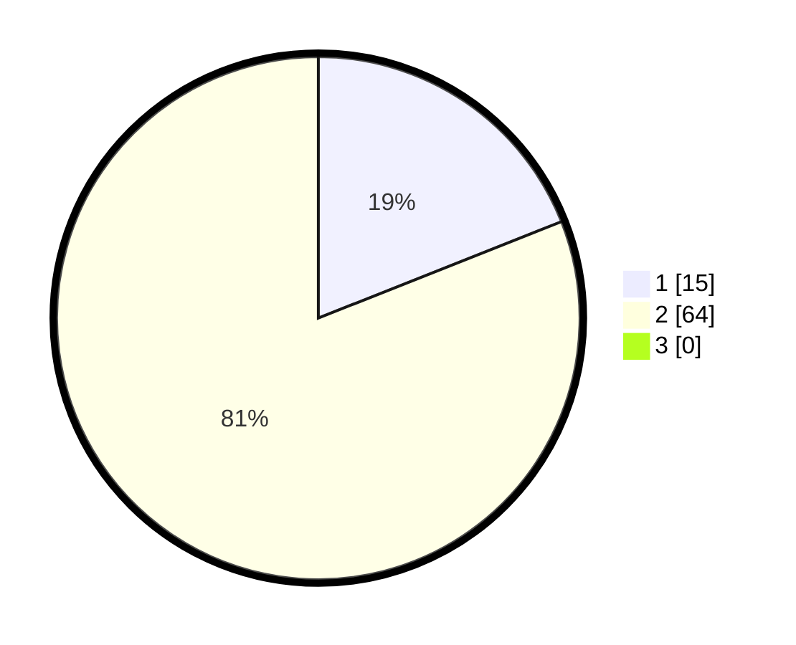

# Hasil

## Grafik

## Tabel

| No. | Nama Paslon    | Suara | Suara (raw) | Persentase |
|:--- |:-------------- | -----:| -----------:| ----------:|
| 1   | ANIES MUHAIMIN | 15    | [15][p-1]   | 18,99      |
| 2   | PRABOWO GIBRAN | 64    | [64][p-2]   | 81,01      |
| 3   | GANJAR MAHFUD  | 0     | [0][p-3]    | 0,00       |

[p-1]: https://github.com/gigit-pemilu/pemilu-2024/blob/main/pilpres/hitung-suara/sub/53-nusa-tenggara-timur/sub/15-manggarai-barat/sub/09-lembor-selatan/sub/2009-nanga-bere/sub/005-tps/sub/paslon-1.txt
[p-2]: https://github.com/gigit-pemilu/pemilu-2024/blob/main/pilpres/hitung-suara/sub/53-nusa-tenggara-timur/sub/15-manggarai-barat/sub/09-lembor-selatan/sub/2009-nanga-bere/sub/005-tps/sub/paslon-2.txt
[p-3]: https://github.com/gigit-pemilu/pemilu-2024/blob/main/pilpres/hitung-suara/sub/53-nusa-tenggara-timur/sub/15-manggarai-barat/sub/09-lembor-selatan/sub/2009-nanga-bere/sub/005-tps/sub/paslon-3.txt

## Foto C Plano

https://sirekap-obj-formc.kpu.go.id/f544/pemilu/ppwp/53/15/09/20/09/5315092009005-20240221-122001--13131c2f-4bc2-403d-b8b7-a67c3deccb97.jpg

https://sirekap-obj-formc.kpu.go.id/f544/pemilu/ppwp/53/15/09/20/09/5315092009005-20240221-122132--69b46fb5-249c-430e-8754-72a451ab9a48.jpg

https://sirekap-obj-formc.kpu.go.id/f544/pemilu/ppwp/53/15/09/20/09/5315092009005-20240221-122229--97ebb8de-7cfc-4eae-9679-945d3f9e3f72.jpg

## Metadata

| Key        | Value               |
| ---------- | ------------------- |
| Time Stamp | 2024-02-25 15:00:00 |

