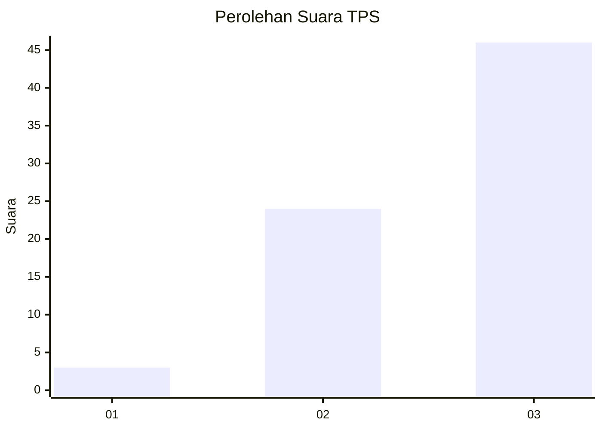
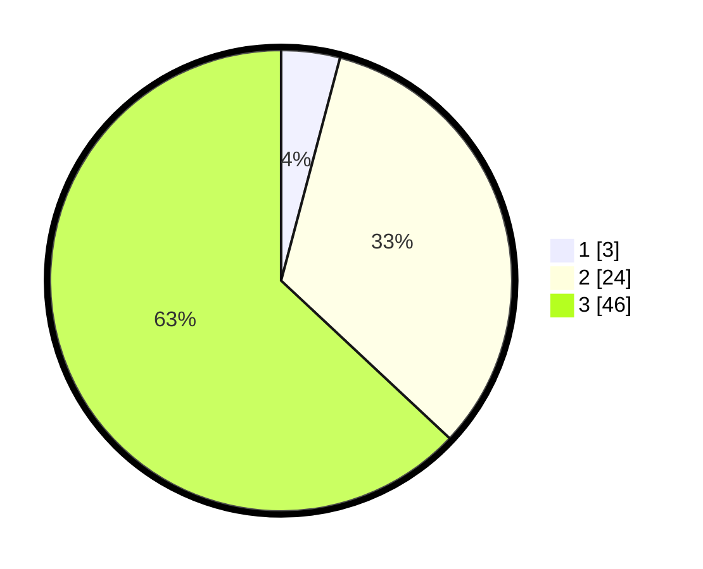

# Hasil

## Grafik

## Tabel

| No. | Nama Paslon    | Suara | Suara (raw) | Persentase |
|:--- |:-------------- | -----:| -----------:| ----------:|
| 1   | ANIES MUHAIMIN | 3     | [3][p-1]    | 4,11       |
| 2   | PRABOWO GIBRAN | 24    | [24][p-2]   | 32,88      |
| 3   | GANJAR MAHFUD  | 46    | [46][p-3]   | 63,01      |

[p-1]: https://github.com/gigit-pemilu/pemilu-2024-53-nusa-tenggara-timur/blob/main/pilpres/hitung-suara/sub/53-nusa-tenggara-timur/sub/15-manggarai-barat/sub/11-pacar/sub/2005-waka/sub/003-tps/sub/paslon-1.txt
[p-2]: https://github.com/gigit-pemilu/pemilu-2024-53-nusa-tenggara-timur/blob/main/pilpres/hitung-suara/sub/53-nusa-tenggara-timur/sub/15-manggarai-barat/sub/11-pacar/sub/2005-waka/sub/003-tps/sub/paslon-2.txt
[p-3]: https://github.com/gigit-pemilu/pemilu-2024-53-nusa-tenggara-timur/blob/main/pilpres/hitung-suara/sub/53-nusa-tenggara-timur/sub/15-manggarai-barat/sub/11-pacar/sub/2005-waka/sub/003-tps/sub/paslon-3.txt

## Foto C Plano

https://sirekap-obj-formc.kpu.go.id/debe/pemilu/ppwp/53/15/11/20/05/5315112005003-20240215-163850--6dd415c2-d2d3-4a4a-8c95-d40ffe0d54aa.jpg

https://sirekap-obj-formc.kpu.go.id/debe/pemilu/ppwp/53/15/11/20/05/5315112005003-20240215-163503--9693518d-6453-42a6-bca8-69759dbeb0fa.jpg

https://sirekap-obj-formc.kpu.go.id/debe/pemilu/ppwp/53/15/11/20/05/5315112005003-20240215-163639--036e33c9-8714-4a42-9683-027ca98012b2.jpg

## Metadata

| Key        | Value               |
| ---------- | ------------------- |
| Time Stamp | 2024-02-15 23:29:50 |

