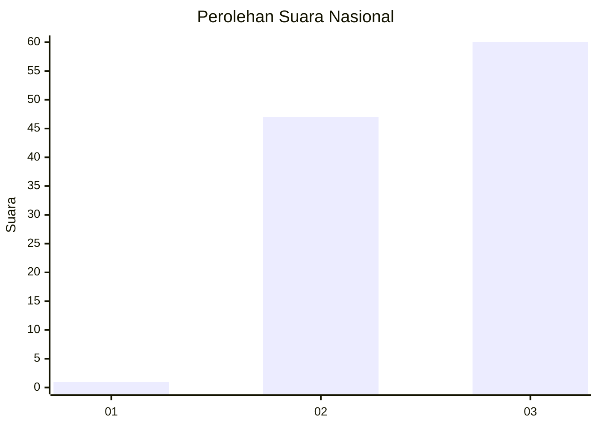
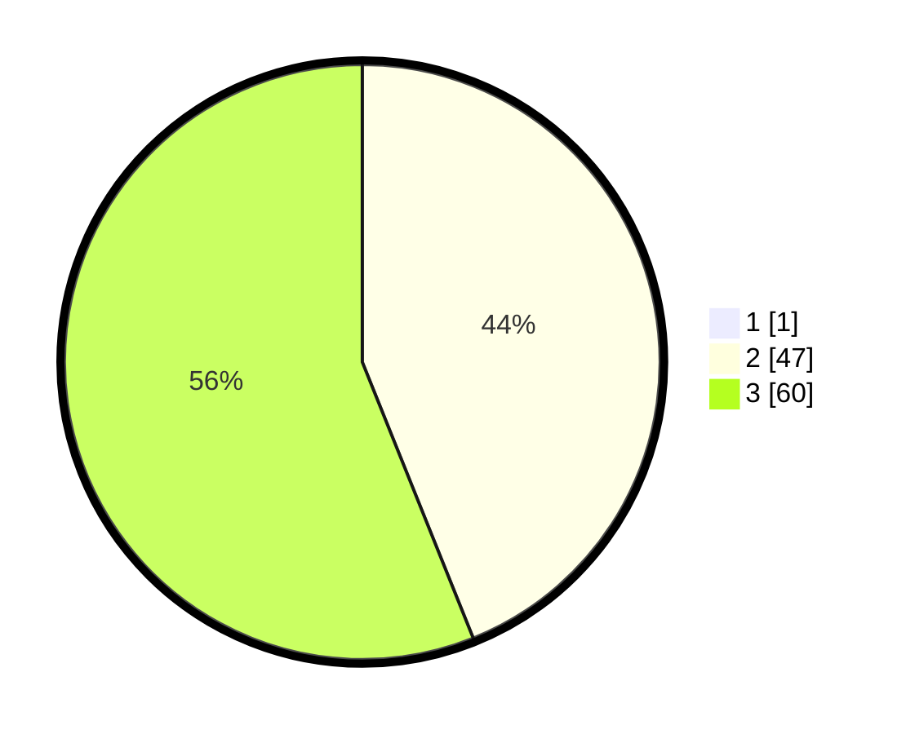

# Hasil

## Grafik

## Tabel

| No. | Nama Paslon    | Suara | Suara (raw) | Persentase |
|:--- |:-------------- | -----:| -----------:| ----------:|
| 1   | ANIES MUHAIMIN | 1     | [1][p-1]    | 0,93       |
| 2   | PRABOWO GIBRAN | 47    | [47][p-2]   | 43,52      |
| 3   | GANJAR MAHFUD  | 60    | [60][p-3]   | 55,56      |

[p-1]: https://github.com/gigit-pemilu/pemilu-2024/blob/main/pilpres/hitung-suara/sub/53-nusa-tenggara-timur/sub/15-manggarai-barat/sub/11-pacar/sub/2009-golo-lajang/sub/005-tps/sub/paslon-1.txt
[p-2]: https://github.com/gigit-pemilu/pemilu-2024/blob/main/pilpres/hitung-suara/sub/53-nusa-tenggara-timur/sub/15-manggarai-barat/sub/11-pacar/sub/2009-golo-lajang/sub/005-tps/sub/paslon-2.txt
[p-3]: https://github.com/gigit-pemilu/pemilu-2024/blob/main/pilpres/hitung-suara/sub/53-nusa-tenggara-timur/sub/15-manggarai-barat/sub/11-pacar/sub/2009-golo-lajang/sub/005-tps/sub/paslon-3.txt

## Foto C Plano

https://sirekap-obj-formc.kpu.go.id/2473/pemilu/ppwp/53/15/11/20/09/5315112009005-20240215-052337--07f3b88d-758e-4321-898f-543d2a16e71c.jpg

https://sirekap-obj-formc.kpu.go.id/2473/pemilu/ppwp/53/15/11/20/09/5315112009005-20240215-052734--76d2e723-c7f0-4c0f-89b6-5a7fcff96d65.jpg

https://sirekap-obj-formc.kpu.go.id/2473/pemilu/ppwp/53/15/11/20/09/5315112009005-20240215-052911--9c2cc809-aad1-432e-a668-9d933b1e288a.jpg

## Metadata

| Key        | Value               |
| ---------- | ------------------- |
| Time Stamp | 2024-02-15 21:30:27 |

## DATA PEMILIH TETAP

Jumlah pemilih dalam DPT: **143**.
 * L: **83**.
 * P: **60**.

## DATA PENGGUNA HAK PILIH

Jumlah pengguna hak pilih dalam DPT: **102**.
 * L: **23**.
 * P: **58**.

Jumlah pengguna hak pilih dalam DPTb: **3**.
 * L: **83**.
 * P: **0**.

Jumlah pengguna hak pilih dalam DPK: **800**.
 * L: **8**.
 * P: **0**.

Jumlah pengguna hak pilih: **105**.
 * L: **52**.
 * P: **73**.

## JUMLAH SUARA SAH DAN TIDAK SAH

JUMLAH SELURUH SUARA SAH: **102**.

JUMLAH SUARA TIDAK SAH: **3**.

JUMLAH SELURUH SUARA SAH DAN SUARA TIDAK SAH: **105**.

