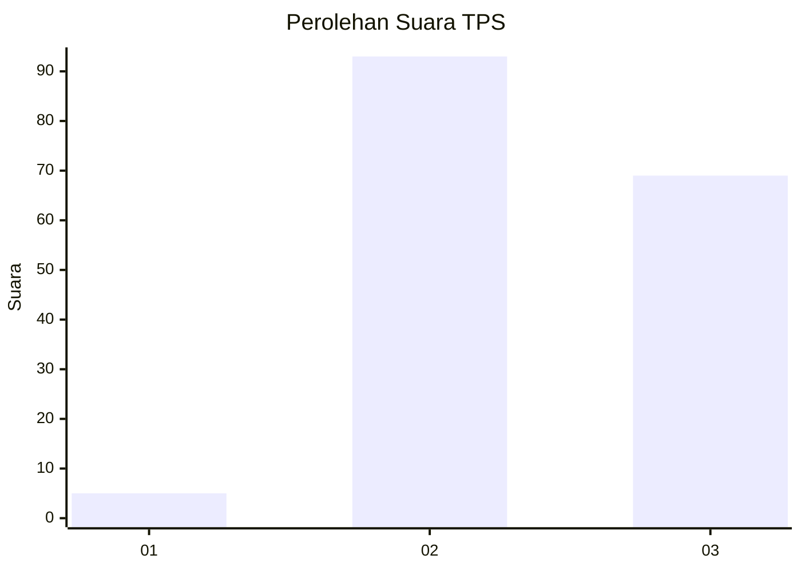
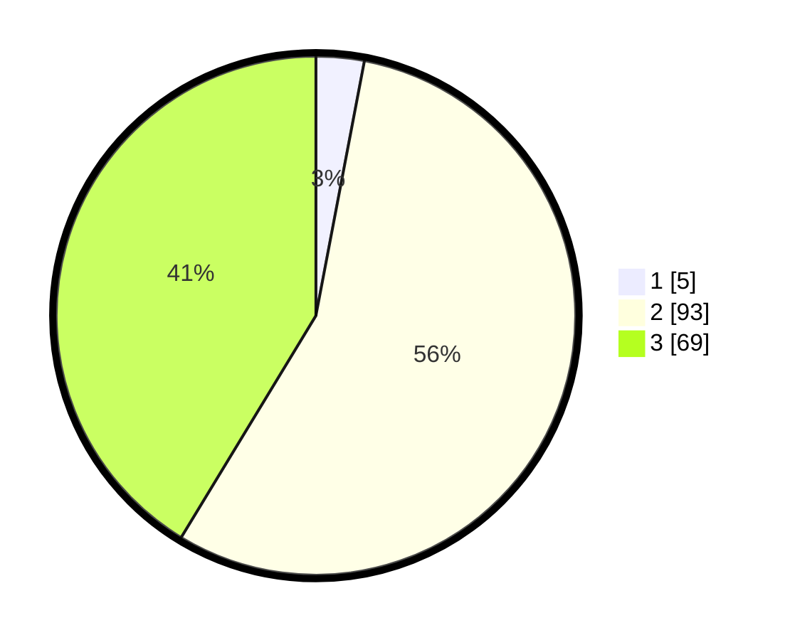

# Hasil

## Grafik

## Tabel

| No. | Nama Paslon    | Suara | Suara (raw) | Persentase |
|:--- |:-------------- | -----:| -----------:| ----------:|
| 1   | ANIES MUHAIMIN | 5     | [5][p-1]    | 2,99       |
| 2   | PRABOWO GIBRAN | 93    | [93][p-2]   | 55,69      |
| 3   | GANJAR MAHFUD  | 69    | [69][p-3]   | 41,32      |

[p-1]: https://github.com/gigit-pemilu/pemilu-2024-53-nusa-tenggara-timur/blob/main/pilpres/hitung-suara/sub/53-nusa-tenggara-timur/sub/16-nagekeo/sub/01-aesesa/sub/1001-dhawe/sub/001-tps/sub/paslon-1.txt
[p-2]: https://github.com/gigit-pemilu/pemilu-2024-53-nusa-tenggara-timur/blob/main/pilpres/hitung-suara/sub/53-nusa-tenggara-timur/sub/16-nagekeo/sub/01-aesesa/sub/1001-dhawe/sub/001-tps/sub/paslon-2.txt
[p-3]: https://github.com/gigit-pemilu/pemilu-2024-53-nusa-tenggara-timur/blob/main/pilpres/hitung-suara/sub/53-nusa-tenggara-timur/sub/16-nagekeo/sub/01-aesesa/sub/1001-dhawe/sub/001-tps/sub/paslon-3.txt

## Foto C Plano

https://sirekap-obj-formc.kpu.go.id/1262/pemilu/ppwp/53/16/01/10/01/5316011001001-20240215-102554--12a64dd6-8496-43e8-9ac1-121849249b07.jpg

https://sirekap-obj-formc.kpu.go.id/1262/pemilu/ppwp/53/16/01/10/01/5316011001001-20240215-102748--227c0e5d-bc28-44e0-bd9f-15c134000ee2.jpg

https://sirekap-obj-formc.kpu.go.id/1262/pemilu/ppwp/53/16/01/10/01/5316011001001-20240215-102911--e1133140-def1-4f19-980a-b38ee65a908b.jpg

## Metadata

| Key        | Value               |
| ---------- | ------------------- |
| Time Stamp | 2024-02-15 21:01:18 |

