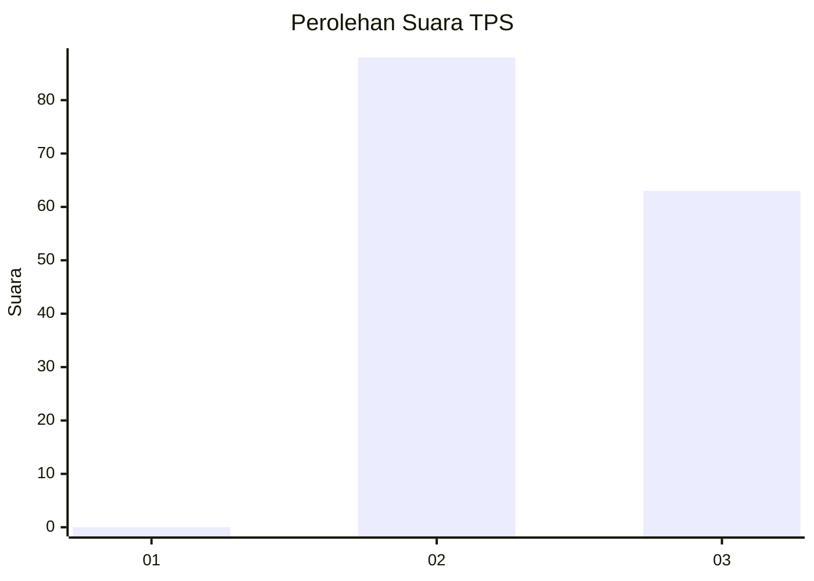
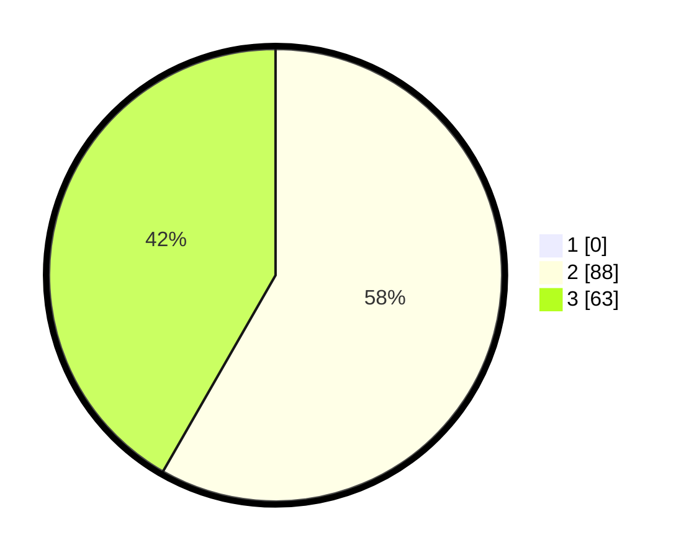

# Hasil

## Grafik

## Tabel

| No. | Nama Paslon    | Suara | Suara (raw) | Persentase |
|:--- |:-------------- | -----:| -----------:| ----------:|
| 1   | ANIES MUHAIMIN | 0     | [0][p-1]    | 0,00       |
| 2   | PRABOWO GIBRAN | 88    | [88][p-2]   | 58,28      |
| 3   | GANJAR MAHFUD  | 63    | [63][p-3]   | 41,72      |

[p-1]: https://github.com/gigit-pemilu/pemilu-2024-53-nusa-tenggara-timur/blob/main/pilpres/hitung-suara/sub/53-nusa-tenggara-timur/sub/16-nagekeo/sub/02-nangaroro/sub/1001-nangaroro/sub/001-tps/sub/paslon-1.txt
[p-2]: https://github.com/gigit-pemilu/pemilu-2024-53-nusa-tenggara-timur/blob/main/pilpres/hitung-suara/sub/53-nusa-tenggara-timur/sub/16-nagekeo/sub/02-nangaroro/sub/1001-nangaroro/sub/001-tps/sub/paslon-2.txt
[p-3]: https://github.com/gigit-pemilu/pemilu-2024-53-nusa-tenggara-timur/blob/main/pilpres/hitung-suara/sub/53-nusa-tenggara-timur/sub/16-nagekeo/sub/02-nangaroro/sub/1001-nangaroro/sub/001-tps/sub/paslon-3.txt

## Foto C Plano

https://sirekap-obj-formc.kpu.go.id/f262/pemilu/ppwp/53/16/02/10/01/5316021001001-20240215-091018--d5379b3e-8f9d-46d3-b34c-ff52364adb83.jpg

https://sirekap-obj-formc.kpu.go.id/f262/pemilu/ppwp/53/16/02/10/01/5316021001001-20240215-091458--60f89e15-a906-44e2-b159-9c4651817b24.jpg

https://sirekap-obj-formc.kpu.go.id/f262/pemilu/ppwp/53/16/02/10/01/5316021001001-20240215-091748--30f30930-d08e-4a46-8139-9d201f1d6bc8.jpg

## Metadata

| Key        | Value               |
| ---------- | ------------------- |
| Time Stamp | 2024-02-17 14:45:18 |

