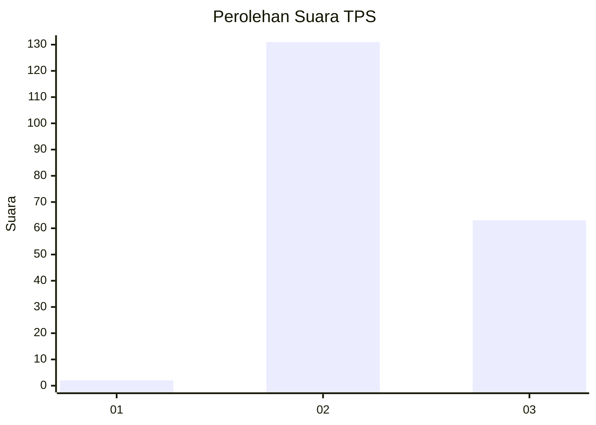
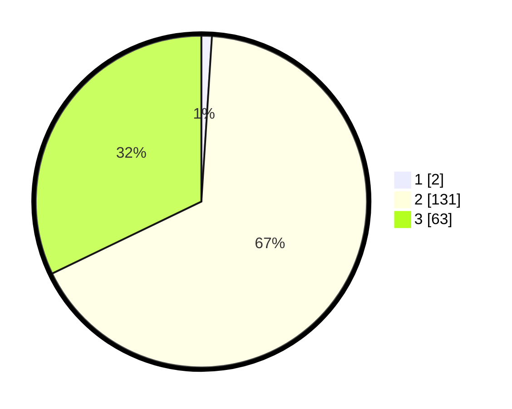

# Hasil

## Grafik

## Tabel

| No. | Nama Paslon    | Suara | Suara (raw) | Persentase |
|:--- |:-------------- | -----:| -----------:| ----------:|
| 1   | ANIES MUHAIMIN | 2     | [2][p-1]    | 1,02       |
| 2   | PRABOWO GIBRAN | 131   | [131][p-2]  | 66,84      |
| 3   | GANJAR MAHFUD  | 63    | [63][p-3]   | 32,14      |

[p-1]: https://github.com/gigit-pemilu/pemilu-2024-53-nusa-tenggara-timur/blob/main/pilpres/hitung-suara/sub/53-nusa-tenggara-timur/sub/16-nagekeo/sub/02-nangaroro/sub/1001-nangaroro/sub/004-tps/sub/paslon-1.txt
[p-2]: https://github.com/gigit-pemilu/pemilu-2024-53-nusa-tenggara-timur/blob/main/pilpres/hitung-suara/sub/53-nusa-tenggara-timur/sub/16-nagekeo/sub/02-nangaroro/sub/1001-nangaroro/sub/004-tps/sub/paslon-2.txt
[p-3]: https://github.com/gigit-pemilu/pemilu-2024-53-nusa-tenggara-timur/blob/main/pilpres/hitung-suara/sub/53-nusa-tenggara-timur/sub/16-nagekeo/sub/02-nangaroro/sub/1001-nangaroro/sub/004-tps/sub/paslon-3.txt

## Foto C Plano

https://sirekap-obj-formc.kpu.go.id/ee41/pemilu/ppwp/53/16/02/10/01/5316021001004-20240215-103409--48330b73-fbb6-4c88-8033-160f6b680745.jpg

https://sirekap-obj-formc.kpu.go.id/ee41/pemilu/ppwp/53/16/02/10/01/5316021001004-20240215-103527--6bdd2a34-f7a0-4247-b4a6-0d742bab0f9d.jpg

https://sirekap-obj-formc.kpu.go.id/ee41/pemilu/ppwp/53/16/02/10/01/5316021001004-20240215-103654--78e33a79-2126-4686-8a64-0349f816e36b.jpg

## Metadata

| Key        | Value               |
| ---------- | ------------------- |
| Time Stamp | 2024-02-17 14:45:18 |

