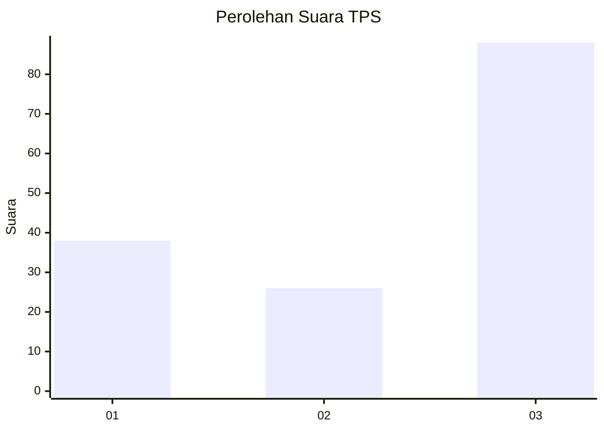
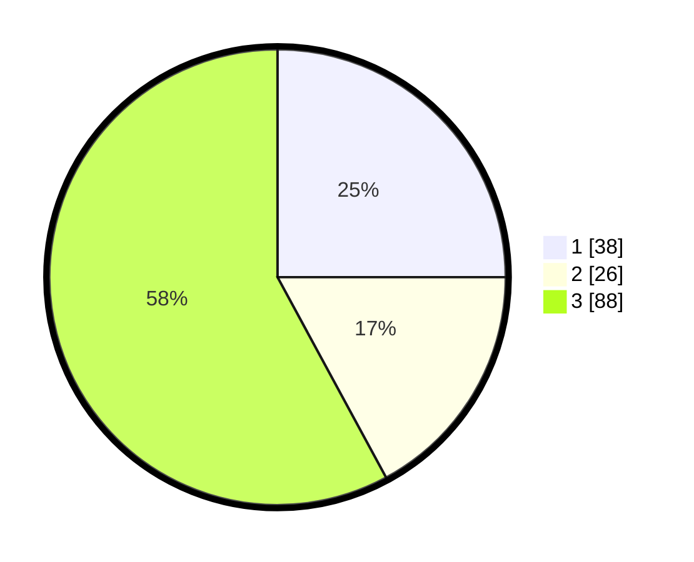

# Hasil

## Grafik

## Tabel

| No. | Nama Paslon    | Suara | Suara (raw) | Persentase |
|:--- |:-------------- | -----:| -----------:| ----------:|
| 1   | ANIES MUHAIMIN | 38    | [38][p-1]   | 25,00      |
| 2   | PRABOWO GIBRAN | 26    | [26][p-2]   | 17,11      |
| 3   | GANJAR MAHFUD  | 88    | [88][p-3]   | 57,89      |

[p-1]: https://github.com/gigit-pemilu/pemilu-2024-53-nusa-tenggara-timur/blob/main/pilpres/hitung-suara/sub/53-nusa-tenggara-timur/sub/16-nagekeo/sub/02-nangaroro/sub/2003-tonggo/sub/001-tps/sub/paslon-1.txt
[p-2]: https://github.com/gigit-pemilu/pemilu-2024-53-nusa-tenggara-timur/blob/main/pilpres/hitung-suara/sub/53-nusa-tenggara-timur/sub/16-nagekeo/sub/02-nangaroro/sub/2003-tonggo/sub/001-tps/sub/paslon-2.txt
[p-3]: https://github.com/gigit-pemilu/pemilu-2024-53-nusa-tenggara-timur/blob/main/pilpres/hitung-suara/sub/53-nusa-tenggara-timur/sub/16-nagekeo/sub/02-nangaroro/sub/2003-tonggo/sub/001-tps/sub/paslon-3.txt

## Foto C Plano

https://sirekap-obj-formc.kpu.go.id/b392/pemilu/ppwp/53/16/02/20/03/5316022003001-20240215-085928--e88ade29-5268-46d2-93cf-f50c30f66078.jpg

https://sirekap-obj-formc.kpu.go.id/b392/pemilu/ppwp/53/16/02/20/03/5316022003001-20240215-090408--7e04ac7d-bb26-4b11-a89c-52e87e12361f.jpg

https://sirekap-obj-formc.kpu.go.id/b392/pemilu/ppwp/53/16/02/20/03/5316022003001-20240215-090653--1201f6c8-f6a9-47b1-9364-0d32785fe6b6.jpg

## Metadata

| Key        | Value               |
| ---------- | ------------------- |
| Time Stamp | 2024-02-17 17:00:04 |

