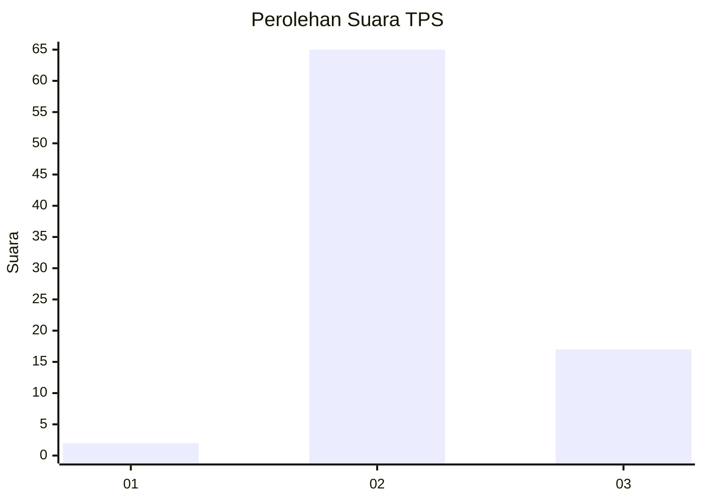

# Hasil

## Grafik

## Tabel

| No. | Nama Paslon    | Suara | Suara (raw) | Persentase |
|:--- |:-------------- | -----:| -----------:| ----------:|
| 1   | ANIES MUHAIMIN | 2     | [2][p-1]    | 2,38       |
| 2   | PRABOWO GIBRAN | 65    | [65][p-2]   | 77,38      |
| 3   | GANJAR MAHFUD  | 17    | [17][p-3]   | 20,24      |

[p-1]: https://github.com/gigit-pemilu/pemilu-2024-53-nusa-tenggara-timur/blob/main/pilpres/hitung-suara/sub/53-nusa-tenggara-timur/sub/16-nagekeo/sub/02-nangaroro/sub/2009-ulupulu/sub/005-tps/sub/paslon-1.txt
[p-2]: https://github.com/gigit-pemilu/pemilu-2024-53-nusa-tenggara-timur/blob/main/pilpres/hitung-suara/sub/53-nusa-tenggara-timur/sub/16-nagekeo/sub/02-nangaroro/sub/2009-ulupulu/sub/005-tps/sub/paslon-2.txt
[p-3]: https://github.com/gigit-pemilu/pemilu-2024-53-nusa-tenggara-timur/blob/main/pilpres/hitung-suara/sub/53-nusa-tenggara-timur/sub/16-nagekeo/sub/02-nangaroro/sub/2009-ulupulu/sub/005-tps/sub/paslon-3.txt

## Foto C Plano

https://sirekap-obj-formc.kpu.go.id/dc2a/pemilu/ppwp/53/16/02/20/09/5316022009005-20240214-221328--040a4517-19ec-42d0-b8cc-8e787cb70cc9.jpg

https://sirekap-obj-formc.kpu.go.id/dc2a/pemilu/ppwp/53/16/02/20/09/5316022009005-20240214-212756--1edf5b10-28d7-4de1-a26c-17845da4f8db.jpg

https://sirekap-obj-formc.kpu.go.id/dc2a/pemilu/ppwp/53/16/02/20/09/5316022009005-20240214-212933--694f7052-2b7d-4b72-8c41-555f6d419976.jpg

## Metadata

| Key        | Value               |
| ---------- | ------------------- |
| Time Stamp | 2024-02-17 14:45:18 |

