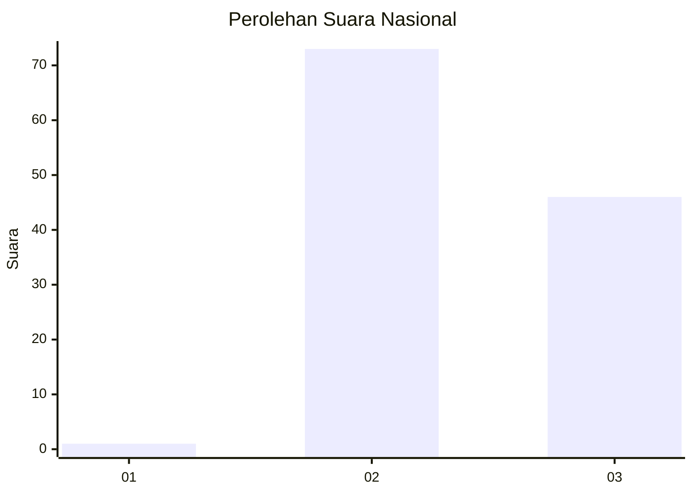
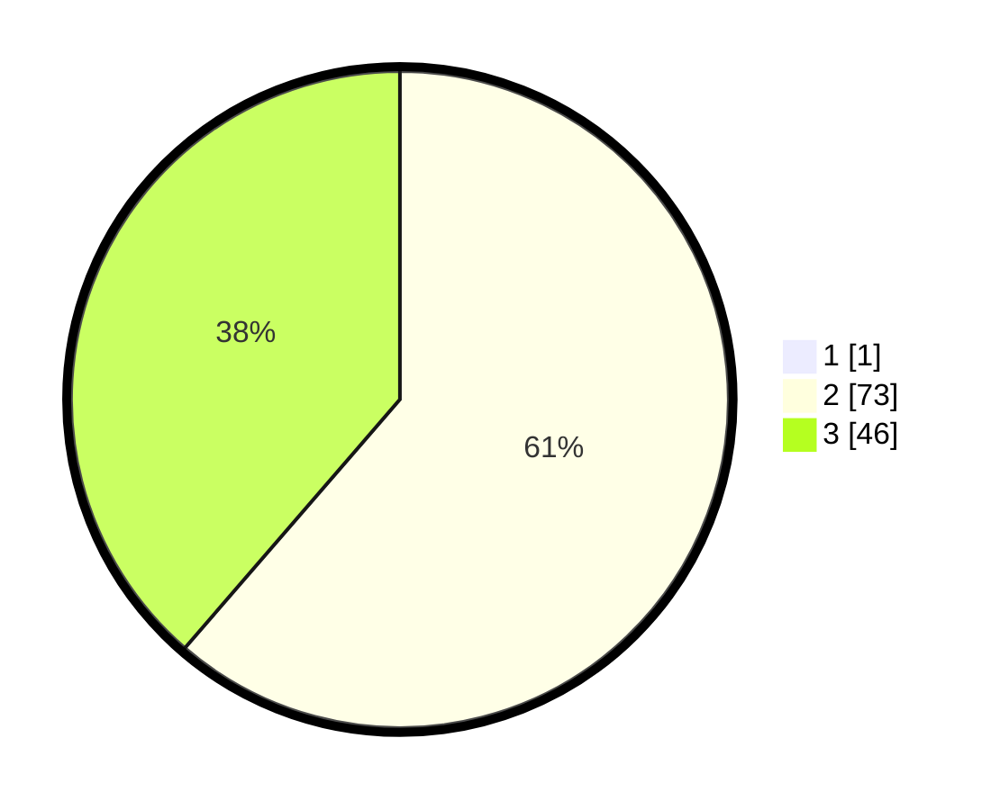

# Hasil

## Grafik

## Tabel

| No. | Nama Paslon    | Suara | Suara (raw) | Persentase |
|:--- |:-------------- | -----:| -----------:| ----------:|
| 1   | ANIES MUHAIMIN | 1     | [1][p-1]    | 0,83       |
| 2   | PRABOWO GIBRAN | 73    | [73][p-2]   | 60,83      |
| 3   | GANJAR MAHFUD  | 46    | [46][p-3]   | 38,33      |

[p-1]: https://github.com/gigit-pemilu/pemilu-2024/blob/main/pilpres/hitung-suara/sub/53-nusa-tenggara-timur/sub/16-nagekeo/sub/03-boawae/sub/1001-natanage/sub/004-tps/sub/paslon-1.txt
[p-2]: https://github.com/gigit-pemilu/pemilu-2024/blob/main/pilpres/hitung-suara/sub/53-nusa-tenggara-timur/sub/16-nagekeo/sub/03-boawae/sub/1001-natanage/sub/004-tps/sub/paslon-2.txt
[p-3]: https://github.com/gigit-pemilu/pemilu-2024/blob/main/pilpres/hitung-suara/sub/53-nusa-tenggara-timur/sub/16-nagekeo/sub/03-boawae/sub/1001-natanage/sub/004-tps/sub/paslon-3.txt

## Foto C Plano

https://sirekap-obj-formc.kpu.go.id/1e2e/pemilu/ppwp/53/16/03/10/01/5316031001004-20240215-004927--58a2ea1c-609a-4649-8e12-66f61249d919.jpg

https://sirekap-obj-formc.kpu.go.id/1e2e/pemilu/ppwp/53/16/03/10/01/5316031001004-20240215-005109--d53fa2b4-8af3-4224-8f37-d5bf5a2e3c6e.jpg

https://sirekap-obj-formc.kpu.go.id/1e2e/pemilu/ppwp/53/16/03/10/01/5316031001004-20240215-005220--930e8fae-c404-4f92-a285-bcab7fac48db.jpg

## Metadata

| Key        | Value               |
| ---------- | ------------------- |
| Time Stamp | 2024-02-17 14:45:18 |

