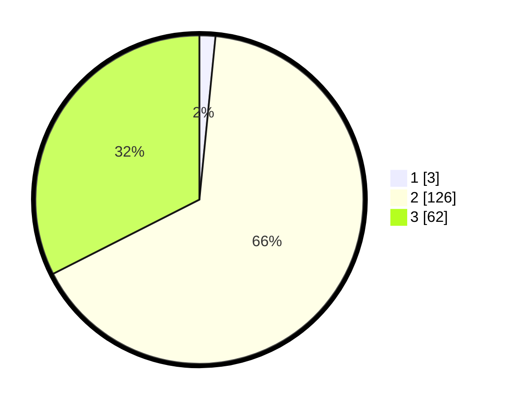

# Hasil

## Grafik

## Tabel

| No. | Nama Paslon    | Suara | Suara (raw) | Persentase |
|:--- |:-------------- | -----:| -----------:| ----------:|
| 1   | ANIES MUHAIMIN | 3     | [3][p-1]    | 1,57       |
| 2   | PRABOWO GIBRAN | 126   | [126][p-2]  | 65,97      |
| 3   | GANJAR MAHFUD  | 62    | [62][p-3]   | 32,46      |

[p-1]: https://github.com/gigit-pemilu/pemilu-2024-53-nusa-tenggara-timur/blob/main/pilpres/hitung-suara/sub/53-nusa-tenggara-timur/sub/17-sumba-tengah/sub/02-umbu-ratu-nggay-barat/sub/2002-praimadeta/sub/001-tps/sub/paslon-1.txt
[p-2]: https://github.com/gigit-pemilu/pemilu-2024-53-nusa-tenggara-timur/blob/main/pilpres/hitung-suara/sub/53-nusa-tenggara-timur/sub/17-sumba-tengah/sub/02-umbu-ratu-nggay-barat/sub/2002-praimadeta/sub/001-tps/sub/paslon-2.txt
[p-3]: https://github.com/gigit-pemilu/pemilu-2024-53-nusa-tenggara-timur/blob/main/pilpres/hitung-suara/sub/53-nusa-tenggara-timur/sub/17-sumba-tengah/sub/02-umbu-ratu-nggay-barat/sub/2002-praimadeta/sub/001-tps/sub/paslon-3.txt

## Foto C Plano

https://sirekap-obj-formc.kpu.go.id/5b21/pemilu/ppwp/53/17/02/20/02/5317022002001-20240215-104453--a2fd1647-7774-47b7-81c4-aba440697eaf.jpg

https://sirekap-obj-formc.kpu.go.id/5b21/pemilu/ppwp/53/17/02/20/02/5317022002001-20240215-095401--ff82d0fc-47d0-4ee9-92cd-b9ca02695371.jpg

https://sirekap-obj-formc.kpu.go.id/5b21/pemilu/ppwp/53/17/02/20/02/5317022002001-20240215-104833--9fee6863-2ff2-43c5-84dc-e9a35ea85650.jpg

## Metadata

| Key        | Value               |
| ---------- | ------------------- |
| Time Stamp | 2024-02-25 12:00:00 |

