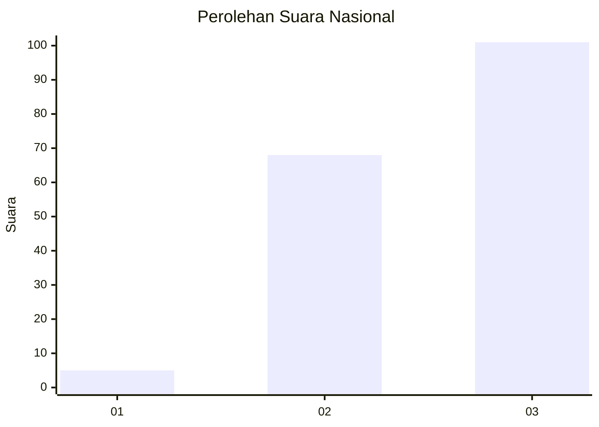
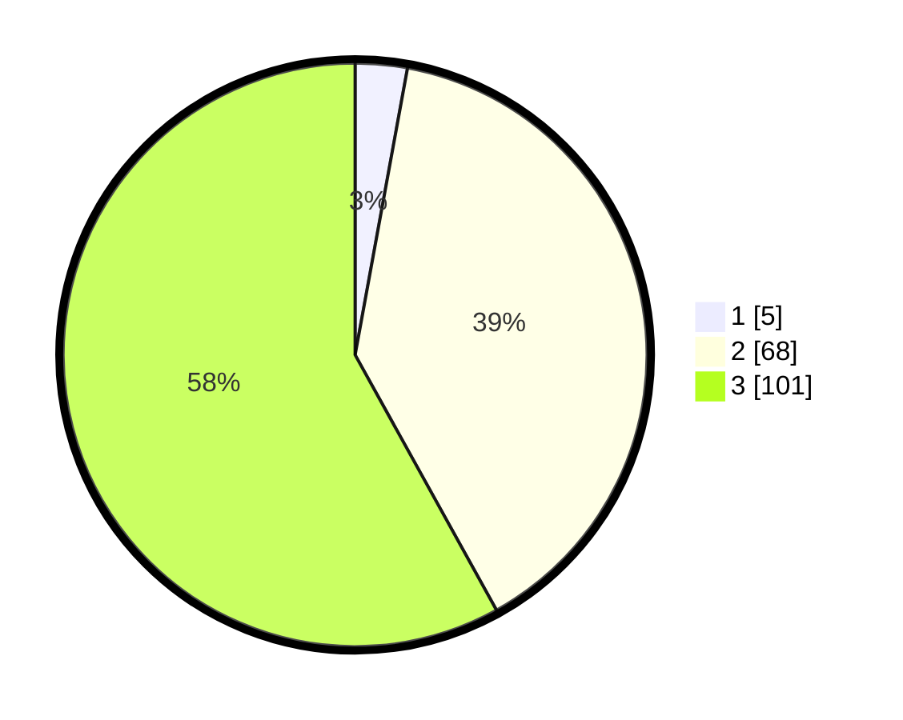

# Hasil

## Grafik

## Tabel

| No. | Nama Paslon    | Suara | Suara (raw) | Persentase |
|:--- |:-------------- | -----:| -----------:| ----------:|
| 1   | ANIES MUHAIMIN | 5     | [5][p-1]    | 2,87       |
| 2   | PRABOWO GIBRAN | 68    | [68][p-2]   | 39,08      |
| 3   | GANJAR MAHFUD  | 101   | [101][p-3]  | 58,05      |

[p-1]: https://github.com/gigit-pemilu/pemilu-2024/blob/main/pilpres/hitung-suara/sub/53-nusa-tenggara-timur/sub/17-sumba-tengah/sub/05-katiku-tana-selatan/sub/2001-konda-maloba/sub/002-tps/sub/paslon-1.txt
[p-2]: https://github.com/gigit-pemilu/pemilu-2024/blob/main/pilpres/hitung-suara/sub/53-nusa-tenggara-timur/sub/17-sumba-tengah/sub/05-katiku-tana-selatan/sub/2001-konda-maloba/sub/002-tps/sub/paslon-2.txt
[p-3]: https://github.com/gigit-pemilu/pemilu-2024/blob/main/pilpres/hitung-suara/sub/53-nusa-tenggara-timur/sub/17-sumba-tengah/sub/05-katiku-tana-selatan/sub/2001-konda-maloba/sub/002-tps/sub/paslon-3.txt

## Foto C Plano

https://sirekap-obj-formc.kpu.go.id/0362/pemilu/ppwp/53/17/05/20/01/5317052001002-20240223-110717--ccad4eef-f889-4807-990d-20b07a45c25c.jpg

https://sirekap-obj-formc.kpu.go.id/0362/pemilu/ppwp/53/17/05/20/01/5317052001002-20240223-110719--7493886d-b222-4ce2-ba83-f5d3a017b4f2.jpg

https://sirekap-obj-formc.kpu.go.id/0362/pemilu/ppwp/53/17/05/20/01/5317052001002-20240223-110718--21a0bb9e-295a-4cf9-b926-f53e39a1772e.jpg

## Metadata

| Key        | Value               |
| ---------- | ------------------- |
| Time Stamp | 2024-02-24 22:31:28 |

