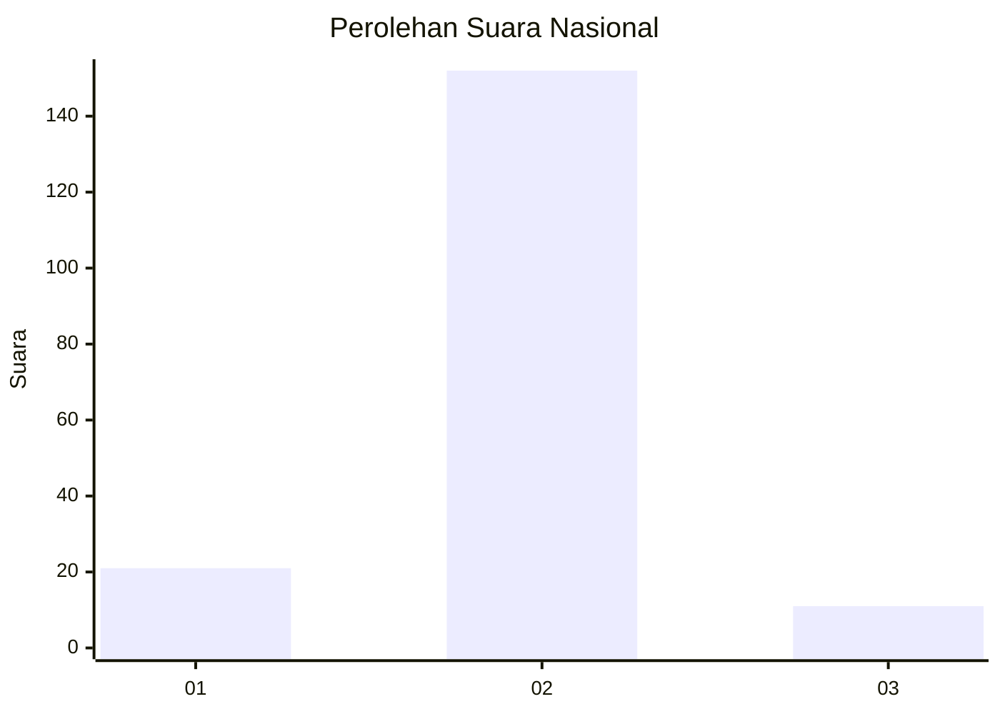
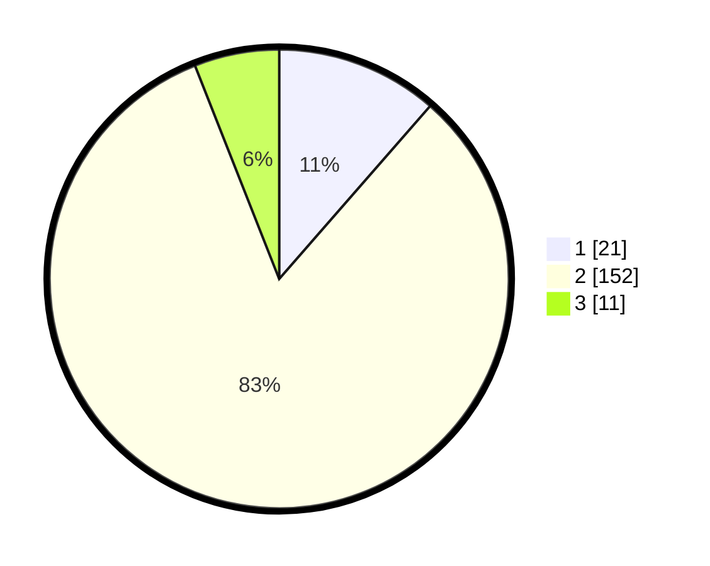

# Hasil

## Grafik

## Tabel

| No. | Nama Paslon    | Suara | Suara (raw) | Persentase |
|:--- |:-------------- | -----:| -----------:| ----------:|
| 1   | ANIES MUHAIMIN | 21    | [21][p-1]   | 11,41      |
| 2   | PRABOWO GIBRAN | 152   | [152][p-2]  | 82,61      |
| 3   | GANJAR MAHFUD  | 11    | [11][p-3]   | 5,98       |

[p-1]: https://github.com/gigit-pemilu/pemilu-2024/blob/main/pilpres/hitung-suara/sub/53-nusa-tenggara-timur/sub/18-sumba-barat-daya/sub/01-loura/sub/2002-lete-konda/sub/004-tps/sub/paslon-1.txt
[p-2]: https://github.com/gigit-pemilu/pemilu-2024/blob/main/pilpres/hitung-suara/sub/53-nusa-tenggara-timur/sub/18-sumba-barat-daya/sub/01-loura/sub/2002-lete-konda/sub/004-tps/sub/paslon-2.txt
[p-3]: https://github.com/gigit-pemilu/pemilu-2024/blob/main/pilpres/hitung-suara/sub/53-nusa-tenggara-timur/sub/18-sumba-barat-daya/sub/01-loura/sub/2002-lete-konda/sub/004-tps/sub/paslon-3.txt

## Foto C Plano

https://sirekap-obj-formc.kpu.go.id/4bf1/pemilu/ppwp/53/18/01/20/02/5318012002004-20240214-212831--a1098893-c253-43d7-8f38-af177b8d40bf.jpg

https://sirekap-obj-formc.kpu.go.id/4bf1/pemilu/ppwp/53/18/01/20/02/5318012002004-20240214-210431--85d21b68-b516-43b4-90f1-bfb386ecdec9.jpg

https://sirekap-obj-formc.kpu.go.id/4bf1/pemilu/ppwp/53/18/01/20/02/5318012002004-20240214-210221--0e7b8f69-0a42-42e2-a1f5-cbd97a1d2596.jpg

## Metadata

| Key        | Value               |
| ---------- | ------------------- |
| Time Stamp | 2024-02-20 13:00:00 |

