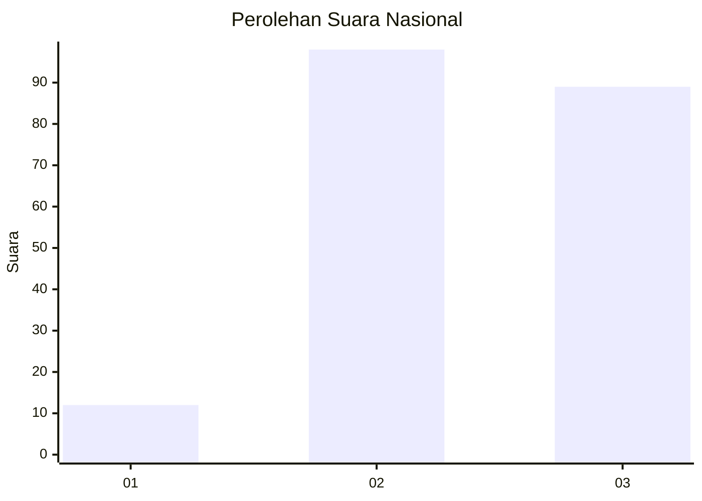
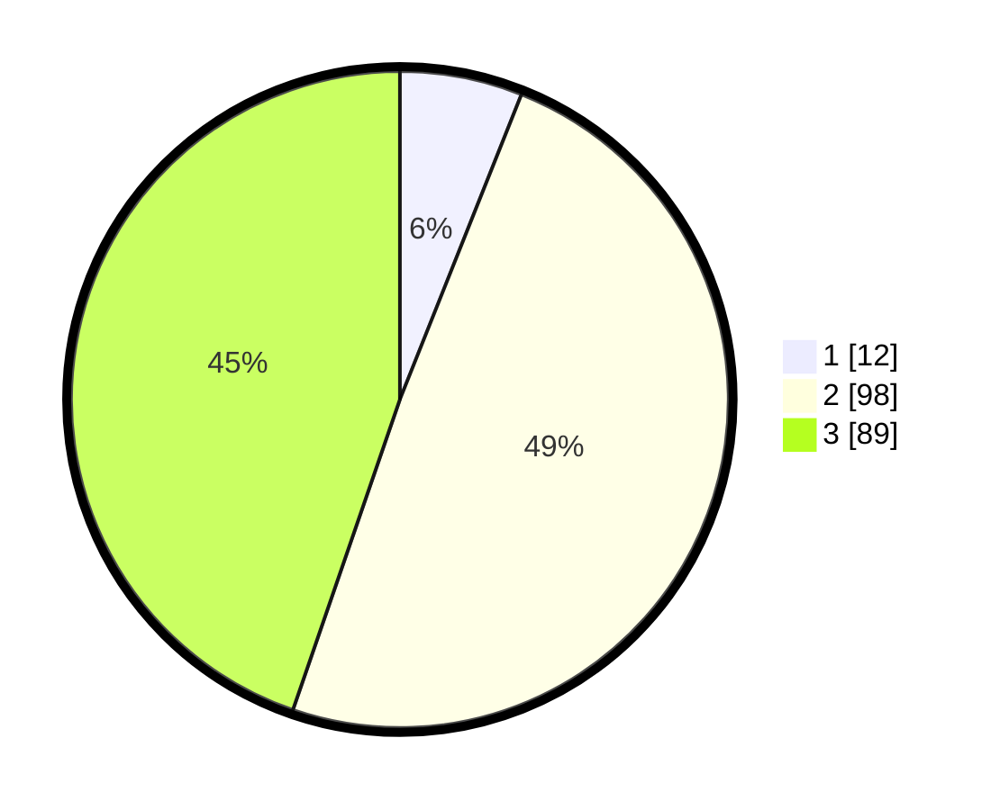

# Hasil

## Grafik

## Tabel

| No. | Nama Paslon    | Suara | Suara (raw) | Persentase |
|:--- |:-------------- | -----:| -----------:| ----------:|
| 1   | ANIES MUHAIMIN | 12    | [12][p-1]   | 6,03       |
| 2   | PRABOWO GIBRAN | 98    | [98][p-2]   | 49,25      |
| 3   | GANJAR MAHFUD  | 89    | [89][p-3]   | 44,72      |

[p-1]: https://github.com/gigit-pemilu/pemilu-2024/blob/main/pilpres/hitung-suara/sub/53-nusa-tenggara-timur/sub/18-sumba-barat-daya/sub/01-loura/sub/2003-karuni/sub/001-tps/sub/paslon-1.txt
[p-2]: https://github.com/gigit-pemilu/pemilu-2024/blob/main/pilpres/hitung-suara/sub/53-nusa-tenggara-timur/sub/18-sumba-barat-daya/sub/01-loura/sub/2003-karuni/sub/001-tps/sub/paslon-2.txt
[p-3]: https://github.com/gigit-pemilu/pemilu-2024/blob/main/pilpres/hitung-suara/sub/53-nusa-tenggara-timur/sub/18-sumba-barat-daya/sub/01-loura/sub/2003-karuni/sub/001-tps/sub/paslon-3.txt

## Foto C Plano

https://sirekap-obj-formc.kpu.go.id/40fd/pemilu/ppwp/53/18/01/20/03/5318012003001-20240215-184342--ed74f959-81f5-497d-a534-9ad793e9e31b.jpg

https://sirekap-obj-formc.kpu.go.id/40fd/pemilu/ppwp/53/18/01/20/03/5318012003001-20240215-190212--c5d3a907-c397-40f0-a227-9e085c2b99be.jpg

https://sirekap-obj-formc.kpu.go.id/40fd/pemilu/ppwp/53/18/01/20/03/5318012003001-20240215-181433--9f64ca15-644e-4d28-a3f5-2bbc276a1806.jpg

## Metadata

| Key        | Value               |
| ---------- | ------------------- |
| Time Stamp | 2024-02-24 22:31:28 |

