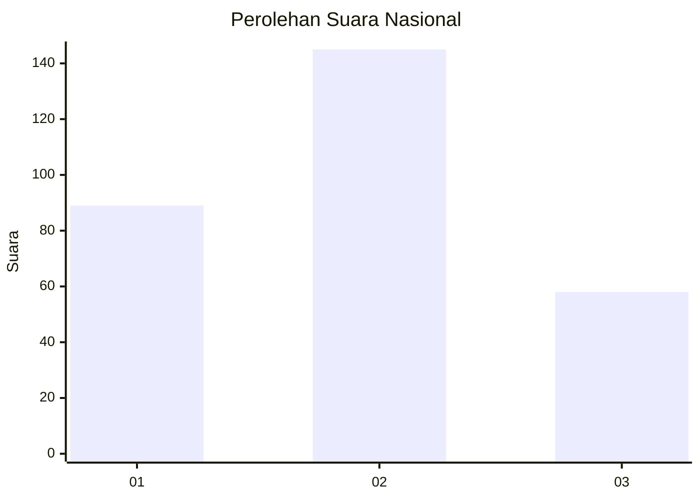
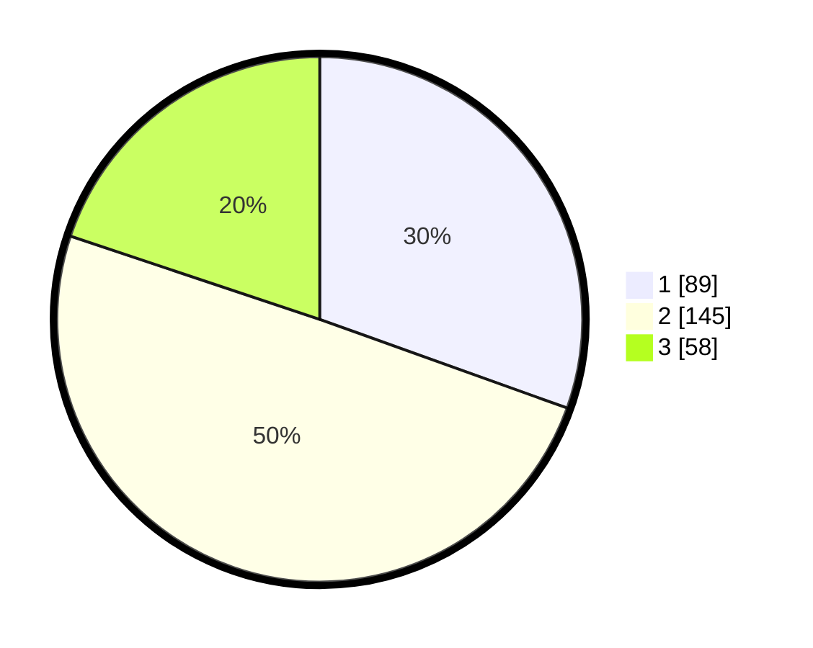

# Hasil

## Grafik

## Tabel

| No. | Nama Paslon    | Suara | Suara (raw) | Persentase |
|:--- |:-------------- | -----:| -----------:| ----------:|
| 1   | ANIES MUHAIMIN | 89    | [89][p-1]   | 30,48      |
| 2   | PRABOWO GIBRAN | 145   | [145][p-2]  | 49,66      |
| 3   | GANJAR MAHFUD  | 58    | [58][p-3]   | 19,86      |

[p-1]: https://github.com/gigit-pemilu/pemilu-2024/blob/main/pilpres/hitung-suara/sub/53-nusa-tenggara-timur/sub/18-sumba-barat-daya/sub/01-loura/sub/2009-rama-dana/sub/004-tps/sub/paslon-1.txt
[p-2]: https://github.com/gigit-pemilu/pemilu-2024/blob/main/pilpres/hitung-suara/sub/53-nusa-tenggara-timur/sub/18-sumba-barat-daya/sub/01-loura/sub/2009-rama-dana/sub/004-tps/sub/paslon-2.txt
[p-3]: https://github.com/gigit-pemilu/pemilu-2024/blob/main/pilpres/hitung-suara/sub/53-nusa-tenggara-timur/sub/18-sumba-barat-daya/sub/01-loura/sub/2009-rama-dana/sub/004-tps/sub/paslon-3.txt

## Foto C Plano

https://sirekap-obj-formc.kpu.go.id/992e/pemilu/ppwp/53/18/01/20/09/5318012009004-20240224-144446--cc495a9f-7784-4e9d-9528-76bf032c62bf.jpg

https://sirekap-obj-formc.kpu.go.id/992e/pemilu/ppwp/53/18/01/20/09/5318012009004-20240224-144625--607ae614-9ff9-42e7-ada9-6ebe117fcdea.jpg

https://sirekap-obj-formc.kpu.go.id/992e/pemilu/ppwp/53/18/01/20/09/5318012009004-20240224-144708--99e38e5a-502c-4012-a594-8a239be3129d.jpg

## Metadata

| Key        | Value               |
| ---------- | ------------------- |
| Time Stamp | 2024-02-29 08:00:00 |

