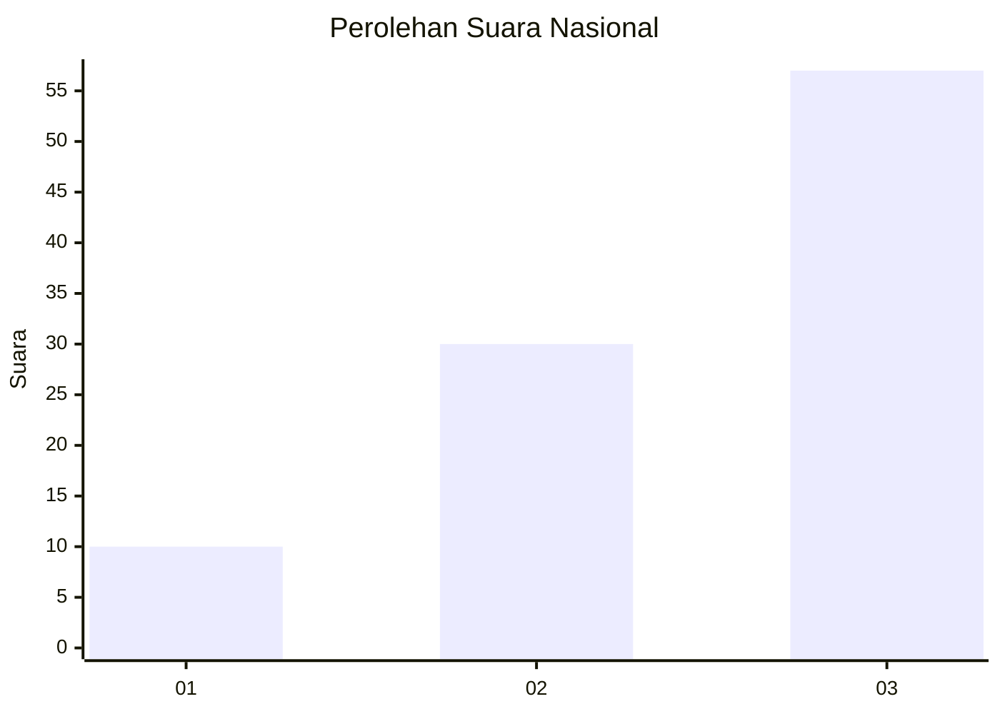
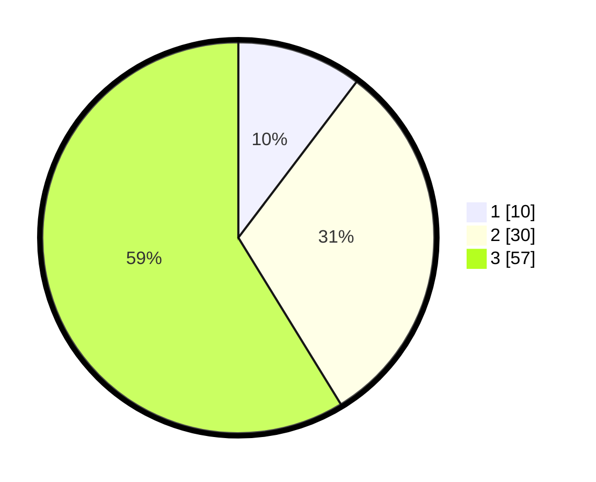

# Hasil

## Grafik

## Tabel

| No. | Nama Paslon    | Suara | Suara (raw) | Persentase |
|:--- |:-------------- | -----:| -----------:| ----------:|
| 1   | ANIES MUHAIMIN | 10    | [10][p-1]   | 10,31      |
| 2   | PRABOWO GIBRAN | 30    | [30][p-2]   | 30,93      |
| 3   | GANJAR MAHFUD  | 57    | [57][p-3]   | 58,76      |

[p-1]: https://github.com/gigit-pemilu/pemilu-2024/blob/main/pilpres/hitung-suara/sub/53-nusa-tenggara-timur/sub/18-sumba-barat-daya/sub/01-loura/sub/2010-wee-mananda/sub/004-tps/sub/paslon-1.txt
[p-2]: https://github.com/gigit-pemilu/pemilu-2024/blob/main/pilpres/hitung-suara/sub/53-nusa-tenggara-timur/sub/18-sumba-barat-daya/sub/01-loura/sub/2010-wee-mananda/sub/004-tps/sub/paslon-2.txt
[p-3]: https://github.com/gigit-pemilu/pemilu-2024/blob/main/pilpres/hitung-suara/sub/53-nusa-tenggara-timur/sub/18-sumba-barat-daya/sub/01-loura/sub/2010-wee-mananda/sub/004-tps/sub/paslon-3.txt

## Foto C Plano

https://sirekap-obj-formc.kpu.go.id/ece2/pemilu/ppwp/53/18/01/20/10/5318012010004-20240221-151534--34fa7542-6f8c-45d8-898c-dd494da341c1.jpg

https://sirekap-obj-formc.kpu.go.id/ece2/pemilu/ppwp/53/18/01/20/10/5318012010004-20240221-151612--1305a7aa-6087-4a79-ab48-731ab5b53ca1.jpg

https://sirekap-obj-formc.kpu.go.id/ece2/pemilu/ppwp/53/18/01/20/10/5318012010004-20240221-151709--d1d97e4f-ab71-4412-b901-77c8627a8ebd.jpg

## Metadata

| Key        | Value               |
| ---------- | ------------------- |
| Time Stamp | 2024-02-25 18:00:00 |

