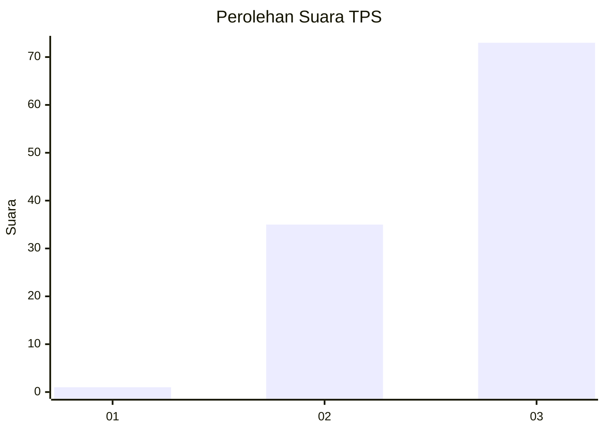
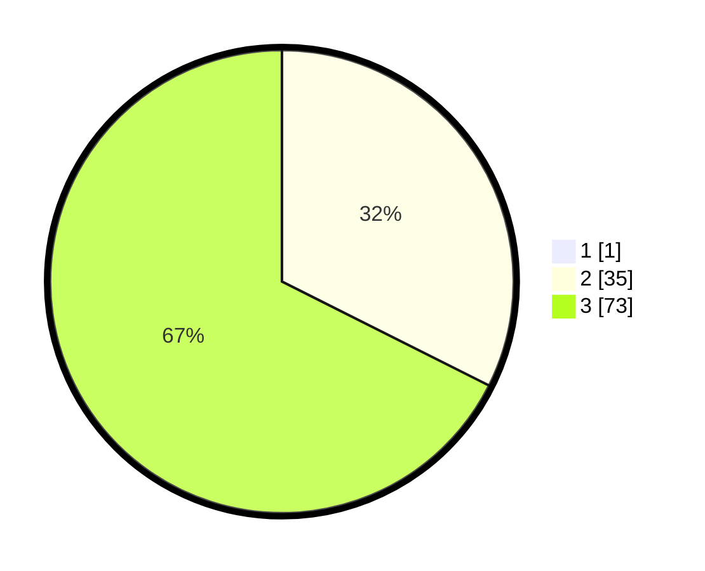

# Hasil

## Grafik

## Tabel

| No. | Nama Paslon    | Suara | Suara (raw) | Persentase |
|:--- |:-------------- | -----:| -----------:| ----------:|
| 1   | ANIES MUHAIMIN | 1     | [1][p-1]    | 0,92       |
| 2   | PRABOWO GIBRAN | 35    | [35][p-2]   | 32,11      |
| 3   | GANJAR MAHFUD  | 73    | [73][p-3]   | 66,97      |

[p-1]: https://github.com/gigit-pemilu/pemilu-2024-53-nusa-tenggara-timur/blob/main/pilpres/hitung-suara/sub/53-nusa-tenggara-timur/sub/18-sumba-barat-daya/sub/02-wewewa-utara/sub/2001-mali-mada/sub/001-tps/sub/paslon-1.txt
[p-2]: https://github.com/gigit-pemilu/pemilu-2024-53-nusa-tenggara-timur/blob/main/pilpres/hitung-suara/sub/53-nusa-tenggara-timur/sub/18-sumba-barat-daya/sub/02-wewewa-utara/sub/2001-mali-mada/sub/001-tps/sub/paslon-2.txt
[p-3]: https://github.com/gigit-pemilu/pemilu-2024-53-nusa-tenggara-timur/blob/main/pilpres/hitung-suara/sub/53-nusa-tenggara-timur/sub/18-sumba-barat-daya/sub/02-wewewa-utara/sub/2001-mali-mada/sub/001-tps/sub/paslon-3.txt

## Foto C Plano

https://sirekap-obj-formc.kpu.go.id/5ba3/pemilu/ppwp/53/18/02/20/01/5318022001001-20240217-081058--fbeb8ec0-704a-4b48-af18-c47be1e34998.jpg

https://sirekap-obj-formc.kpu.go.id/5ba3/pemilu/ppwp/53/18/02/20/01/5318022001001-20240215-115701--532a4d0a-1d07-47ba-aad2-93425589ad42.jpg

https://sirekap-obj-formc.kpu.go.id/5ba3/pemilu/ppwp/53/18/02/20/01/5318022001001-20240215-115958--26033962-ef86-4298-8502-1ceaf677070c.jpg

## Metadata

| Key        | Value               |
| ---------- | ------------------- |
| Time Stamp | 2024-02-17 08:30:03 |

