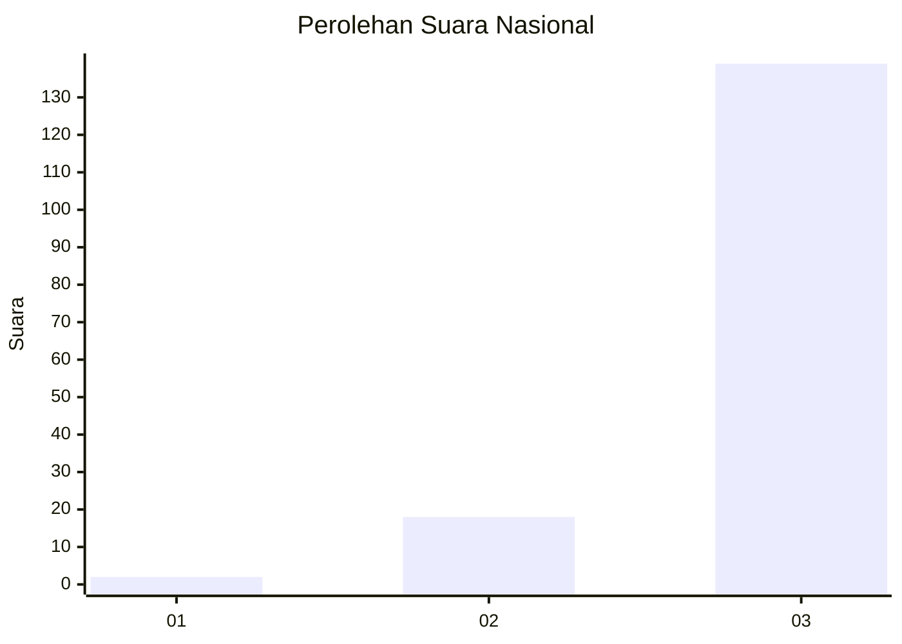
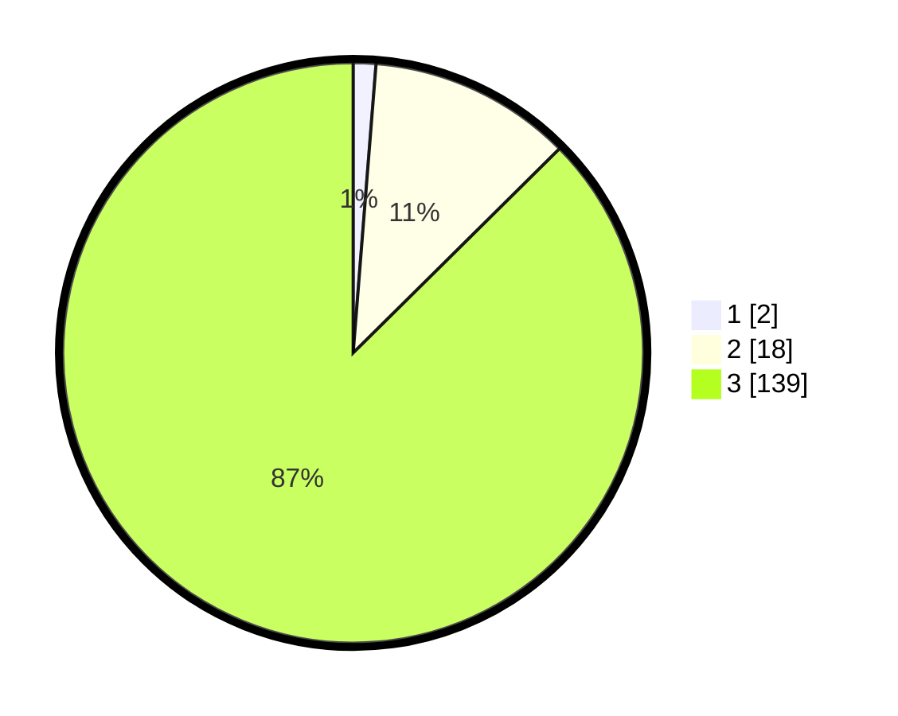

# Hasil

## Grafik

## Tabel

| No. | Nama Paslon    | Suara | Suara (raw) | Persentase |
|:--- |:-------------- | -----:| -----------:| ----------:|
| 1   | ANIES MUHAIMIN | 2     | [2][p-1]    | 1,26       |
| 2   | PRABOWO GIBRAN | 18    | [18][p-2]   | 11,32      |
| 3   | GANJAR MAHFUD  | 139   | [139][p-3]  | 87,42      |

[p-1]: https://github.com/gigit-pemilu/pemilu-2024/blob/main/pilpres/hitung-suara/sub/53-nusa-tenggara-timur/sub/18-sumba-barat-daya/sub/02-wewewa-utara/sub/2001-mali-mada/sub/003-tps/sub/paslon-1.txt
[p-2]: https://github.com/gigit-pemilu/pemilu-2024/blob/main/pilpres/hitung-suara/sub/53-nusa-tenggara-timur/sub/18-sumba-barat-daya/sub/02-wewewa-utara/sub/2001-mali-mada/sub/003-tps/sub/paslon-2.txt
[p-3]: https://github.com/gigit-pemilu/pemilu-2024/blob/main/pilpres/hitung-suara/sub/53-nusa-tenggara-timur/sub/18-sumba-barat-daya/sub/02-wewewa-utara/sub/2001-mali-mada/sub/003-tps/sub/paslon-3.txt

## Foto C Plano

https://sirekap-obj-formc.kpu.go.id/59d6/pemilu/ppwp/53/18/02/20/01/5318022001003-20240215-004311--d0149573-e147-482c-9a95-764aca93aeba.jpg

https://sirekap-obj-formc.kpu.go.id/59d6/pemilu/ppwp/53/18/02/20/01/5318022001003-20240215-004352--bea90120-2256-4f37-a492-2e262e841f47.jpg

https://sirekap-obj-formc.kpu.go.id/59d6/pemilu/ppwp/53/18/02/20/01/5318022001003-20240215-030725--6a7db5b0-a766-49b3-9f88-e944a60a6bd2.jpg

## Metadata

| Key        | Value               |
| ---------- | ------------------- |
| Time Stamp | 2024-02-25 22:00:00 |

