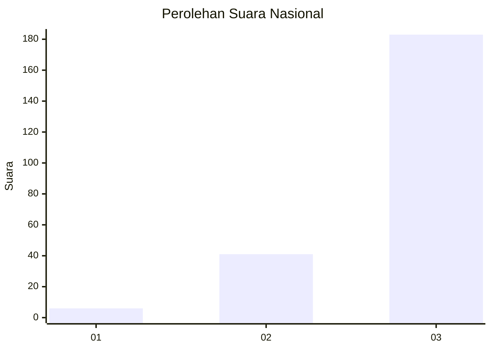
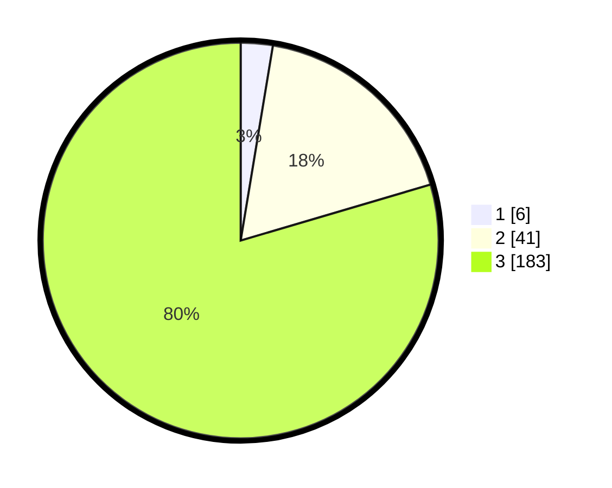

# Hasil

## Grafik

## Tabel

| No. | Nama Paslon    | Suara | Suara (raw) | Persentase |
|:--- |:-------------- | -----:| -----------:| ----------:|
| 1   | ANIES MUHAIMIN | 6     | [6][p-1]    | 2,61       |
| 2   | PRABOWO GIBRAN | 41    | [41][p-2]   | 17,83      |
| 3   | GANJAR MAHFUD  | 183   | [183][p-3]  | 79,57      |

[p-1]: https://github.com/gigit-pemilu/pemilu-2024/blob/main/pilpres/hitung-suara/sub/53-nusa-tenggara-timur/sub/18-sumba-barat-daya/sub/02-wewewa-utara/sub/2002-wano-talla/sub/002-tps/sub/paslon-1.txt
[p-2]: https://github.com/gigit-pemilu/pemilu-2024/blob/main/pilpres/hitung-suara/sub/53-nusa-tenggara-timur/sub/18-sumba-barat-daya/sub/02-wewewa-utara/sub/2002-wano-talla/sub/002-tps/sub/paslon-2.txt
[p-3]: https://github.com/gigit-pemilu/pemilu-2024/blob/main/pilpres/hitung-suara/sub/53-nusa-tenggara-timur/sub/18-sumba-barat-daya/sub/02-wewewa-utara/sub/2002-wano-talla/sub/002-tps/sub/paslon-3.txt

## Foto C Plano

https://sirekap-obj-formc.kpu.go.id/ab52/pemilu/ppwp/53/18/02/20/02/5318022002002-20240215-020512--85badb9b-9e97-4196-bbcc-47b04114481b.jpg

https://sirekap-obj-formc.kpu.go.id/ab52/pemilu/ppwp/53/18/02/20/02/5318022002002-20240215-021501--0cbcf257-2572-47a7-a222-b7eb65f0f054.jpg

https://sirekap-obj-formc.kpu.go.id/ab52/pemilu/ppwp/53/18/02/20/02/5318022002002-20240215-021819--f401cf9e-5b6b-47c6-895a-6724eb95dd89.jpg

## Metadata

| Key        | Value               |
| ---------- | ------------------- |
| Time Stamp | 2024-02-25 19:00:00 |

