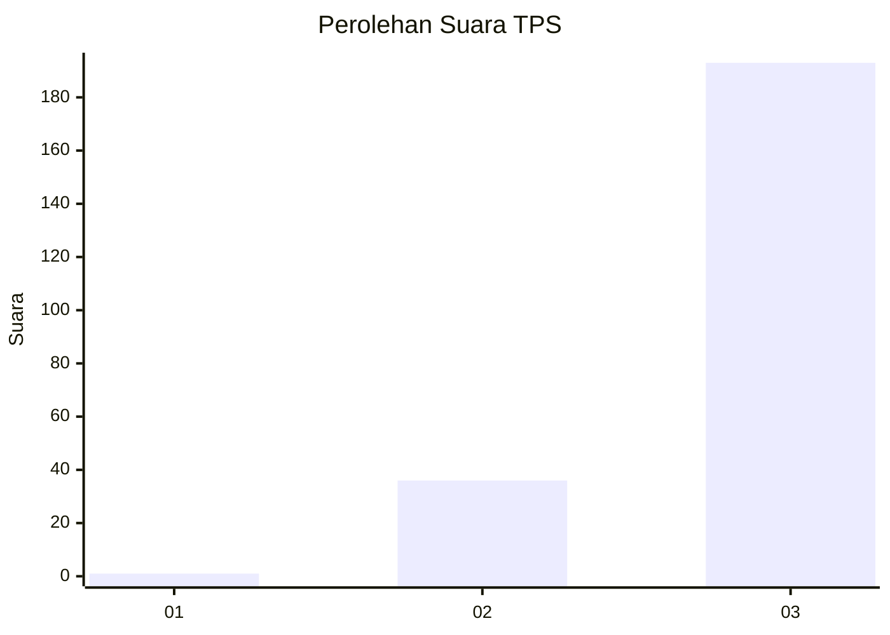
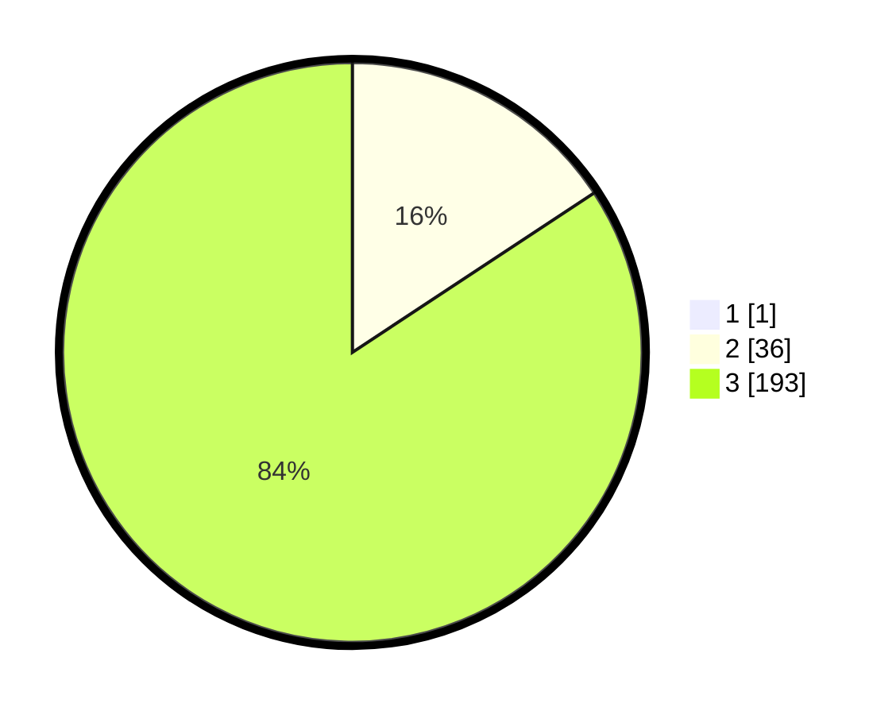

# Hasil

## Grafik

## Tabel

| No. | Nama Paslon    | Suara | Suara (raw) | Persentase |
|:--- |:-------------- | -----:| -----------:| ----------:|
| 1   | ANIES MUHAIMIN | 1     | [1][p-1]    | 0,43       |
| 2   | PRABOWO GIBRAN | 36    | [36][p-2]   | 15,65      |
| 3   | GANJAR MAHFUD  | 193   | [193][p-3]  | 83,91      |

[p-1]: https://github.com/gigit-pemilu/pemilu-2024-53-nusa-tenggara-timur/blob/main/pilpres/hitung-suara/sub/53-nusa-tenggara-timur/sub/18-sumba-barat-daya/sub/02-wewewa-utara/sub/2012-mawo-maliti/sub/003-tps/sub/paslon-1.txt
[p-2]: https://github.com/gigit-pemilu/pemilu-2024-53-nusa-tenggara-timur/blob/main/pilpres/hitung-suara/sub/53-nusa-tenggara-timur/sub/18-sumba-barat-daya/sub/02-wewewa-utara/sub/2012-mawo-maliti/sub/003-tps/sub/paslon-2.txt
[p-3]: https://github.com/gigit-pemilu/pemilu-2024-53-nusa-tenggara-timur/blob/main/pilpres/hitung-suara/sub/53-nusa-tenggara-timur/sub/18-sumba-barat-daya/sub/02-wewewa-utara/sub/2012-mawo-maliti/sub/003-tps/sub/paslon-3.txt

## Foto C Plano

https://sirekap-obj-formc.kpu.go.id/cf65/pemilu/ppwp/53/18/02/20/12/5318022012003-20240214-204250--cad1077a-0361-4bf0-ba44-57846679c85f.jpg

https://sirekap-obj-formc.kpu.go.id/cf65/pemilu/ppwp/53/18/02/20/12/5318022012003-20240223-084003--b00617b4-e94c-4ab3-a906-451ace89aeca.jpg

https://sirekap-obj-formc.kpu.go.id/cf65/pemilu/ppwp/53/18/02/20/12/5318022012003-20240223-084132--c82dc8f3-27a8-47b8-a1c5-6d46c255ee69.jpg

## Metadata

| Key        | Value               |
| ---------- | ------------------- |
| Time Stamp | 2024-02-24 22:31:28 |

