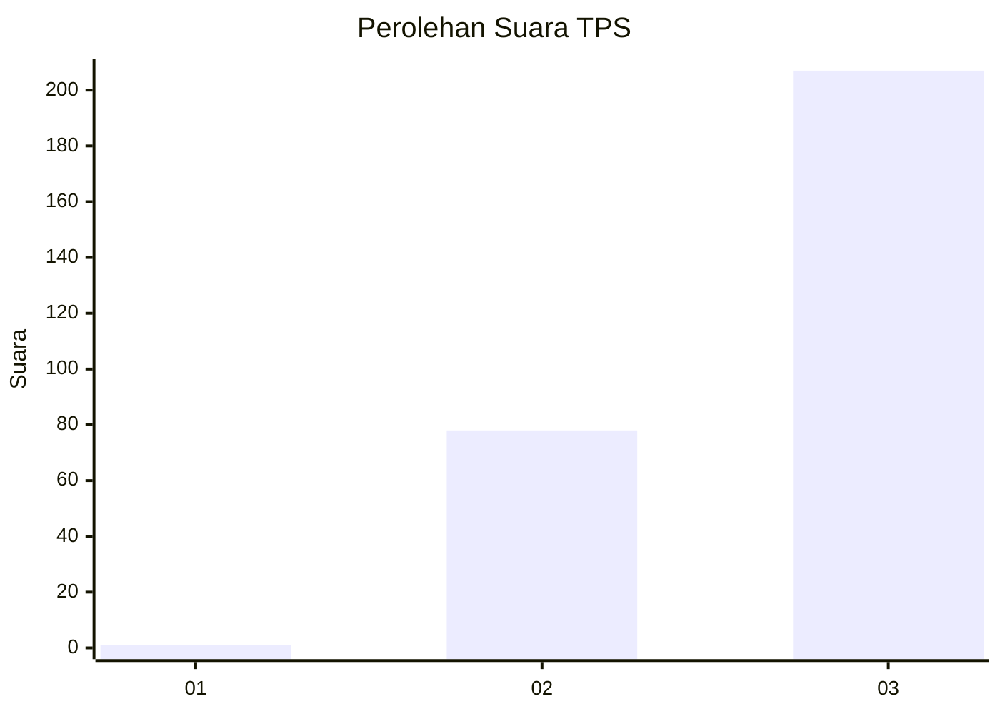
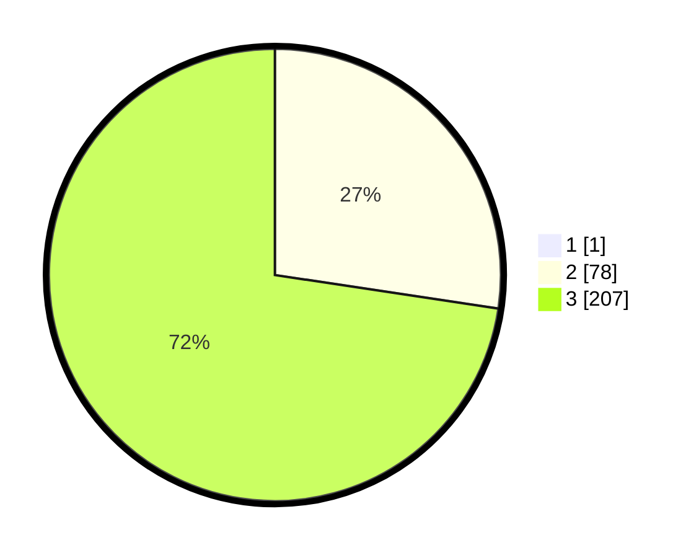

# Hasil

## Grafik

## Tabel

| No. | Nama Paslon    | Suara | Suara (raw) | Persentase |
|:--- |:-------------- | -----:| -----------:| ----------:|
| 1   | ANIES MUHAIMIN | 1     | [1][p-1]    | 0,35       |
| 2   | PRABOWO GIBRAN | 78    | [78][p-2]   | 27,27      |
| 3   | GANJAR MAHFUD  | 207   | [207][p-3]  | 72,38      |

[p-1]: https://github.com/gigit-pemilu/pemilu-2024-53-nusa-tenggara-timur/blob/main/pilpres/hitung-suara/sub/53-nusa-tenggara-timur/sub/18-sumba-barat-daya/sub/03-wewewa-timur/sub/2015-wee-lima/sub/002-tps/sub/paslon-1.txt
[p-2]: https://github.com/gigit-pemilu/pemilu-2024-53-nusa-tenggara-timur/blob/main/pilpres/hitung-suara/sub/53-nusa-tenggara-timur/sub/18-sumba-barat-daya/sub/03-wewewa-timur/sub/2015-wee-lima/sub/002-tps/sub/paslon-2.txt
[p-3]: https://github.com/gigit-pemilu/pemilu-2024-53-nusa-tenggara-timur/blob/main/pilpres/hitung-suara/sub/53-nusa-tenggara-timur/sub/18-sumba-barat-daya/sub/03-wewewa-timur/sub/2015-wee-lima/sub/002-tps/sub/paslon-3.txt

## Foto C Plano

https://sirekap-obj-formc.kpu.go.id/9883/pemilu/ppwp/53/18/03/20/15/5318032015002-20240216-094529--cea1ae87-5058-43d6-ad75-144c3aee5509.jpg

https://sirekap-obj-formc.kpu.go.id/9883/pemilu/ppwp/53/18/03/20/15/5318032015002-20240216-094740--e7689840-b52c-49b7-93b9-00981d8cddab.jpg

https://sirekap-obj-formc.kpu.go.id/9883/pemilu/ppwp/53/18/03/20/15/5318032015002-20240216-095002--2ebe41ef-de10-4518-bf6b-653032ea5cbc.jpg

## Metadata

| Key        | Value               |
| ---------- | ------------------- |
| Time Stamp | 2024-02-24 23:00:00 |

