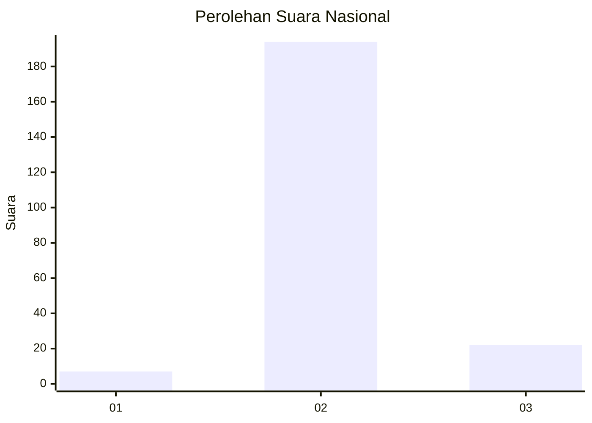
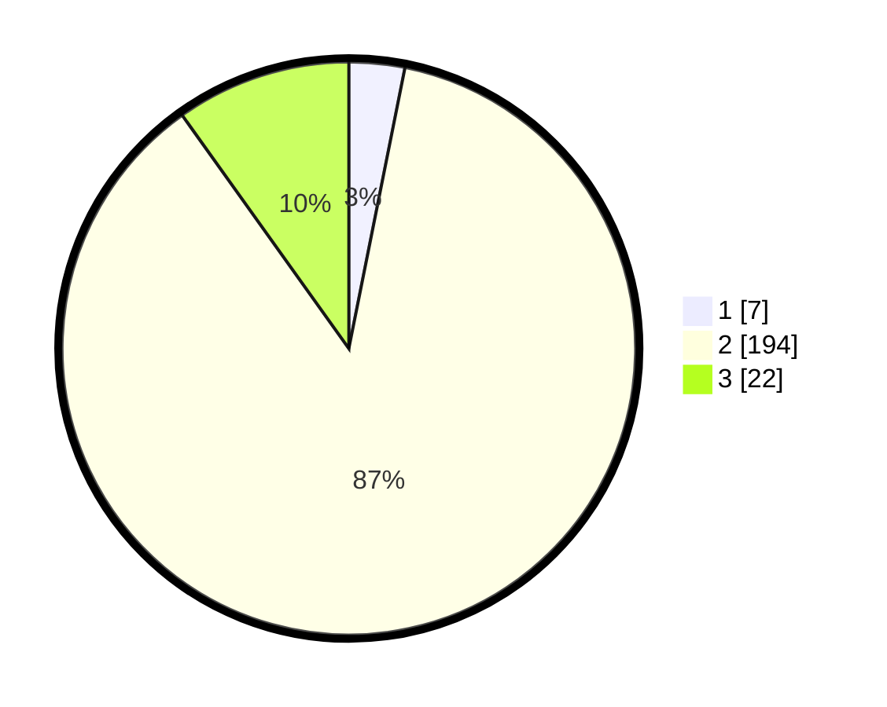

# Hasil

## Grafik

## Tabel

| No. | Nama Paslon    | Suara | Suara (raw) | Persentase |
|:--- |:-------------- | -----:| -----------:| ----------:|
| 1   | ANIES MUHAIMIN | 7     | [7][p-1]    | 3,14       |
| 2   | PRABOWO GIBRAN | 194   | [194][p-2]  | 87,00      |
| 3   | GANJAR MAHFUD  | 22    | [22][p-3]   | 9,87       |

[p-1]: https://github.com/gigit-pemilu/pemilu-2024/blob/main/pilpres/hitung-suara/sub/53-nusa-tenggara-timur/sub/18-sumba-barat-daya/sub/04-wewewa-barat/sub/2001-waimangura/sub/002-tps/sub/paslon-1.txt
[p-2]: https://github.com/gigit-pemilu/pemilu-2024/blob/main/pilpres/hitung-suara/sub/53-nusa-tenggara-timur/sub/18-sumba-barat-daya/sub/04-wewewa-barat/sub/2001-waimangura/sub/002-tps/sub/paslon-2.txt
[p-3]: https://github.com/gigit-pemilu/pemilu-2024/blob/main/pilpres/hitung-suara/sub/53-nusa-tenggara-timur/sub/18-sumba-barat-daya/sub/04-wewewa-barat/sub/2001-waimangura/sub/002-tps/sub/paslon-3.txt

## Foto C Plano

https://sirekap-obj-formc.kpu.go.id/44a7/pemilu/ppwp/53/18/04/20/01/5318042001002-20240215-132535--88e3629a-cbd5-4d39-9880-d8c02b0d2634.jpg

https://sirekap-obj-formc.kpu.go.id/44a7/pemilu/ppwp/53/18/04/20/01/5318042001002-20240215-132819--cc43b170-2d26-4a75-a809-38c37f79ca5c.jpg

https://sirekap-obj-formc.kpu.go.id/44a7/pemilu/ppwp/53/18/04/20/01/5318042001002-20240215-133135--4633377e-13c8-411b-a2db-bf53fd322ed4.jpg

## Metadata

| Key        | Value               |
| ---------- | ------------------- |
| Time Stamp | 2024-02-25 17:00:00 |

