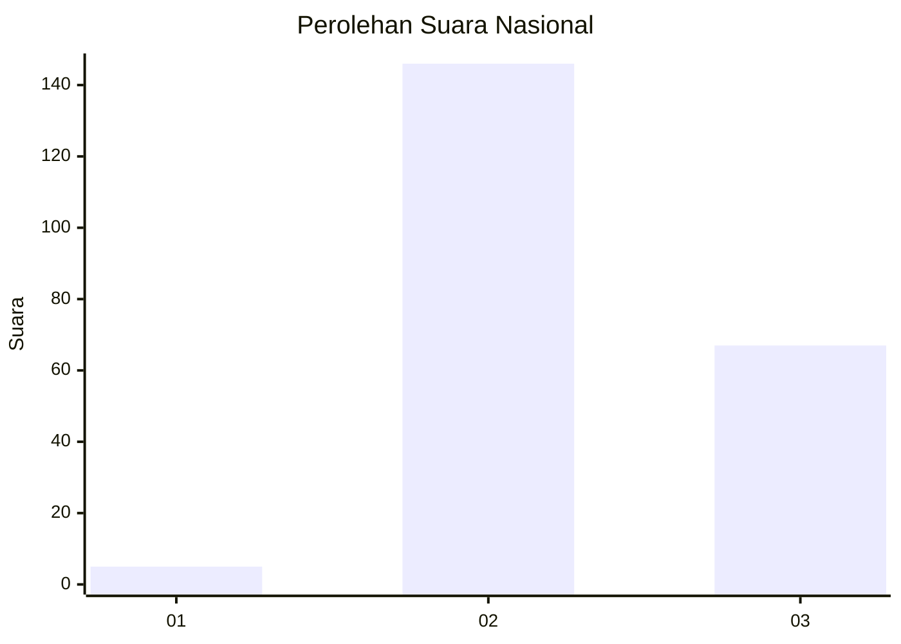
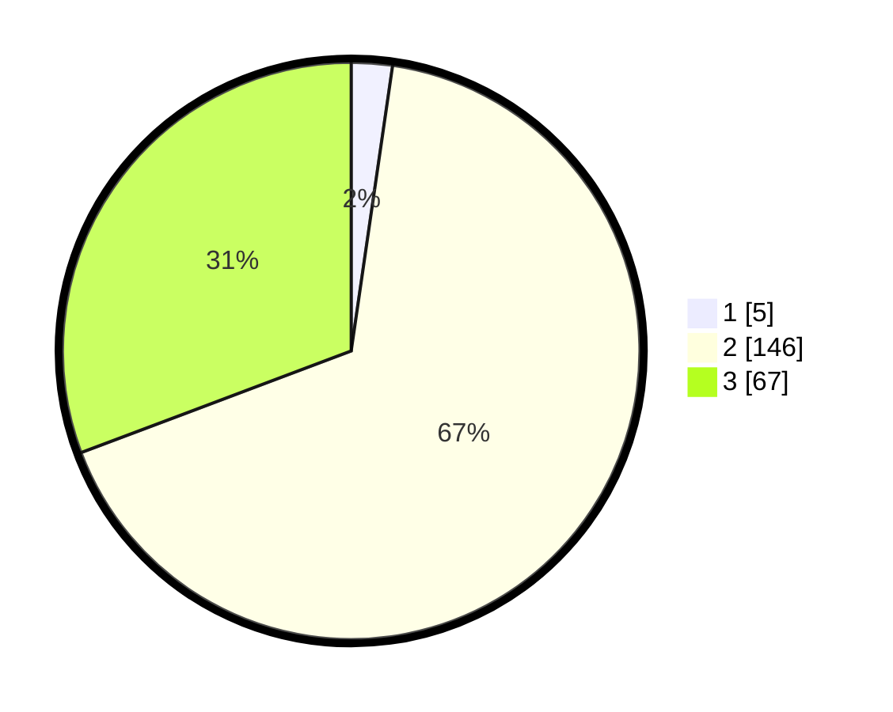

# Hasil

## Grafik

## Tabel

| No. | Nama Paslon    | Suara | Suara (raw) | Persentase |
|:--- |:-------------- | -----:| -----------:| ----------:|
| 1   | ANIES MUHAIMIN | 5     | [5][p-1]    | 2,29       |
| 2   | PRABOWO GIBRAN | 146   | [146][p-2]  | 66,97      |
| 3   | GANJAR MAHFUD  | 67    | [67][p-3]   | 30,73      |

[p-1]: https://github.com/gigit-pemilu/pemilu-2024/blob/main/pilpres/hitung-suara/sub/53-nusa-tenggara-timur/sub/18-sumba-barat-daya/sub/04-wewewa-barat/sub/2001-waimangura/sub/005-tps/sub/paslon-1.txt
[p-2]: https://github.com/gigit-pemilu/pemilu-2024/blob/main/pilpres/hitung-suara/sub/53-nusa-tenggara-timur/sub/18-sumba-barat-daya/sub/04-wewewa-barat/sub/2001-waimangura/sub/005-tps/sub/paslon-2.txt
[p-3]: https://github.com/gigit-pemilu/pemilu-2024/blob/main/pilpres/hitung-suara/sub/53-nusa-tenggara-timur/sub/18-sumba-barat-daya/sub/04-wewewa-barat/sub/2001-waimangura/sub/005-tps/sub/paslon-3.txt

## Foto C Plano

https://sirekap-obj-formc.kpu.go.id/01df/pemilu/ppwp/53/18/04/20/01/5318042001005-20240215-090230--138fff69-cd49-4d92-ad7e-ef0b5fb5b576.jpg

https://sirekap-obj-formc.kpu.go.id/01df/pemilu/ppwp/53/18/04/20/01/5318042001005-20240215-090802--51ef32bf-44c9-4519-b49d-eb492cc708cf.jpg

https://sirekap-obj-formc.kpu.go.id/01df/pemilu/ppwp/53/18/04/20/01/5318042001005-20240215-090921--5dc1eb56-79c3-41ea-9192-2e21efa5fbd6.jpg

## Metadata

| Key        | Value               |
| ---------- | ------------------- |
| Time Stamp | 2024-02-25 17:00:00 |

