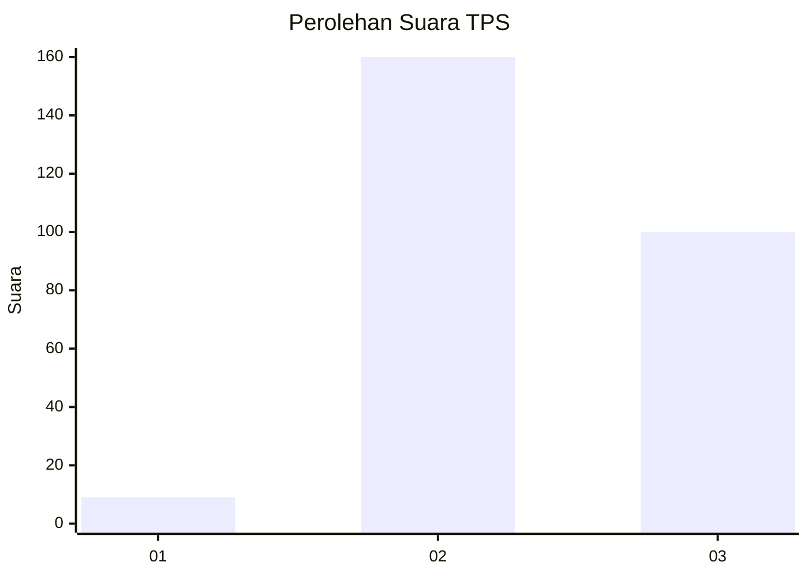
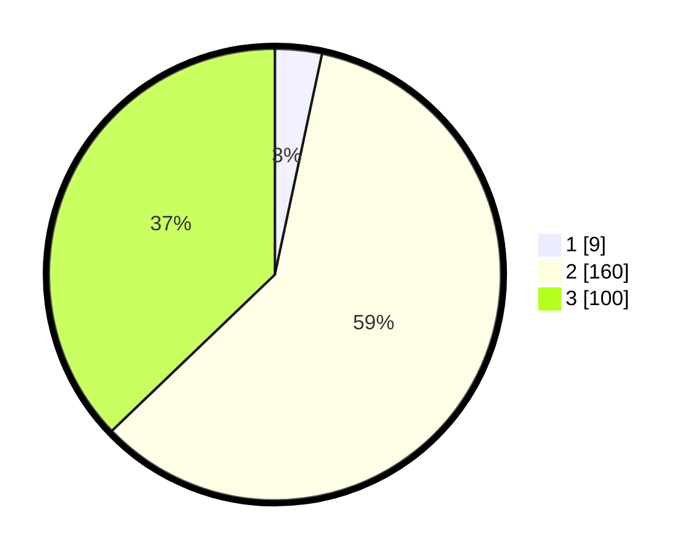

# Hasil

## Grafik

## Tabel

| No. | Nama Paslon    | Suara | Suara (raw) | Persentase |
|:--- |:-------------- | -----:| -----------:| ----------:|
| 1   | ANIES MUHAIMIN | 9     | [9][p-1]    | 3,35       |
| 2   | PRABOWO GIBRAN | 160   | [160][p-2]  | 59,48      |
| 3   | GANJAR MAHFUD  | 100   | [100][p-3]  | 37,17      |

[p-1]: https://github.com/gigit-pemilu/pemilu-2024-53-nusa-tenggara-timur/blob/main/pilpres/hitung-suara/sub/53-nusa-tenggara-timur/sub/18-sumba-barat-daya/sub/05-wewewa-selatan/sub/2001-buru-deilo/sub/002-tps/sub/paslon-1.txt
[p-2]: https://github.com/gigit-pemilu/pemilu-2024-53-nusa-tenggara-timur/blob/main/pilpres/hitung-suara/sub/53-nusa-tenggara-timur/sub/18-sumba-barat-daya/sub/05-wewewa-selatan/sub/2001-buru-deilo/sub/002-tps/sub/paslon-2.txt
[p-3]: https://github.com/gigit-pemilu/pemilu-2024-53-nusa-tenggara-timur/blob/main/pilpres/hitung-suara/sub/53-nusa-tenggara-timur/sub/18-sumba-barat-daya/sub/05-wewewa-selatan/sub/2001-buru-deilo/sub/002-tps/sub/paslon-3.txt

## Foto C Plano

https://sirekap-obj-formc.kpu.go.id/b051/pemilu/ppwp/53/18/05/20/01/5318052001002-20240215-104314--18751c0c-a773-437a-b08f-a0f84f3b6cfd.jpg

https://sirekap-obj-formc.kpu.go.id/b051/pemilu/ppwp/53/18/05/20/01/5318052001002-20240215-143305--806214ec-fe5a-4317-88c4-0af98c202719.jpg

https://sirekap-obj-formc.kpu.go.id/b051/pemilu/ppwp/53/18/05/20/01/5318052001002-20240215-103430--8f41d6ec-e8fb-4221-91a0-a7d3a3b5e764.jpg

## Metadata

| Key        | Value               |
| ---------- | ------------------- |
| Time Stamp | 2024-02-25 20:00:00 |

