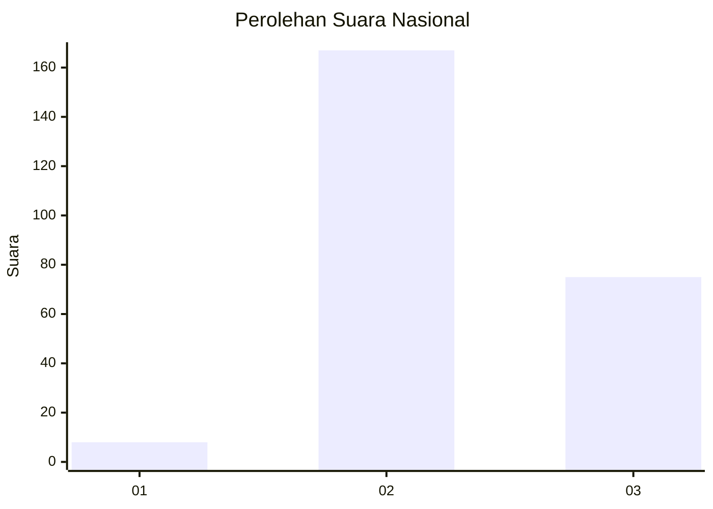

# Hasil

## Grafik

## Tabel

| No. | Nama Paslon    | Suara | Suara (raw) | Persentase |
|:--- |:-------------- | -----:| -----------:| ----------:|
| 1   | ANIES MUHAIMIN | 8     | [8][p-1]    | 3,20       |
| 2   | PRABOWO GIBRAN | 167   | [167][p-2]  | 66,80      |
| 3   | GANJAR MAHFUD  | 75    | [75][p-3]   | 30,00      |

[p-1]: https://github.com/gigit-pemilu/pemilu-2024/blob/main/pilpres/hitung-suara/sub/53-nusa-tenggara-timur/sub/18-sumba-barat-daya/sub/05-wewewa-selatan/sub/2003-buru-kaghu/sub/001-tps/sub/paslon-1.txt
[p-2]: https://github.com/gigit-pemilu/pemilu-2024/blob/main/pilpres/hitung-suara/sub/53-nusa-tenggara-timur/sub/18-sumba-barat-daya/sub/05-wewewa-selatan/sub/2003-buru-kaghu/sub/001-tps/sub/paslon-2.txt
[p-3]: https://github.com/gigit-pemilu/pemilu-2024/blob/main/pilpres/hitung-suara/sub/53-nusa-tenggara-timur/sub/18-sumba-barat-daya/sub/05-wewewa-selatan/sub/2003-buru-kaghu/sub/001-tps/sub/paslon-3.txt

## Foto C Plano

https://sirekap-obj-formc.kpu.go.id/86a2/pemilu/ppwp/53/18/05/20/03/5318052003001-20240215-154124--9b74d979-efbd-4f8b-9e24-64767ca9ae8d.jpg

https://sirekap-obj-formc.kpu.go.id/86a2/pemilu/ppwp/53/18/05/20/03/5318052003001-20240215-154021--3d5df5d4-bd32-43bc-b25b-f51a0be4df85.jpg

https://sirekap-obj-formc.kpu.go.id/86a2/pemilu/ppwp/53/18/05/20/03/5318052003001-20240215-165311--31e3622f-40d9-427e-a3cd-9cc24ffdb6d3.jpg

## Metadata

| Key        | Value               |
| ---------- | ------------------- |
| Time Stamp | 2024-02-25 22:00:00 |

