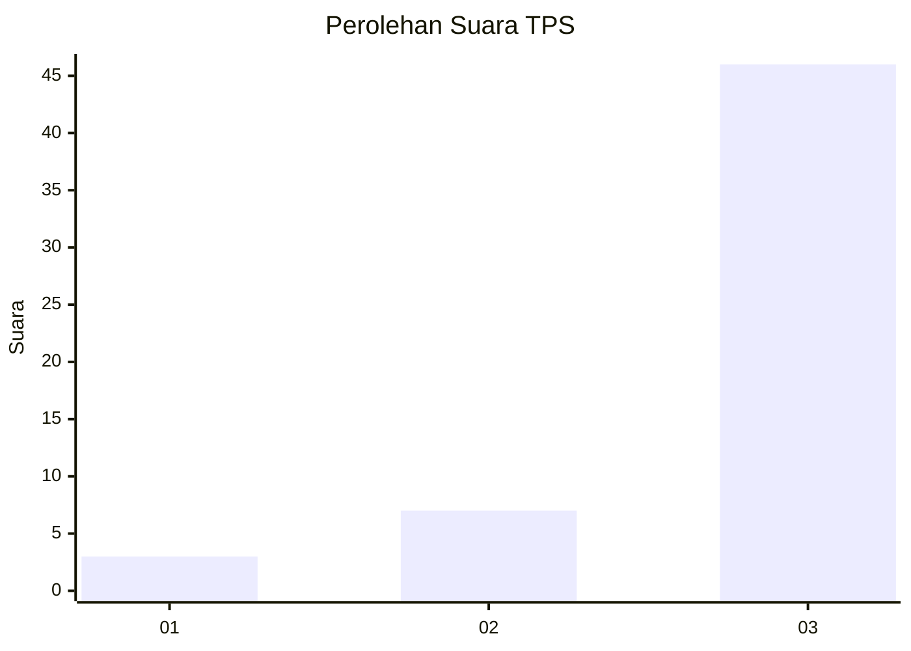
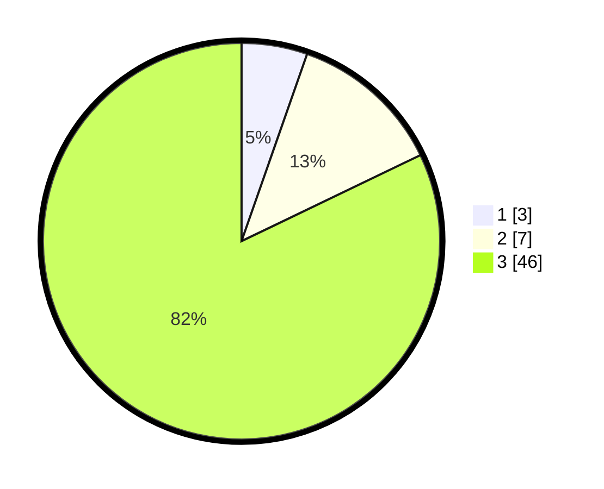

# Hasil

## Grafik

## Tabel

| No. | Nama Paslon    | Suara | Suara (raw) | Persentase |
|:--- |:-------------- | -----:| -----------:| ----------:|
| 1   | ANIES MUHAIMIN | 3     | [3][p-1]    | 5,36       |
| 2   | PRABOWO GIBRAN | 7     | [7][p-2]    | 12,50      |
| 3   | GANJAR MAHFUD  | 46    | [46][p-3]   | 82,14      |

[p-1]: https://github.com/gigit-pemilu/pemilu-2024-53-nusa-tenggara-timur/blob/main/pilpres/hitung-suara/sub/53-nusa-tenggara-timur/sub/18-sumba-barat-daya/sub/05-wewewa-selatan/sub/2004-denduka/sub/003-tps/sub/paslon-1.txt
[p-2]: https://github.com/gigit-pemilu/pemilu-2024-53-nusa-tenggara-timur/blob/main/pilpres/hitung-suara/sub/53-nusa-tenggara-timur/sub/18-sumba-barat-daya/sub/05-wewewa-selatan/sub/2004-denduka/sub/003-tps/sub/paslon-2.txt
[p-3]: https://github.com/gigit-pemilu/pemilu-2024-53-nusa-tenggara-timur/blob/main/pilpres/hitung-suara/sub/53-nusa-tenggara-timur/sub/18-sumba-barat-daya/sub/05-wewewa-selatan/sub/2004-denduka/sub/003-tps/sub/paslon-3.txt

## Foto C Plano

https://sirekap-obj-formc.kpu.go.id/6f5e/pemilu/ppwp/53/18/05/20/04/5318052004003-20240215-121846--51d76ade-32da-4ace-9739-c4aaf136ec49.jpg

https://sirekap-obj-formc.kpu.go.id/6f5e/pemilu/ppwp/53/18/05/20/04/5318052004003-20240215-122028--e1253bf6-7a01-4a5a-ad89-9b317d012dbb.jpg

https://sirekap-obj-formc.kpu.go.id/6f5e/pemilu/ppwp/53/18/05/20/04/5318052004003-20240215-122214--c6f54616-5a35-4108-8853-4acbcef967ee.jpg

## Metadata

| Key        | Value               |
| ---------- | ------------------- |
| Time Stamp | 2024-02-24 22:31:28 |

