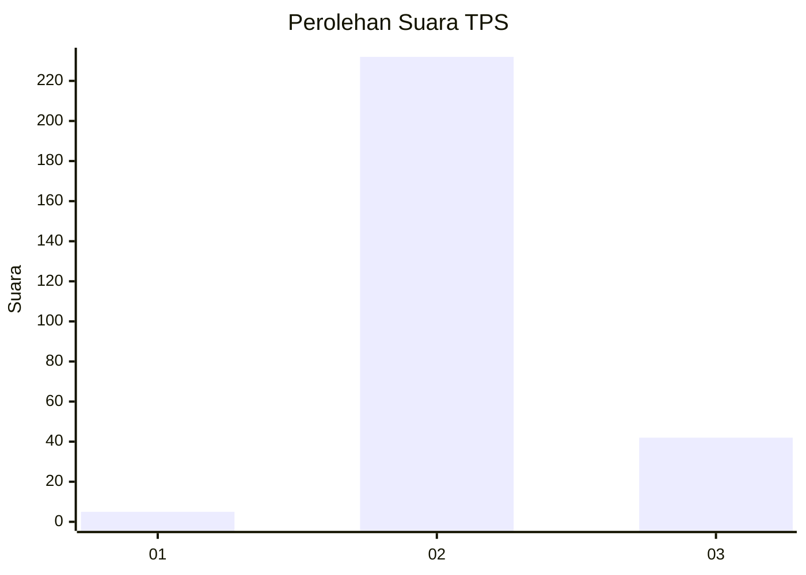
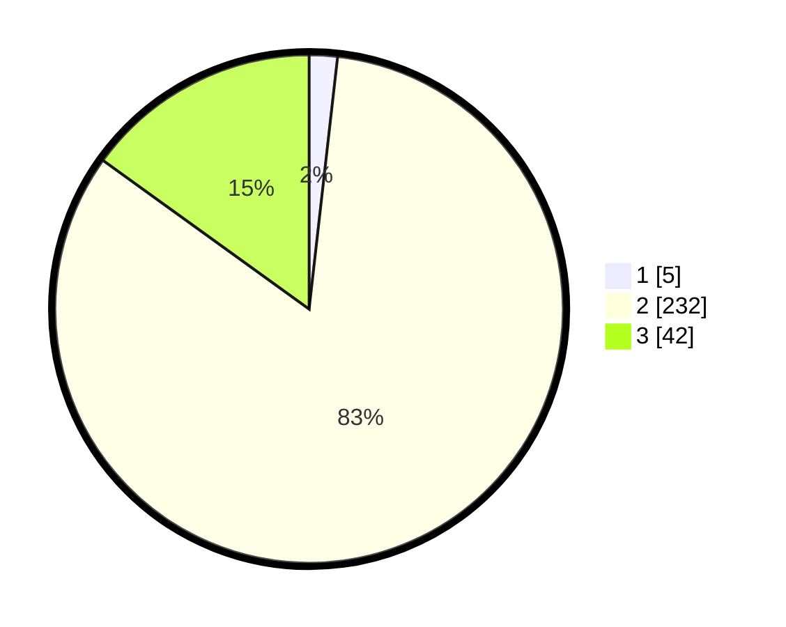

# Hasil

## Grafik

## Tabel

| No. | Nama Paslon    | Suara | Suara (raw) | Persentase |
|:--- |:-------------- | -----:| -----------:| ----------:|
| 1   | ANIES MUHAIMIN | 5     | [5][p-1]    | 1,79       |
| 2   | PRABOWO GIBRAN | 232   | [232][p-2]  | 83,15      |
| 3   | GANJAR MAHFUD  | 42    | [42][p-3]   | 15,05      |

[p-1]: https://github.com/gigit-pemilu/pemilu-2024-53-nusa-tenggara-timur/blob/main/pilpres/hitung-suara/sub/53-nusa-tenggara-timur/sub/18-sumba-barat-daya/sub/05-wewewa-selatan/sub/2012-mandungo/sub/003-tps/sub/paslon-1.txt
[p-2]: https://github.com/gigit-pemilu/pemilu-2024-53-nusa-tenggara-timur/blob/main/pilpres/hitung-suara/sub/53-nusa-tenggara-timur/sub/18-sumba-barat-daya/sub/05-wewewa-selatan/sub/2012-mandungo/sub/003-tps/sub/paslon-2.txt
[p-3]: https://github.com/gigit-pemilu/pemilu-2024-53-nusa-tenggara-timur/blob/main/pilpres/hitung-suara/sub/53-nusa-tenggara-timur/sub/18-sumba-barat-daya/sub/05-wewewa-selatan/sub/2012-mandungo/sub/003-tps/sub/paslon-3.txt

## Foto C Plano

https://sirekap-obj-formc.kpu.go.id/6709/pemilu/ppwp/53/18/05/20/12/5318052012003-20240215-122526--fbcfbb4b-3d19-4662-99db-1b5714657bd6.jpg

https://sirekap-obj-formc.kpu.go.id/6709/pemilu/ppwp/53/18/05/20/12/5318052012003-20240215-122918--3aff343c-3ec2-427c-9886-6bb3016d3bd2.jpg

https://sirekap-obj-formc.kpu.go.id/6709/pemilu/ppwp/53/18/05/20/12/5318052012003-20240215-123159--db1d91b4-b10e-4c1f-9370-b6d69de2d578.jpg

## Metadata

| Key        | Value               |
| ---------- | ------------------- |
| Time Stamp | 2024-02-25 16:00:00 |

