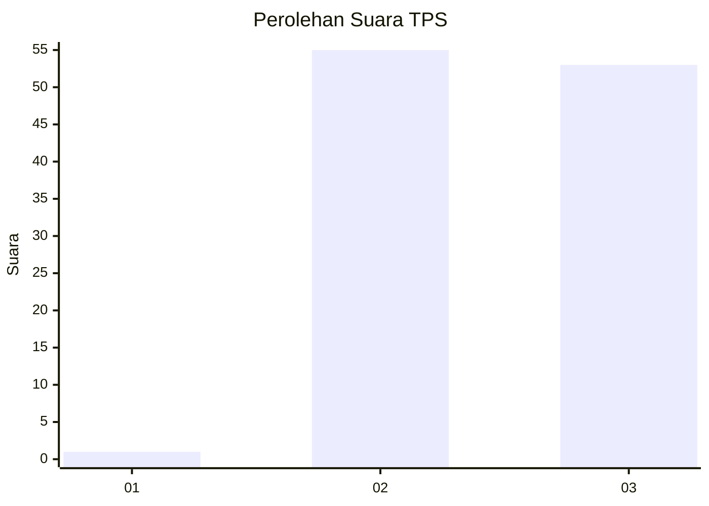
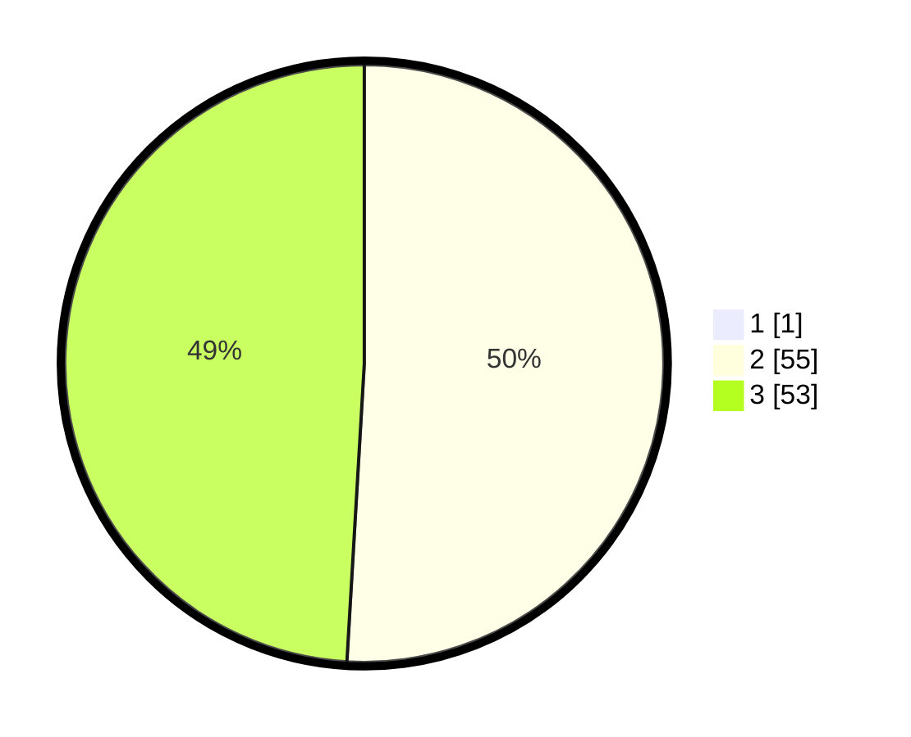

# Hasil

## Grafik

## Tabel

| No. | Nama Paslon    | Suara | Suara (raw) | Persentase |
|:--- |:-------------- | -----:| -----------:| ----------:|
| 1   | ANIES MUHAIMIN | 1     | [1][p-1]    | 0,92       |
| 2   | PRABOWO GIBRAN | 55    | [55][p-2]   | 50,46      |
| 3   | GANJAR MAHFUD  | 53    | [53][p-3]   | 48,62      |

[p-1]: https://github.com/gigit-pemilu/pemilu-2024-53-nusa-tenggara-timur/blob/main/pilpres/hitung-suara/sub/53-nusa-tenggara-timur/sub/18-sumba-barat-daya/sub/06-kodi-bangedo/sub/2011-mata-kapore/sub/001-tps/sub/paslon-1.txt
[p-2]: https://github.com/gigit-pemilu/pemilu-2024-53-nusa-tenggara-timur/blob/main/pilpres/hitung-suara/sub/53-nusa-tenggara-timur/sub/18-sumba-barat-daya/sub/06-kodi-bangedo/sub/2011-mata-kapore/sub/001-tps/sub/paslon-2.txt
[p-3]: https://github.com/gigit-pemilu/pemilu-2024-53-nusa-tenggara-timur/blob/main/pilpres/hitung-suara/sub/53-nusa-tenggara-timur/sub/18-sumba-barat-daya/sub/06-kodi-bangedo/sub/2011-mata-kapore/sub/001-tps/sub/paslon-3.txt

## Foto C Plano

https://sirekap-obj-formc.kpu.go.id/520b/pemilu/ppwp/53/18/06/20/11/5318062011001-20240215-200006--dbb16e29-c69d-4e3c-ada6-9823b7afd5d3.jpg

https://sirekap-obj-formc.kpu.go.id/520b/pemilu/ppwp/53/18/06/20/11/5318062011001-20240215-201449--fe7194c4-b628-433a-a8f9-18b30d96a856.jpg

https://sirekap-obj-formc.kpu.go.id/520b/pemilu/ppwp/53/18/06/20/11/5318062011001-20240215-201708--767b2dd8-3756-4270-bd3c-95a27f6d1eb2.jpg

## Metadata

| Key        | Value               |
| ---------- | ------------------- |
| Time Stamp | 2024-02-16 01:00:27 |

