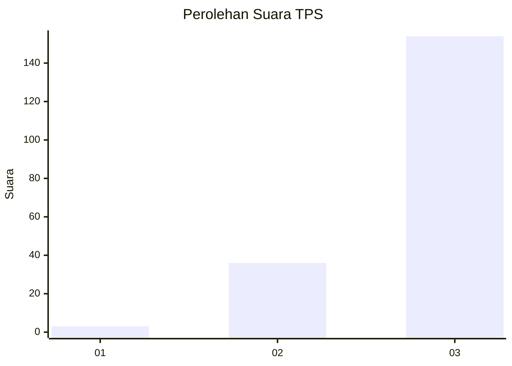
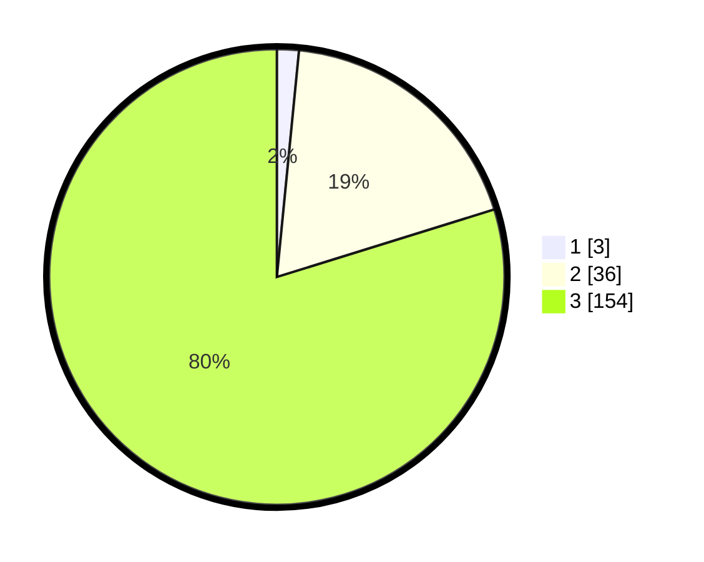

# Hasil

## Grafik

## Tabel

| No. | Nama Paslon    | Suara | Suara (raw) | Persentase |
|:--- |:-------------- | -----:| -----------:| ----------:|
| 1   | ANIES MUHAIMIN | 3     | [3][p-1]    | 1,55       |
| 2   | PRABOWO GIBRAN | 36    | [36][p-2]   | 18,65      |
| 3   | GANJAR MAHFUD  | 154   | [154][p-3]  | 79,79      |

[p-1]: https://github.com/gigit-pemilu/pemilu-2024-53-nusa-tenggara-timur/blob/main/pilpres/hitung-suara/sub/53-nusa-tenggara-timur/sub/18-sumba-barat-daya/sub/06-kodi-bangedo/sub/2024-mere-kehe/sub/001-tps/sub/paslon-1.txt
[p-2]: https://github.com/gigit-pemilu/pemilu-2024-53-nusa-tenggara-timur/blob/main/pilpres/hitung-suara/sub/53-nusa-tenggara-timur/sub/18-sumba-barat-daya/sub/06-kodi-bangedo/sub/2024-mere-kehe/sub/001-tps/sub/paslon-2.txt
[p-3]: https://github.com/gigit-pemilu/pemilu-2024-53-nusa-tenggara-timur/blob/main/pilpres/hitung-suara/sub/53-nusa-tenggara-timur/sub/18-sumba-barat-daya/sub/06-kodi-bangedo/sub/2024-mere-kehe/sub/001-tps/sub/paslon-3.txt

## Foto C Plano

https://sirekap-obj-formc.kpu.go.id/7b21/pemilu/ppwp/53/18/06/20/24/5318062024001-20240215-103850--0467a759-97b2-4104-96a0-084d66c83c9a.jpg

https://sirekap-obj-formc.kpu.go.id/7b21/pemilu/ppwp/53/18/06/20/24/5318062024001-20240215-104148--6572cd70-7955-4b5f-b4b8-40dbbb41aa66.jpg

https://sirekap-obj-formc.kpu.go.id/7b21/pemilu/ppwp/53/18/06/20/24/5318062024001-20240215-104203--a8250ed2-aed5-4549-98b3-fc228ae97c85.jpg

## Metadata

| Key        | Value               |
| ---------- | ------------------- |
| Time Stamp | 2024-02-24 22:31:28 |

