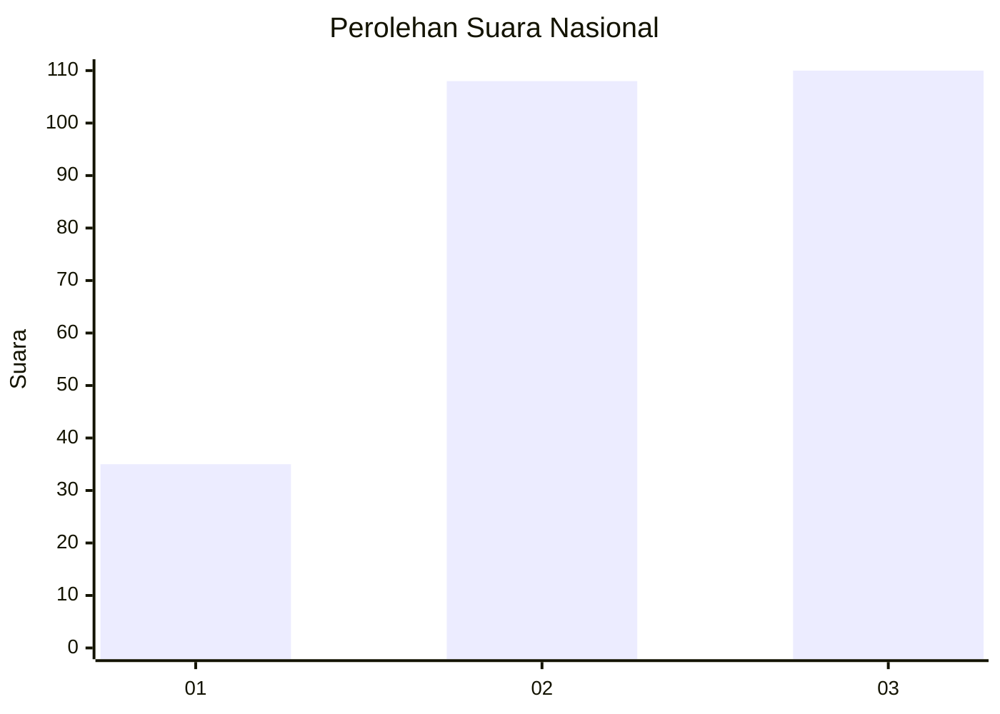
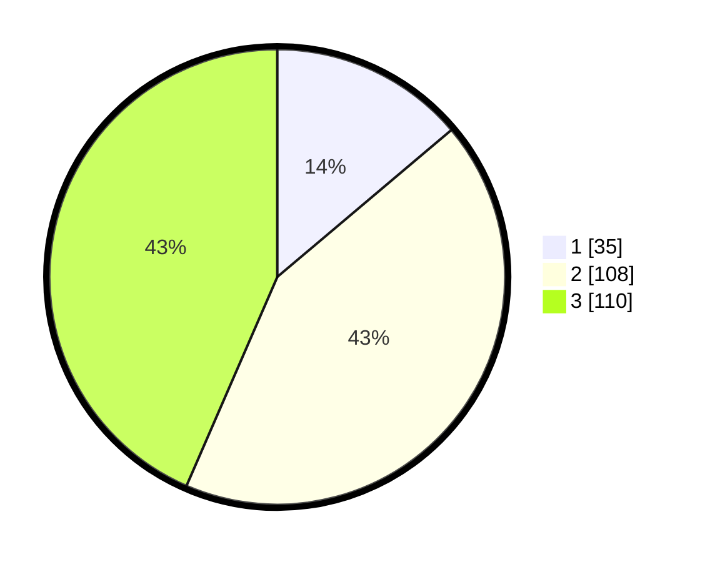

# Hasil

## Grafik

## Tabel

| No. | Nama Paslon    | Suara | Suara (raw) | Persentase |
|:--- |:-------------- | -----:| -----------:| ----------:|
| 1   | ANIES MUHAIMIN | 35    | [35][p-1]   | 13,83      |
| 2   | PRABOWO GIBRAN | 108   | [108][p-2]  | 42,69      |
| 3   | GANJAR MAHFUD  | 110   | [110][p-3]  | 43,48      |

[p-1]: https://github.com/gigit-pemilu/pemilu-2024/blob/main/pilpres/hitung-suara/sub/53-nusa-tenggara-timur/sub/18-sumba-barat-daya/sub/07-kodi/sub/2002-ate-dalo/sub/001-tps/sub/paslon-1.txt
[p-2]: https://github.com/gigit-pemilu/pemilu-2024/blob/main/pilpres/hitung-suara/sub/53-nusa-tenggara-timur/sub/18-sumba-barat-daya/sub/07-kodi/sub/2002-ate-dalo/sub/001-tps/sub/paslon-2.txt
[p-3]: https://github.com/gigit-pemilu/pemilu-2024/blob/main/pilpres/hitung-suara/sub/53-nusa-tenggara-timur/sub/18-sumba-barat-daya/sub/07-kodi/sub/2002-ate-dalo/sub/001-tps/sub/paslon-3.txt

## Foto C Plano

https://sirekap-obj-formc.kpu.go.id/647a/pemilu/ppwp/53/18/07/20/02/5318072002001-20240217-072552--5b718a60-9dd9-4941-a7ff-9ecd9f8535ca.jpg

https://sirekap-obj-formc.kpu.go.id/647a/pemilu/ppwp/53/18/07/20/02/5318072002001-20240217-072907--a2f5ee0d-ca9b-469a-b3df-181b5c01620d.jpg

https://sirekap-obj-formc.kpu.go.id/647a/pemilu/ppwp/53/18/07/20/02/5318072002001-20240217-073323--a2993717-6089-41fb-bb44-e4ad7e31cbfc.jpg

## Metadata

| Key        | Value               |
| ---------- | ------------------- |
| Time Stamp | 2024-02-24 22:31:28 |

