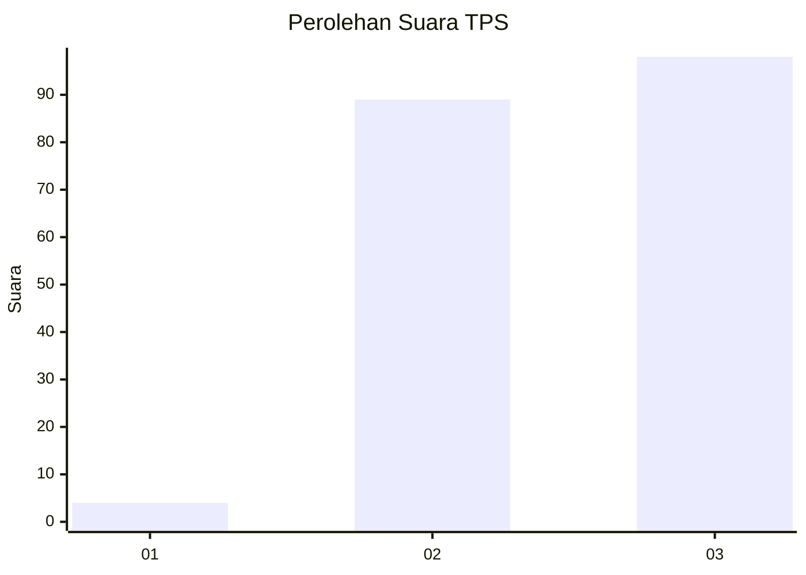
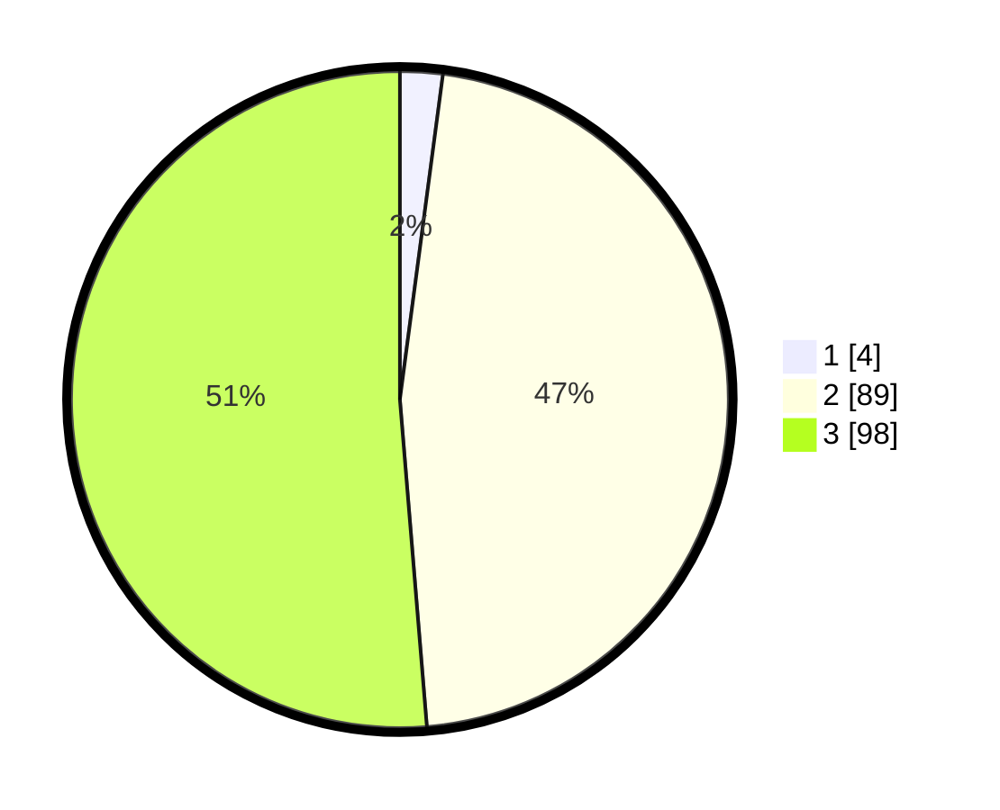

# Hasil

## Grafik

## Tabel

| No. | Nama Paslon    | Suara | Suara (raw) | Persentase |
|:--- |:-------------- | -----:| -----------:| ----------:|
| 1   | ANIES MUHAIMIN | 4     | [4][p-1]    | 2,09       |
| 2   | PRABOWO GIBRAN | 89    | [89][p-2]   | 46,60      |
| 3   | GANJAR MAHFUD  | 98    | [98][p-3]   | 51,31      |

[p-1]: https://github.com/gigit-pemilu/pemilu-2024-53-nusa-tenggara-timur/blob/main/pilpres/hitung-suara/sub/53-nusa-tenggara-timur/sub/18-sumba-barat-daya/sub/07-kodi/sub/2003-hamonggo-lele/sub/001-tps/sub/paslon-1.txt
[p-2]: https://github.com/gigit-pemilu/pemilu-2024-53-nusa-tenggara-timur/blob/main/pilpres/hitung-suara/sub/53-nusa-tenggara-timur/sub/18-sumba-barat-daya/sub/07-kodi/sub/2003-hamonggo-lele/sub/001-tps/sub/paslon-2.txt
[p-3]: https://github.com/gigit-pemilu/pemilu-2024-53-nusa-tenggara-timur/blob/main/pilpres/hitung-suara/sub/53-nusa-tenggara-timur/sub/18-sumba-barat-daya/sub/07-kodi/sub/2003-hamonggo-lele/sub/001-tps/sub/paslon-3.txt

## Foto C Plano

https://sirekap-obj-formc.kpu.go.id/8c8d/pemilu/ppwp/53/18/07/20/03/5318072003001-20240215-175149--580724bf-94bf-4b41-933e-655c73cca6c4.jpg

https://sirekap-obj-formc.kpu.go.id/8c8d/pemilu/ppwp/53/18/07/20/03/5318072003001-20240215-175934--1707bf31-e2c3-40e8-8962-b5de9082c191.jpg

https://sirekap-obj-formc.kpu.go.id/8c8d/pemilu/ppwp/53/18/07/20/03/5318072003001-20240215-180416--8873d52e-3c1a-4d59-a3cd-c1319c9ed705.jpg

## Metadata

| Key        | Value               |
| ---------- | ------------------- |
| Time Stamp | 2024-02-26 13:00:00 |

