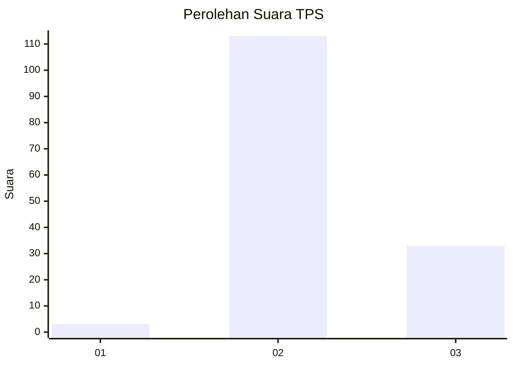

# Hasil

## Grafik

## Tabel

| No. | Nama Paslon    | Suara | Suara (raw) | Persentase |
|:--- |:-------------- | -----:| -----------:| ----------:|
| 1   | ANIES MUHAIMIN | 3     | [3][p-1]    | 2,01       |
| 2   | PRABOWO GIBRAN | 113   | [113][p-2]  | 75,84      |
| 3   | GANJAR MAHFUD  | 33    | [33][p-3]   | 22,15      |

[p-1]: https://github.com/gigit-pemilu/pemilu-2024-53-nusa-tenggara-timur/blob/main/pilpres/hitung-suara/sub/53-nusa-tenggara-timur/sub/18-sumba-barat-daya/sub/07-kodi/sub/2003-hamonggo-lele/sub/002-tps/sub/paslon-1.txt
[p-2]: https://github.com/gigit-pemilu/pemilu-2024-53-nusa-tenggara-timur/blob/main/pilpres/hitung-suara/sub/53-nusa-tenggara-timur/sub/18-sumba-barat-daya/sub/07-kodi/sub/2003-hamonggo-lele/sub/002-tps/sub/paslon-2.txt
[p-3]: https://github.com/gigit-pemilu/pemilu-2024-53-nusa-tenggara-timur/blob/main/pilpres/hitung-suara/sub/53-nusa-tenggara-timur/sub/18-sumba-barat-daya/sub/07-kodi/sub/2003-hamonggo-lele/sub/002-tps/sub/paslon-3.txt

## Foto C Plano

https://sirekap-obj-formc.kpu.go.id/4298/pemilu/ppwp/53/18/07/20/03/5318072003002-20240215-161934--e1e25d0a-2da6-47b4-8863-ab0d8a244cd8.jpg

https://sirekap-obj-formc.kpu.go.id/4298/pemilu/ppwp/53/18/07/20/03/5318072003002-20240215-161746--4c2a58e2-2d93-41e0-9e32-7ddcf2b65612.jpg

https://sirekap-obj-formc.kpu.go.id/4298/pemilu/ppwp/53/18/07/20/03/5318072003002-20240215-153159--a44af843-312f-438f-b95c-1b2a33e3a3c0.jpg

## Metadata

| Key        | Value               |
| ---------- | ------------------- |
| Time Stamp | 2024-02-25 16:00:00 |

