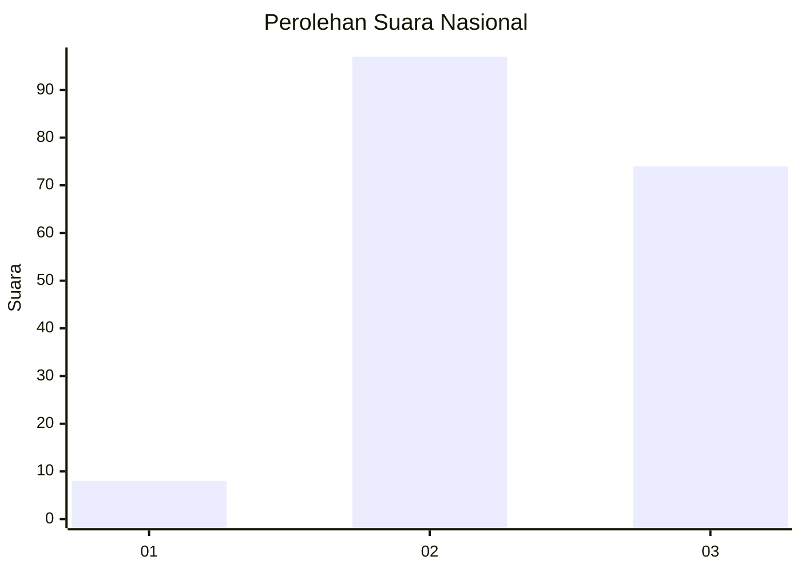
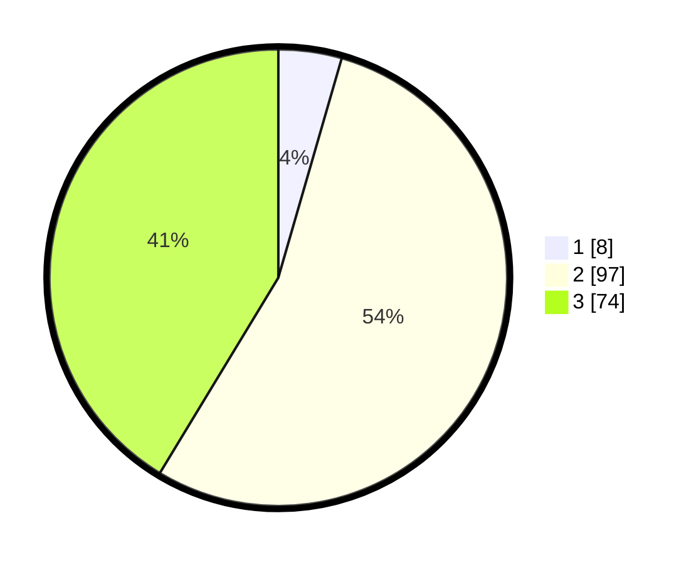

# Hasil

## Grafik

## Tabel

| No. | Nama Paslon    | Suara | Suara (raw) | Persentase |
|:--- |:-------------- | -----:| -----------:| ----------:|
| 1   | ANIES MUHAIMIN | 8     | [8][p-1]    | 4,47       |
| 2   | PRABOWO GIBRAN | 97    | [97][p-2]   | 54,19      |
| 3   | GANJAR MAHFUD  | 74    | [74][p-3]   | 41,34      |

[p-1]: https://github.com/gigit-pemilu/pemilu-2024/blob/main/pilpres/hitung-suara/sub/53-nusa-tenggara-timur/sub/18-sumba-barat-daya/sub/07-kodi/sub/2003-hamonggo-lele/sub/003-tps/sub/paslon-1.txt
[p-2]: https://github.com/gigit-pemilu/pemilu-2024/blob/main/pilpres/hitung-suara/sub/53-nusa-tenggara-timur/sub/18-sumba-barat-daya/sub/07-kodi/sub/2003-hamonggo-lele/sub/003-tps/sub/paslon-2.txt
[p-3]: https://github.com/gigit-pemilu/pemilu-2024/blob/main/pilpres/hitung-suara/sub/53-nusa-tenggara-timur/sub/18-sumba-barat-daya/sub/07-kodi/sub/2003-hamonggo-lele/sub/003-tps/sub/paslon-3.txt

## Foto C Plano

https://sirekap-obj-formc.kpu.go.id/96d6/pemilu/ppwp/53/18/07/20/03/5318072003003-20240215-163913--6fcb9056-d009-4c5c-9634-5d51daed6490.jpg

https://sirekap-obj-formc.kpu.go.id/96d6/pemilu/ppwp/53/18/07/20/03/5318072003003-20240215-164401--e6d76df5-bfad-490f-9f0c-c9b4fe54856c.jpg

https://sirekap-obj-formc.kpu.go.id/96d6/pemilu/ppwp/53/18/07/20/03/5318072003003-20240215-164232--4ed8e680-ef42-49f4-946b-13376b2b8205.jpg

## Metadata

| Key        | Value               |
| ---------- | ------------------- |
| Time Stamp | 2024-02-25 12:00:00 |

