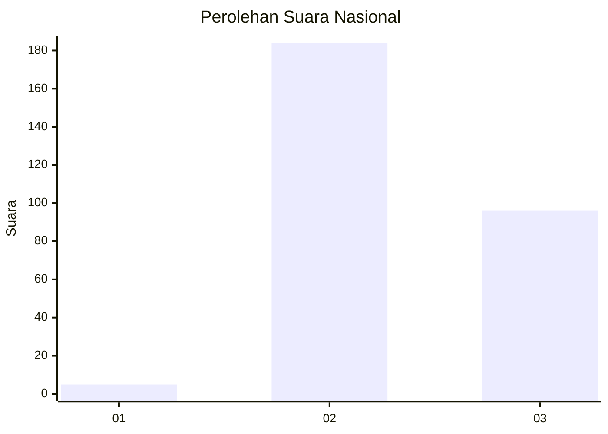
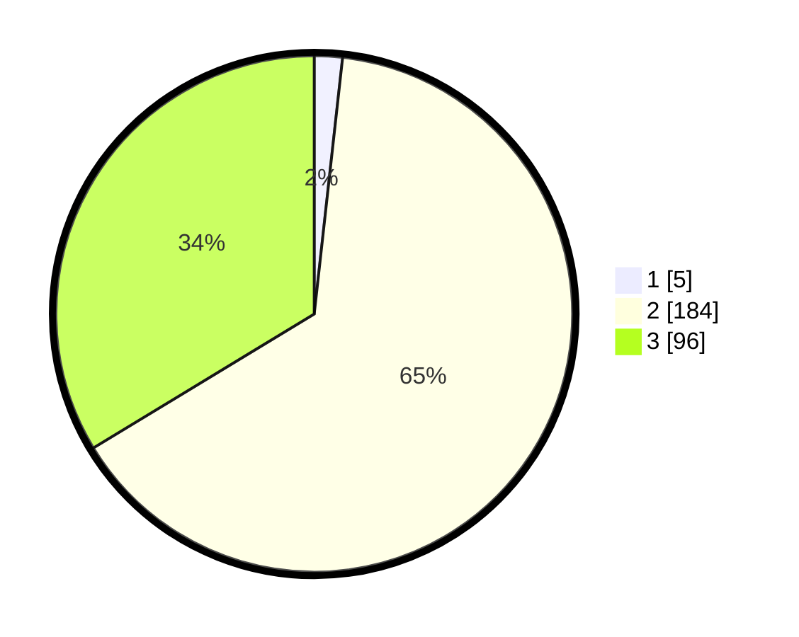

# Hasil

## Grafik

## Tabel

| No. | Nama Paslon    | Suara | Suara (raw) | Persentase |
|:--- |:-------------- | -----:| -----------:| ----------:|
| 1   | ANIES MUHAIMIN | 5     | [5][p-1]    | 1,75       |
| 2   | PRABOWO GIBRAN | 184   | [184][p-2]  | 64,56      |
| 3   | GANJAR MAHFUD  | 96    | [96][p-3]   | 33,68      |

[p-1]: https://github.com/gigit-pemilu/pemilu-2024/blob/main/pilpres/hitung-suara/sub/53-nusa-tenggara-timur/sub/18-sumba-barat-daya/sub/07-kodi/sub/2009-kawango-hari/sub/001-tps/sub/paslon-1.txt
[p-2]: https://github.com/gigit-pemilu/pemilu-2024/blob/main/pilpres/hitung-suara/sub/53-nusa-tenggara-timur/sub/18-sumba-barat-daya/sub/07-kodi/sub/2009-kawango-hari/sub/001-tps/sub/paslon-2.txt
[p-3]: https://github.com/gigit-pemilu/pemilu-2024/blob/main/pilpres/hitung-suara/sub/53-nusa-tenggara-timur/sub/18-sumba-barat-daya/sub/07-kodi/sub/2009-kawango-hari/sub/001-tps/sub/paslon-3.txt

## Foto C Plano

https://sirekap-obj-formc.kpu.go.id/b5ac/pemilu/ppwp/53/18/07/20/09/5318072009001-20240215-223329--45f7f57d-6636-4309-8711-dc3f2f87a136.jpg

https://sirekap-obj-formc.kpu.go.id/b5ac/pemilu/ppwp/53/18/07/20/09/5318072009001-20240215-223403--d681f52d-74a4-43f5-9b12-6a07bd35673c.jpg

https://sirekap-obj-formc.kpu.go.id/b5ac/pemilu/ppwp/53/18/07/20/09/5318072009001-20240215-223425--f7807cd1-33f8-426c-b18a-cd038a5127d2.jpg

## Metadata

| Key        | Value               |
| ---------- | ------------------- |
| Time Stamp | 2024-02-25 16:00:00 |

