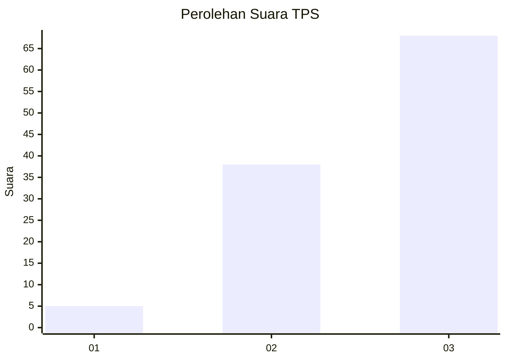
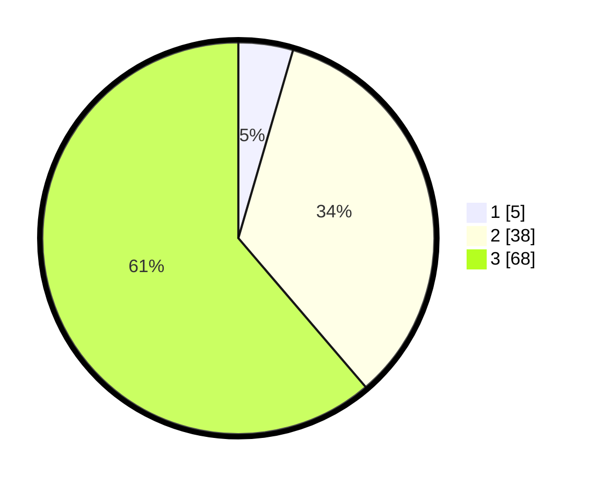

# Hasil

## Grafik

## Tabel

| No. | Nama Paslon    | Suara | Suara (raw) | Persentase |
|:--- |:-------------- | -----:| -----------:| ----------:|
| 1   | ANIES MUHAIMIN | 5     | [5][p-1]    | 4,50       |
| 2   | PRABOWO GIBRAN | 38    | [38][p-2]   | 34,23      |
| 3   | GANJAR MAHFUD  | 68    | [68][p-3]   | 61,26      |

[p-1]: https://github.com/gigit-pemilu/pemilu-2024-53-nusa-tenggara-timur/blob/main/pilpres/hitung-suara/sub/53-nusa-tenggara-timur/sub/18-sumba-barat-daya/sub/07-kodi/sub/2012-watu-wona/sub/003-tps/sub/paslon-1.txt
[p-2]: https://github.com/gigit-pemilu/pemilu-2024-53-nusa-tenggara-timur/blob/main/pilpres/hitung-suara/sub/53-nusa-tenggara-timur/sub/18-sumba-barat-daya/sub/07-kodi/sub/2012-watu-wona/sub/003-tps/sub/paslon-2.txt
[p-3]: https://github.com/gigit-pemilu/pemilu-2024-53-nusa-tenggara-timur/blob/main/pilpres/hitung-suara/sub/53-nusa-tenggara-timur/sub/18-sumba-barat-daya/sub/07-kodi/sub/2012-watu-wona/sub/003-tps/sub/paslon-3.txt

## Foto C Plano

https://sirekap-obj-formc.kpu.go.id/d4bf/pemilu/ppwp/53/18/07/20/12/5318072012003-20240215-193751--7a6a6b47-cef2-4ec3-b0a6-8313ca4f8e28.jpg

https://sirekap-obj-formc.kpu.go.id/d4bf/pemilu/ppwp/53/18/07/20/12/5318072012003-20240215-195145--2e57a91f-2f1e-408c-bae0-d8b78e27655b.jpg

https://sirekap-obj-formc.kpu.go.id/d4bf/pemilu/ppwp/53/18/07/20/12/5318072012003-20240215-185930--0966285f-ffe9-41e5-a466-0331cf0c3b89.jpg

## Metadata

| Key        | Value               |
| ---------- | ------------------- |
| Time Stamp | 2024-02-15 21:01:18 |

