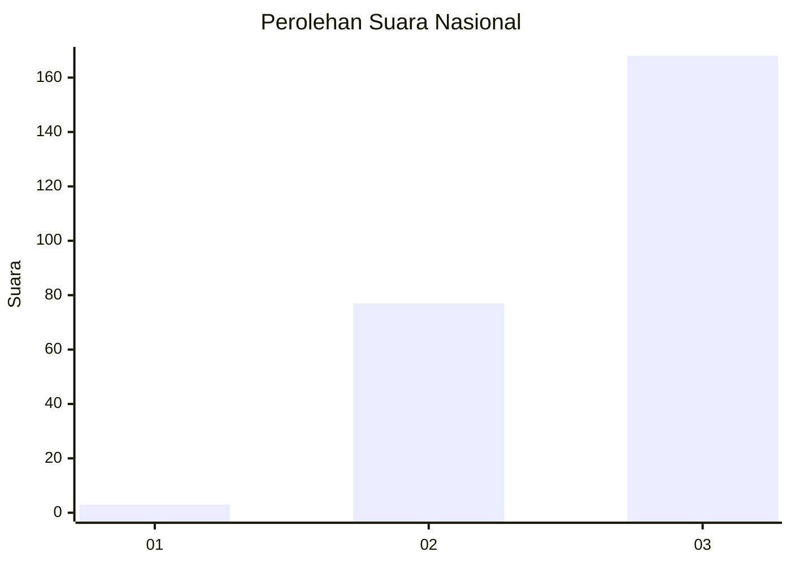
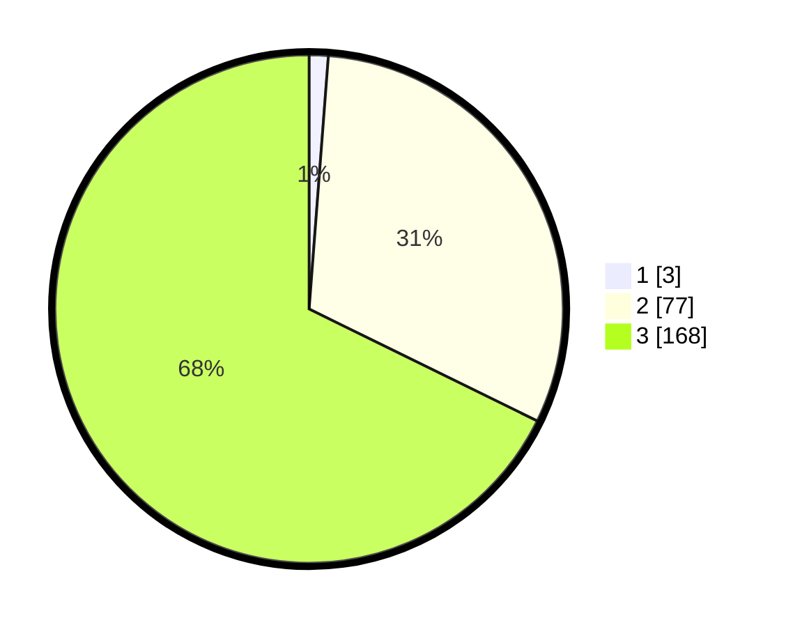

# Hasil

## Grafik

## Tabel

| No. | Nama Paslon    | Suara | Suara (raw) | Persentase |
|:--- |:-------------- | -----:| -----------:| ----------:|
| 1   | ANIES MUHAIMIN | 3     | [3][p-1]    | 1,21       |
| 2   | PRABOWO GIBRAN | 77    | [77][p-2]   | 31,05      |
| 3   | GANJAR MAHFUD  | 168   | [168][p-3]  | 67,74      |

[p-1]: https://github.com/gigit-pemilu/pemilu-2024/blob/main/pilpres/hitung-suara/sub/53-nusa-tenggara-timur/sub/18-sumba-barat-daya/sub/07-kodi/sub/2013-tanjung-karoso/sub/005-tps/sub/paslon-1.txt
[p-2]: https://github.com/gigit-pemilu/pemilu-2024/blob/main/pilpres/hitung-suara/sub/53-nusa-tenggara-timur/sub/18-sumba-barat-daya/sub/07-kodi/sub/2013-tanjung-karoso/sub/005-tps/sub/paslon-2.txt
[p-3]: https://github.com/gigit-pemilu/pemilu-2024/blob/main/pilpres/hitung-suara/sub/53-nusa-tenggara-timur/sub/18-sumba-barat-daya/sub/07-kodi/sub/2013-tanjung-karoso/sub/005-tps/sub/paslon-3.txt

## Foto C Plano

https://sirekap-obj-formc.kpu.go.id/b1d6/pemilu/ppwp/53/18/07/20/13/5318072013005-20240216-134346--f7978ca6-8df2-4bf5-95c1-1c1a8e03cebc.jpg

https://sirekap-obj-formc.kpu.go.id/b1d6/pemilu/ppwp/53/18/07/20/13/5318072013005-20240216-134617--104e95de-e495-4923-aeb7-15529f27966b.jpg

https://sirekap-obj-formc.kpu.go.id/b1d6/pemilu/ppwp/53/18/07/20/13/5318072013005-20240216-134846--5c787f55-f7e6-4da6-96b6-e2d8c8381a44.jpg

## Metadata

| Key        | Value               |
| ---------- | ------------------- |
| Time Stamp | 2024-02-25 13:00:00 |

