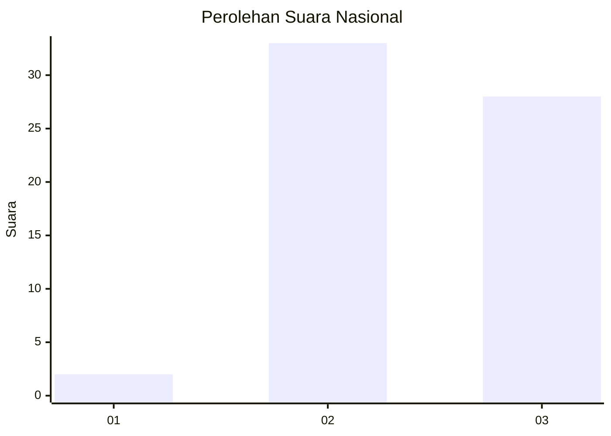
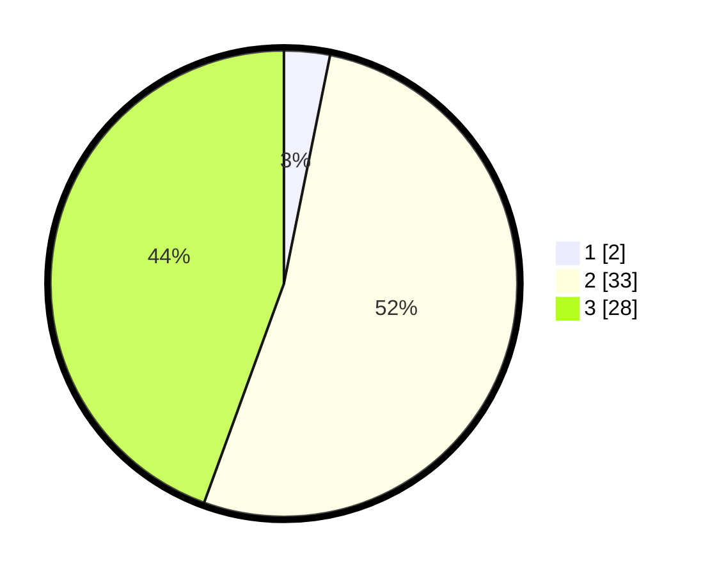

# Hasil

## Grafik

## Tabel

| No. | Nama Paslon    | Suara | Suara (raw) | Persentase |
|:--- |:-------------- | -----:| -----------:| ----------:|
| 1   | ANIES MUHAIMIN | 2     | [2][p-1]    | 3,17       |
| 2   | PRABOWO GIBRAN | 33    | [33][p-2]   | 52,38      |
| 3   | GANJAR MAHFUD  | 28    | [28][p-3]   | 44,44      |

[p-1]: https://github.com/gigit-pemilu/pemilu-2024/blob/main/pilpres/hitung-suara/sub/53-nusa-tenggara-timur/sub/18-sumba-barat-daya/sub/07-kodi/sub/2018-kadoki-horo/sub/003-tps/sub/paslon-1.txt
[p-2]: https://github.com/gigit-pemilu/pemilu-2024/blob/main/pilpres/hitung-suara/sub/53-nusa-tenggara-timur/sub/18-sumba-barat-daya/sub/07-kodi/sub/2018-kadoki-horo/sub/003-tps/sub/paslon-2.txt
[p-3]: https://github.com/gigit-pemilu/pemilu-2024/blob/main/pilpres/hitung-suara/sub/53-nusa-tenggara-timur/sub/18-sumba-barat-daya/sub/07-kodi/sub/2018-kadoki-horo/sub/003-tps/sub/paslon-3.txt

## Foto C Plano

https://sirekap-obj-formc.kpu.go.id/6ffc/pemilu/ppwp/53/18/07/20/18/5318072018003-20240215-161341--9bd8d359-8e07-4cd2-9162-dc5de8c6eb15.jpg

https://sirekap-obj-formc.kpu.go.id/6ffc/pemilu/ppwp/53/18/07/20/18/5318072018003-20240215-161428--3c983c0a-ee1d-42ea-89fc-7e1f051f46e2.jpg

https://sirekap-obj-formc.kpu.go.id/6ffc/pemilu/ppwp/53/18/07/20/18/5318072018003-20240215-161455--0fc758e3-9716-45d0-9151-57cd6bfe4cf1.jpg

## Metadata

| Key        | Value               |
| ---------- | ------------------- |
| Time Stamp | 2024-02-24 22:31:28 |

