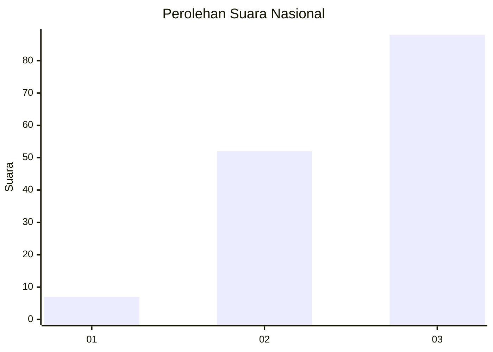
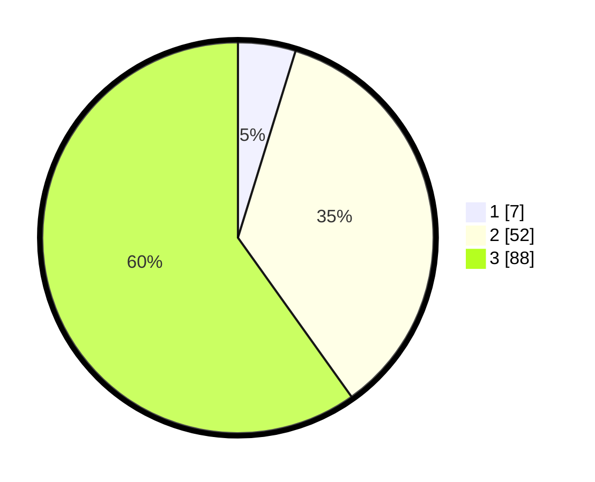

# Hasil

## Grafik

## Tabel

| No. | Nama Paslon    | Suara | Suara (raw) | Persentase |
|:--- |:-------------- | -----:| -----------:| ----------:|
| 1   | ANIES MUHAIMIN | 7     | [7][p-1]    | 4,76       |
| 2   | PRABOWO GIBRAN | 52    | [52][p-2]   | 35,37      |
| 3   | GANJAR MAHFUD  | 88    | [88][p-3]   | 59,86      |

[p-1]: https://github.com/gigit-pemilu/pemilu-2024/blob/main/pilpres/hitung-suara/sub/53-nusa-tenggara-timur/sub/18-sumba-barat-daya/sub/08-kodi-utara/sub/2001-hoha-wungo/sub/006-tps/sub/paslon-1.txt
[p-2]: https://github.com/gigit-pemilu/pemilu-2024/blob/main/pilpres/hitung-suara/sub/53-nusa-tenggara-timur/sub/18-sumba-barat-daya/sub/08-kodi-utara/sub/2001-hoha-wungo/sub/006-tps/sub/paslon-2.txt
[p-3]: https://github.com/gigit-pemilu/pemilu-2024/blob/main/pilpres/hitung-suara/sub/53-nusa-tenggara-timur/sub/18-sumba-barat-daya/sub/08-kodi-utara/sub/2001-hoha-wungo/sub/006-tps/sub/paslon-3.txt

## Foto C Plano

https://sirekap-obj-formc.kpu.go.id/6234/pemilu/ppwp/53/18/08/20/01/5318082001006-20240215-000657--417c20c7-ec7f-4b3e-836e-0c94a140dab0.jpg

https://sirekap-obj-formc.kpu.go.id/6234/pemilu/ppwp/53/18/08/20/01/5318082001006-20240216-094157--65f4a073-e093-4554-8d33-d5e49d6daa51.jpg

https://sirekap-obj-formc.kpu.go.id/6234/pemilu/ppwp/53/18/08/20/01/5318082001006-20240216-095329--65eb0f20-89be-4ad6-8b6d-a8985842cf12.jpg

## Metadata

| Key        | Value               |
| ---------- | ------------------- |
| Time Stamp | 2024-02-16 10:00:28 |

