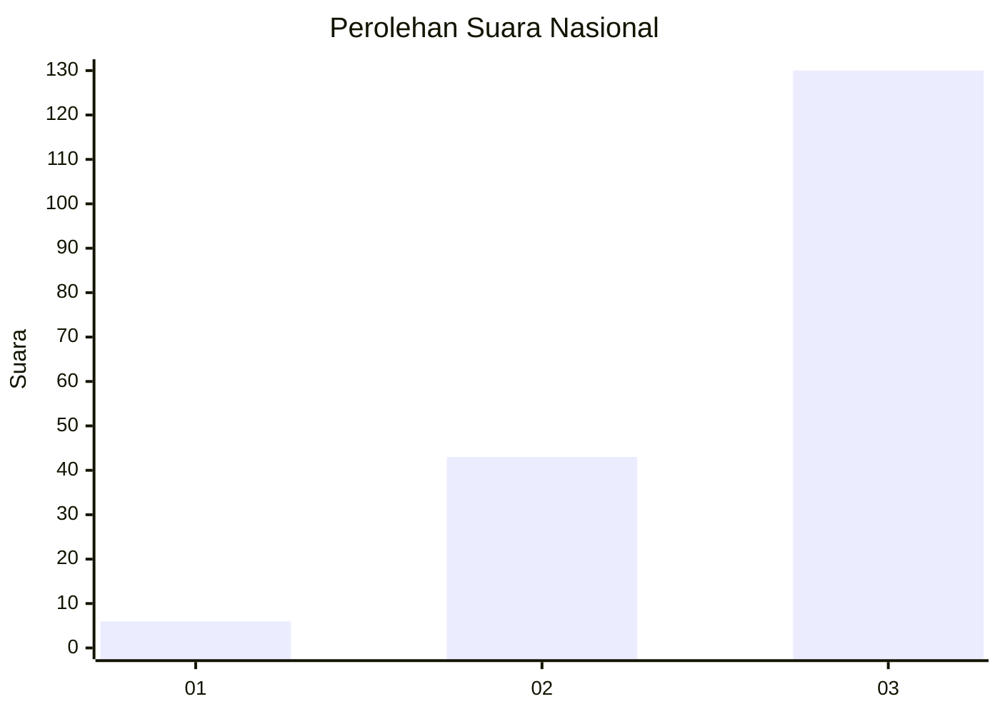
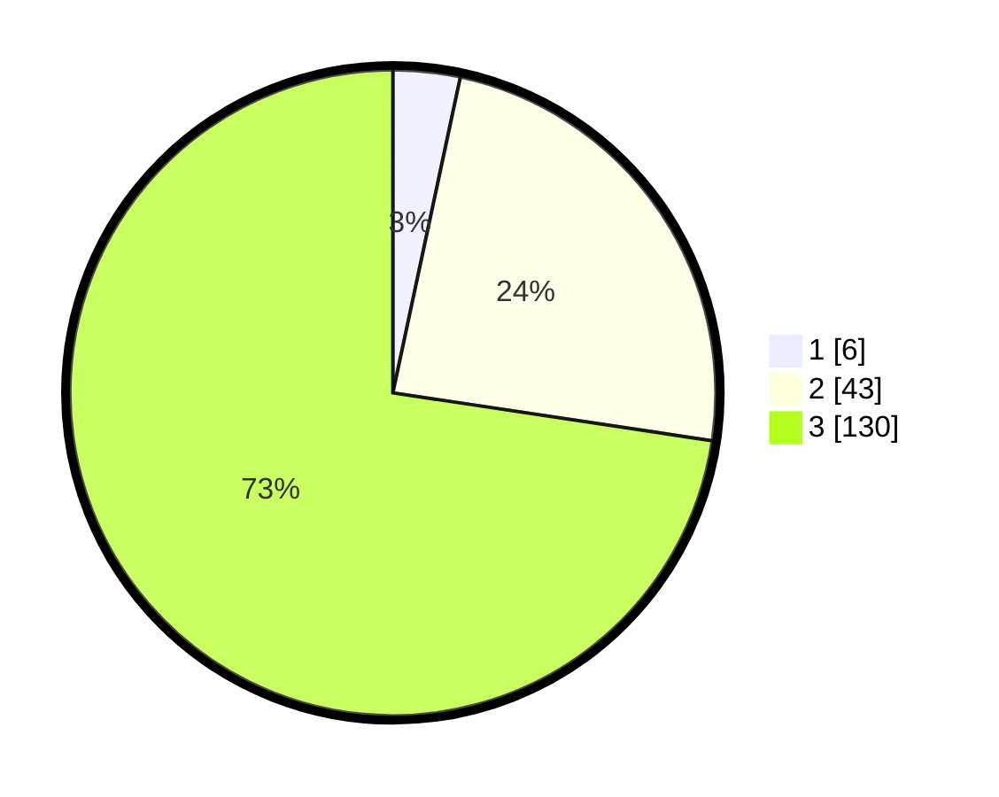

# Hasil

## Grafik

## Tabel

| No. | Nama Paslon    | Suara | Suara (raw) | Persentase |
|:--- |:-------------- | -----:| -----------:| ----------:|
| 1   | ANIES MUHAIMIN | 6     | [6][p-1]    | 3,35       |
| 2   | PRABOWO GIBRAN | 43    | [43][p-2]   | 24,02      |
| 3   | GANJAR MAHFUD  | 130   | [130][p-3]  | 72,63      |

[p-1]: https://github.com/gigit-pemilu/pemilu-2024/blob/main/pilpres/hitung-suara/sub/53-nusa-tenggara-timur/sub/18-sumba-barat-daya/sub/08-kodi-utara/sub/2003-wailabubur/sub/002-tps/sub/paslon-1.txt
[p-2]: https://github.com/gigit-pemilu/pemilu-2024/blob/main/pilpres/hitung-suara/sub/53-nusa-tenggara-timur/sub/18-sumba-barat-daya/sub/08-kodi-utara/sub/2003-wailabubur/sub/002-tps/sub/paslon-2.txt
[p-3]: https://github.com/gigit-pemilu/pemilu-2024/blob/main/pilpres/hitung-suara/sub/53-nusa-tenggara-timur/sub/18-sumba-barat-daya/sub/08-kodi-utara/sub/2003-wailabubur/sub/002-tps/sub/paslon-3.txt

## Foto C Plano

https://sirekap-obj-formc.kpu.go.id/3ecc/pemilu/ppwp/53/18/08/20/03/5318082003002-20240215-200550--769b4b72-754e-427d-868f-3d2054236160.jpg

https://sirekap-obj-formc.kpu.go.id/3ecc/pemilu/ppwp/53/18/08/20/03/5318082003002-20240215-165215--fccab9e4-bf51-4e01-b1a1-ed76a50bcaa6.jpg

https://sirekap-obj-formc.kpu.go.id/3ecc/pemilu/ppwp/53/18/08/20/03/5318082003002-20240215-165342--85e81f57-caf4-4e08-9ffb-84c4f80533d4.jpg

## Metadata

| Key        | Value               |
| ---------- | ------------------- |
| Time Stamp | 2024-02-25 15:00:00 |

